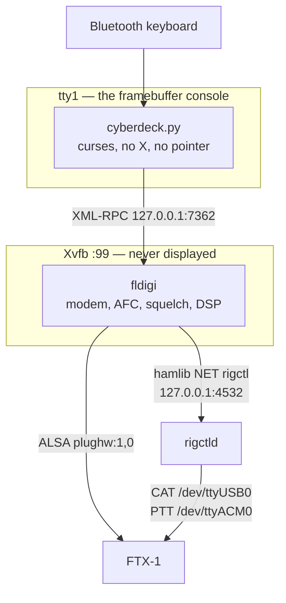

# Keyboard-to-Keyboard Cyberdeck

A self-contained HF text terminal. fldigi does the modem work invisibly; a
purpose-built terminal is the only thing on the screen. No window manager, no
mouse, no pointer, nothing to click — the feel of a dedicated 1980s packet
terminal over modern digital modes.


Full design rationale is in [design_doc.md](design_doc.md).

### Color schemes

One hue on black, cycled with `F4`. Monochrome means one hue, not one
intensity: the dim variant carries the timestamps and the callsign column.

| | |
|---|---|
| **Matrix** — `#00FF41` | **Deckard** — `#FFB000` |
|  |  |
| **Hal** — `#FF3B30` | **Tron** — `#00D9FF` |
|  |  |

Hal is the least legible of the four, because red has the lowest luminance of
any saturated hue. That is inherent and it is also the point — it is the scheme
for operating at night without wrecking dark adaptation. Tron is cyan-shifted
deliberately: a true blue on black is close to unreadable as body text.

## What it does

* Conversational keyboard-to-keyboard QSOs in fldigi's digital modes — PSK,
  RTTY, Olivia, MFSK, Contestia, THOR, DominoEX, Feld Hell.
* An **over-based** transmit model, which is fldigi's norm and HF's norm:
  compose while receiving, `Ctrl-T` to start the over, `Ctrl-K` to hand back.
  `Enter` inserts a newline; it does not send.
* Mode switching, carrier tuning and rig control from the keyboard.
* Four monochrome color schemes, switchable at runtime.

It deliberately does **not** do contest logging, ADIF, weak-signal modes,
waterfall display, image modes, or packet.

## Screens


`F2` toggles the whole screen rather than overlaying a panel: on 66 columns a
tuning display worth reading and a conversation worth reading do not coexist.

Tuning is key-driven, not waterfall-driven: `↑` `↓` run fldigi's own signal
search and `←` `→` nudge the carrier ten hertz at a time. Those keys work on
the conversation screen too, which is where they belong — the decoded text is
the only real confirmation that tuning worked. See §8 of the design document
for why there is no software spectrum.


Eleven curated conversational modes with the current one marked `<`. `m` opens
the full list — 97 conversational modems, paginated, single-key selection.

## Keys

| Key | Action |
|---|---|
| `F1` | Menu |
| `F2` | Toggle the chat and tuning screens |
| `F3` | Mode picker, including **AUTO (RSID)** |
| `F4` | Cycle the color scheme |
| `←` `→` | Carrier ∓10 Hz — works on both screens |
| `↑` `↓` | Search for the next signal — works on both screens |
| `Ctrl-T` | Start the over — send the buffer and key the rig |
| `Ctrl-K` | Hand back — drop to receive when the buffer drains |
| `Ctrl-C` | Abort transmit immediately |
| `Ctrl-I` | Toggle transmit inhibit |
| `PgUp` / `PgDn` | Scroll the transcript |
| `Ctrl-Q` | Quit |
| `Esc` | Close a menu |

Menus take arrow keys as well as their single-key shortcuts: `↑` `↓` move a
`▸` marker, `Enter` chooses. Transmit starts **inhibited** at every power-on;
`Ctrl-I` arms it.

`Ctrl-I` and `Tab` are the same byte — ASCII 9 — so `Tab` also toggles the
inhibit. Watch the status line if you hit it by accident.

## How it is put together



| File | What it is |
|---|---|
| `cyberdeck.py` | The terminal: curses, key handling, the main loop |
| `fldigi_client.py` | The XML-RPC boundary. Never raises at the caller |
| `session.py` | Transcript, compose buffer, the shape of an over |
| `render.py` | Layout as pure functions, so it can be tested at any width |
| `menus.py` | Menu structure and rendering |
| `colors.py` | The four schemes, console palette and ANSI fallback |
| `config.py` | `cyberdeck.conf` — the station's own settings |
| `build_deck_image.sh` | Builds and flashes the Pi's SD card |
| `configure_fldigi.py` | Sets fldigi's audio and rig control without its GUI |
| [`deploy_cyberdeck_instructions.md`](deploy_cyberdeck_instructions.md) | The full runbook, blank card to on the air |
| `deck.conf` | How to build that card: hostname, panel, keyboard, radio |

## Running it on a laptop with the FTX-1

Everything except the panel and the Bluetooth keyboard works on a laptop, over
SSH or in a terminal window. This is how it is developed.

**1. fldigi must have a working configuration directory.** It crashes on an
empty one — an assertion failure during first-run setup. Run fldigi once on a
desktop, set your callsign and audio device, and quit.

**2. Connect the FTX-1.** One USB-C cable presents three devices. These values
are proven on this radio:

| Function | Device | Setting |
|---|---|---|
| CAT | `/dev/ttyUSB0` (CP2105) | 38400 baud, hamlib rig 1035 |
| PTT | `/dev/ttyACM0` | a separate port from CAT |
| Audio | `plughw:1,0` (C-Media) | mono in and out |

The two-serial-port arrangement is the awkward part: hamlib takes one port per
rig, so `rigctld` bridges both and fldigi connects to it as *Hamlib NET
rigctl* on `localhost:4532`.

```bash
rigctld -m 1035 -r /dev/ttyUSB0 -s 38400 -p /dev/ttyACM0 -P RIG -t 4532 &
```

Then point fldigi at it **without using its dialogs** — the deck has no pointer
and often no screen, so everything that has to be right is set from the command
line:

```bash
python3 configure_fldigi.py --show          # what is set now
python3 configure_fldigi.py --list-audio    # PortAudio's device names
python3 configure_fldigi.py --rigctld --audio "USB Audio Device" --call KD3CCO
```

`--rigctld` is the important one. The FTX-1 presents CAT and PTT on two separate
serial ports and fldigi's hamlib configuration has room for one, which is why
`rigctld` bridges both. Pointing fldigi straight at the CAT port instead means
it and `rigctld` fight over the same device and one of them loses.

**3. Start fldigi headless and the terminal.**

```bash
git clone <this repo> && cd keyboard-to-keyboard-cyberdeck
cp cyberdeck.conf.example cyberdeck.conf   # set CALLSIGN and the rest
./dev-fldigi.sh                            # Xvfb + fldigi, seeded config
python3 cyberdeck.py
```

`dev-fldigi.sh` copies `~/.fldigi` into `fldigi-config/` the first time,
because of the empty-config crash above.

**Turn the squelch on before you operate.** With it open fldigi decodes the
noise floor continuously and the transcript fills with random characters within
seconds. `F2`, then `s`.

## Running it on a Raspberry Pi 3A+ with the FTX-1

> The condensed version is below. For the step-by-step with recovery
> procedures, follow
> **[deploy_cyberdeck_instructions.md](deploy_cyberdeck_instructions.md)**.

The deck proper: a 3A+, a 5" DSI panel, a Bluetooth keyboard, and the FTX-1 on
the single USB port.

**That port is spent on the radio.** The 3A+ has one USB-A socket wired
straight to the SoC with no hub chip, which is why the keyboard is Bluetooth
and the panel attaches by DSI rather than USB.

### Configure the build

Two files, in the same form as the iGate project's:

```bash
cp deck.conf.example deck.conf          # the machine
cp deck.secrets.example deck.secrets    # credentials — gitignored
```

`deck.conf` carries the hostname, the account, the DSI overlay, the console
font, the radio's device paths, and **the Bluetooth keyboard**:

```
DECK_BT_KEYBOARD = 34:88:5D:1A:2B:3C
DECK_BT_KEYBOARD_NAME = Logitech K380
DECK_BT_PAIR_TIMEOUT = 120
```

Find the address with `bluetoothctl scan on` on any Linux machine with the
keyboard in pairing mode. The build refuses to proceed with the example
address still in place: a headless deck whose keyboard will not pair, with its
only USB port holding a radio, has no way in but SSH.

`deck.secrets` carries the account password and the WiFi networks. Both the
image and the finished card contain these in recoverable form — Raspberry Pi
OS has no disk encryption and the card pulls out with a fingernail.

### Build and flash

```bash
./build_deck_image.sh check              # validate both files
./build_deck_image.sh units              # review the systemd units first
./build_deck_image.sh build              # produce deck-build/cyberdeck.img
lsblk                                    # find the card
./build_deck_image.sh flash /dev/sdX     # asks you to type the path twice
```

`/dev/sdX` is not a real device. Check `lsblk` and use what it tells you.

### What the build does

The card is customized offline on your laptop, not on the Pi, so it boots
straight into a working terminal with no console session at any point:

* WiFi profiles, the user account with a hashed password, SSH and your key.
* The project into `/opt/cyberdeck`, with `cyberdeck.conf` alongside.
* The Bluetooth pairing service, its retry timer, and the first-boot installer.
* A **seeded fldigi configuration** — an empty one crashes.
* `config.txt`: the DSI panel overlay.
* `cmdline.txt`: quiet boot, no cursor, no login prompt — the screen stays
  blank until the terminal appears.
* The console font that sets the character grid.
* Six systemd units: Xvfb, fldigi, rigctld, the terminal on tty1, and the
  Bluetooth pairing service with its retry timer.
* `run/` on tmpfs, so the card is not written during normal operation.

### First boot

The Pi joins WiFi, installs fldigi, Xvfb, hamlib and Python, pairs the
keyboard, and starts the terminal. Allow five to ten minutes.

Put the keyboard in pairing mode before powering the deck on. If it is not
found, `cyberdeck-btpair.timer` retries every five minutes rather than giving
up, and the deck is still reachable at `ssh deck@cyberdeck.local`.

## Tests

```bash
for t in test_session.py test_render.py test_menus.py test_screen.py \
         test_menu_nav.py test_menu_arrows.py; do
  python3 "$t"
done
```

120 checks. `test_screen.py` and `test_menu_nav.py` fork a pseudo-terminal, run
the real application, and read the screen back with a terminal emulator, so the
tests assert on what the deck looks like rather than on functions in isolation.
They need a running fldigi — start `./dev-fldigi.sh` first.

Regenerate the screenshots with `python3 capture_png.py`, which renders the
screens at each scheme's own hex values. `capture_screens.py` produces the
same screens as text, in `docs/screens.md`.

## Status

**The deck exists and runs.** Built, flashed, booted on a Pi 3A+, panel lit,
Bluetooth keyboard bonded, fldigi and rigctld running, audio decoding. It has
not yet made a contact.

Working end to end:

* `build_deck_image.sh build` and `flash` — run through, and the resulting card
  verifies before boot (`deploy_cyberdeck_instructions.md`, phase 2 step 4).
* The Waveshare 5" DSI panel on a 3A+, with `dtoverlay=vc4-kms-dsi-7inch`.
* WiFi, NTP, first-boot package installation, SSH.
* The Bluetooth keyboard, after a one-time manual bonding (see below).
* fldigi 4.2.06 under Xvfb, driven over XML-RPC; audio decoding confirmed by
  the squelch-off noise test.
* Rig control **reads**: frequency, mode and signal figures track the radio.

**Known limitations**

* **The deck cannot set the radio's frequency.** Hamlib 4.6.2, which is what
  Raspberry Pi OS Trixie ships, builds a malformed Yaesu frequency command for
  the FT-991 model — `FA` plus eight digits where the FTX-1's CAT manual
  specifies nine, zero-padded. The radio discards it silently. Reads are
  unaffected, which is what made it hard to find. Writing `FA014075000;` to the
  port by hand moves the VFO immediately. Hamlib 4.6.5 builds the command
  correctly, so the fix is a hamlib upgrade; `rigctld_client.py` documents the
  bug and carries a workaround that is **not currently wired in**.
* **First-time Bluetooth bonding is manual.** An LE keyboard will not deliver
  input over an unbonded link, and bonding needs a passkey displayed by the Pi
  and typed on the keyboard — which cannot be automated. `cyberdeck-btpair`
  reconnects an already-bonded keyboard; the first bond is a one-off
  `bluetoothctl` session, documented in the deployment runbook.
* `main.rx_only` does not inhibit fldigi's `main.tune`; the transmit inhibit is
  enforced in the terminal instead.
* Nothing has been transmitted. Every transmit path — PTT, the over model, the
  abort key against a live carrier — is written and unit-tested but has never
  keyed a radio.

**Fixed along the way**, recorded because each cost real time:

* Raspberry Pi OS ships the Pi 3's WiFi *and* Bluetooth radios rfkill-blocked.
  Setting the regulatory domain does not clear it. The build now unblocks both
  before NetworkManager starts — without that, first boot installs nothing and
  the keyboard never pairs, which presents as four unrelated faults.
* `curses.wrapper` leaves the terminal in `cbreak`, where `Ctrl-C` raises
  `KeyboardInterrupt` instead of reaching the handler — on the one key whose
  job is to stop a transmission. The terminal now runs in `raw` mode and drops
  PTT on every exit path.
* The status bar rendered as an unreadable solid block: `A_REVERSE` combined
  with `A_BOLD` put the bold intensity on the background. Reverse-video pairs
  are now defined as black-on-hue outright.
