# Keyboard-to-Keyboard Cyberdeck

A self-contained HF text terminal. fldigi does the modem work invisibly; a
purpose-built terminal is the only thing on the screen. No window manager, no
mouse, no pointer, nothing to click — the feel of a dedicated 1980s packet
terminal over modern digital modes.

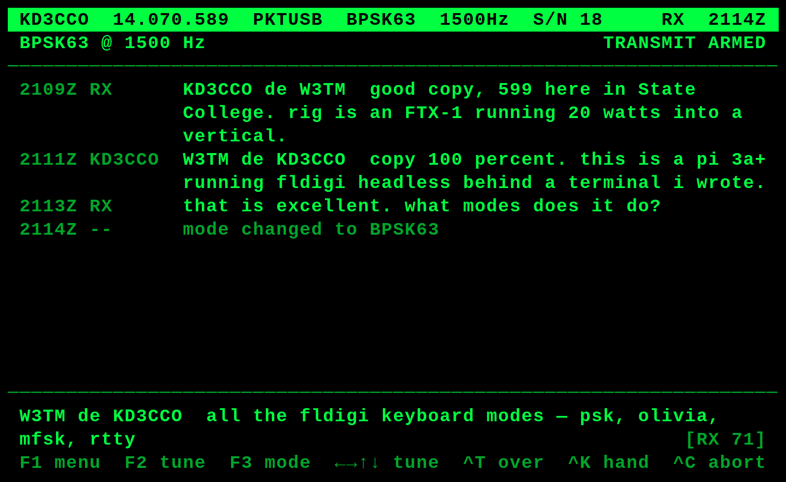

## Start here

| Goal | What to do | What to read |
|---|---|---|
| **Run it on a computer I already have** | Start fldigi, then `./src/cyberdeck.py` | [Running it on a laptop](#running-it-on-a-laptop-with-your-own-radio). Nothing else in this repository applies. |
| **Build the deck** | Flash a card with `tools/build_deck_image.sh` | [The runbook](docs/deploy_cyberdeck_instructions.md) |
| **Operate it** | — | [The operating tutorial](docs/operating_tutorial.md) |
| **Understand why it is built this way** | — | [The design document](docs/design_doc.md) |

The application is an ordinary Python program. It needs a terminal and an
fldigi to talk to, and nothing else: no Pi, no panel, no Bluetooth keyboard, no
SD card image, no touchscreen, no real-time clock. Those exist because the
author's copy runs on a Raspberry Pi 3A+ behind a 5" panel, and most of this
repository describes that machine — but none of it is required to use the
terminal, and the laptop path above is a supported way to run it permanently
rather than a demo mode.

Full design rationale is in [design_doc.md](docs/design_doc.md). There is a
write-up of why it exists and what it is like to operate at
**[hatandspecs.github.io/hamradio — A Keyboard-to-Keyboard Cyberdeck for the
FTX-1](https://hatandspecs.github.io/hamradio/articles/keyboard-to-keyboard-cyberdeck/)**.

### Color schemes

One hue on black, cycled with `F4`. Monochrome means one hue, not one
intensity: the dim variant carries the timestamps and the callsign column.

| | |
|---|---|
| **Matrix** — `#00FF41` | **Deckard** — `#FFB000` |
|  | 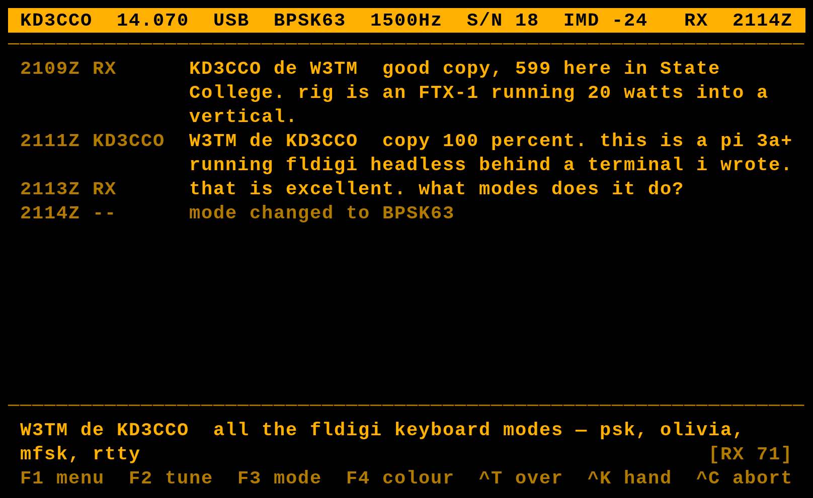 |
| **Hal** — `#FF3B30` | **Tron** — `#00D9FF` |
| 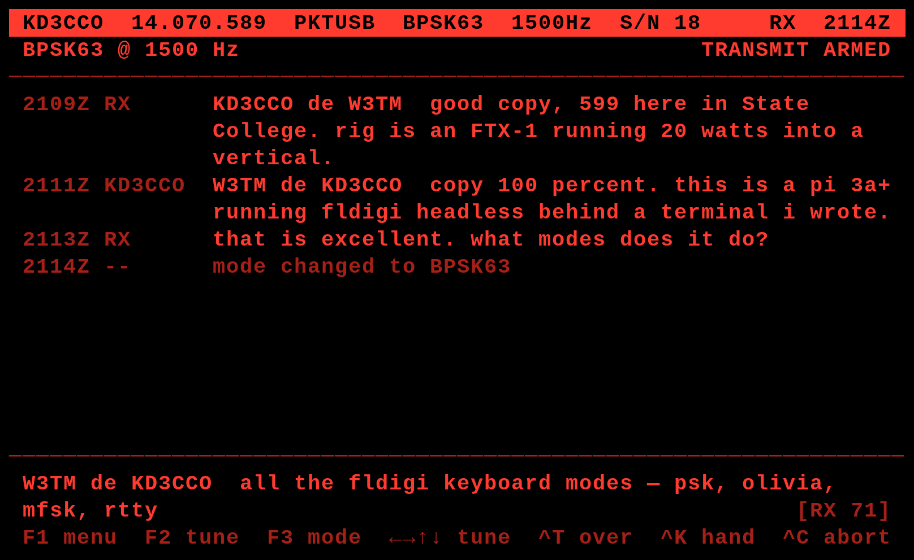 | 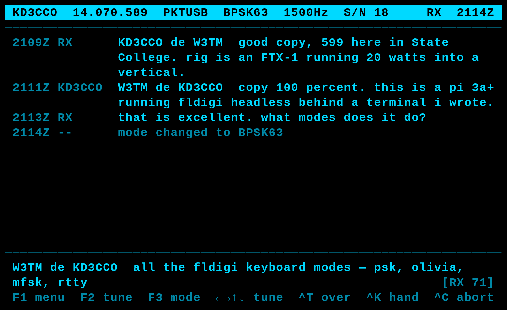 |
| **Ripley** — `#FFFFFF` | |
| 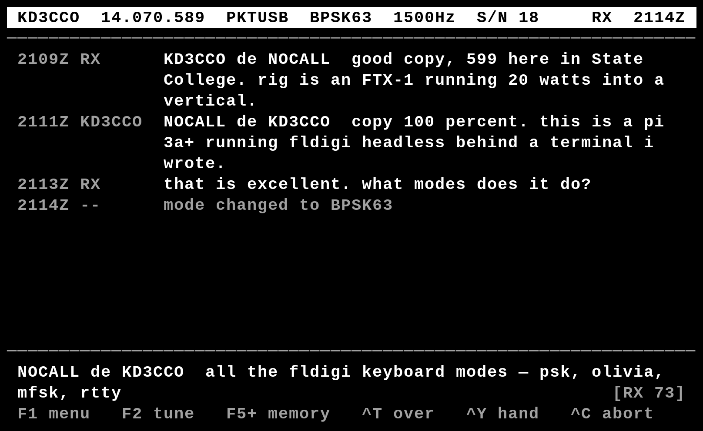 | |

Hal is the least legible of the five, because red has the lowest luminance of
any saturated hue. That is inherent and it is also the point — it is the scheme
for operating at night without wrecking dark adaptation. Tron is cyan-shifted
deliberately: a true blue on black is close to unreadable as body text.

Ripley is white: no hue at all, which is the oldest meaning of monochrome and
the most legible of the five in daylight. It is also the only scheme that
redefines the console's own default foreground rather than a color the console
was not using — safe because the deck owns `tty1` and the palette is put back
on exit.

## What it does

* Conversational keyboard-to-keyboard QSOs in fldigi's digital modes — PSK,
  RTTY, Olivia, MFSK, Contestia, THOR, DominoEX, Feld Hell.
* An **over-based** transmit model, which is fldigi's norm and HF's norm:
  compose while receiving, `Ctrl-T` to start the over, `Ctrl-Y` to hand back.
  `Enter` inserts a newline; it does not send.
* Mode switching, carrier tuning and rig control from the keyboard.
* Four monochrome color schemes, switchable at runtime.
* A status line that reports **the radio's** state rather than the program's
  intent: `RX`, `TX`, `DRAIN` while a handed-back over is still going out,
  `INH` while transmit is inhibited.
* **Pairing its own Bluetooth keyboard, with no SSH** — scan, tap, passkey on
  the panel. The deck raises the screen by itself when no keyboard is
  attached, because that is the one situation it cannot be told about.
* **Touch, minimally**: drag the transcript to scroll it, tap to choose on the
  pairing screens. No pointer, no cursor, nothing else is selectable.

It deliberately does **not** do contest logging, ADIF, weak-signal modes,
waterfall display, image modes, or packet.

## Screens

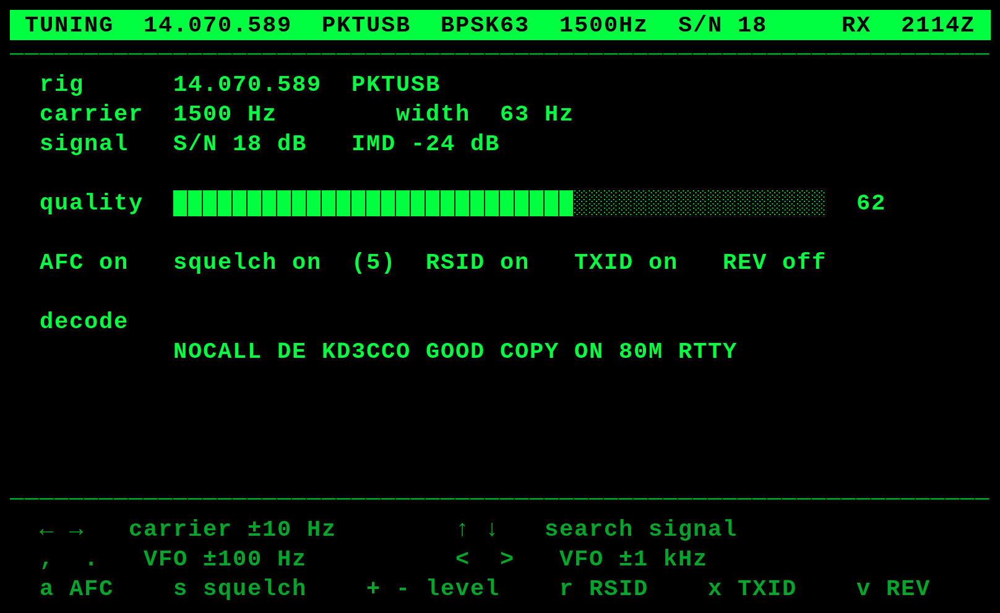

`F2` toggles the whole screen rather than overlaying a panel: on 66 columns a
tuning display worth reading and a conversation worth reading do not coexist.

Tuning is key-driven, not waterfall-driven: `↑` `↓` run fldigi's own signal
search and `←` `→` nudge the carrier ten hertz at a time. Those keys work on
the conversation screen too, which is where they belong — the decoded text is
the only real confirmation that tuning worked. See §8 of the design document
for why there is no software spectrum.

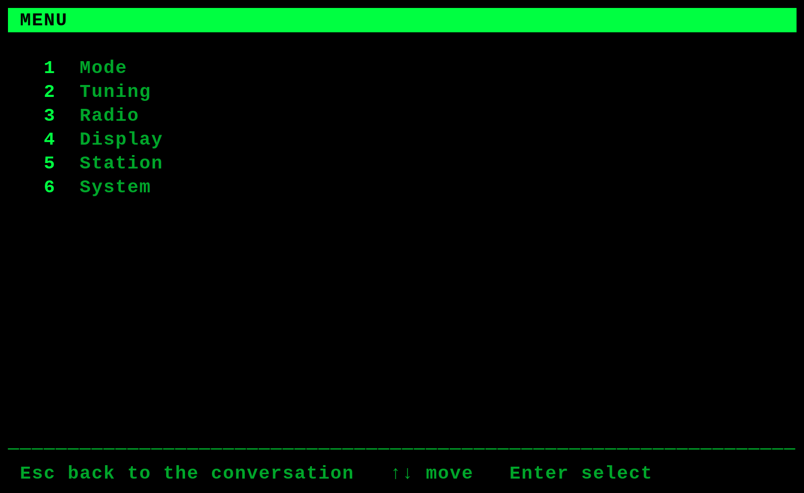

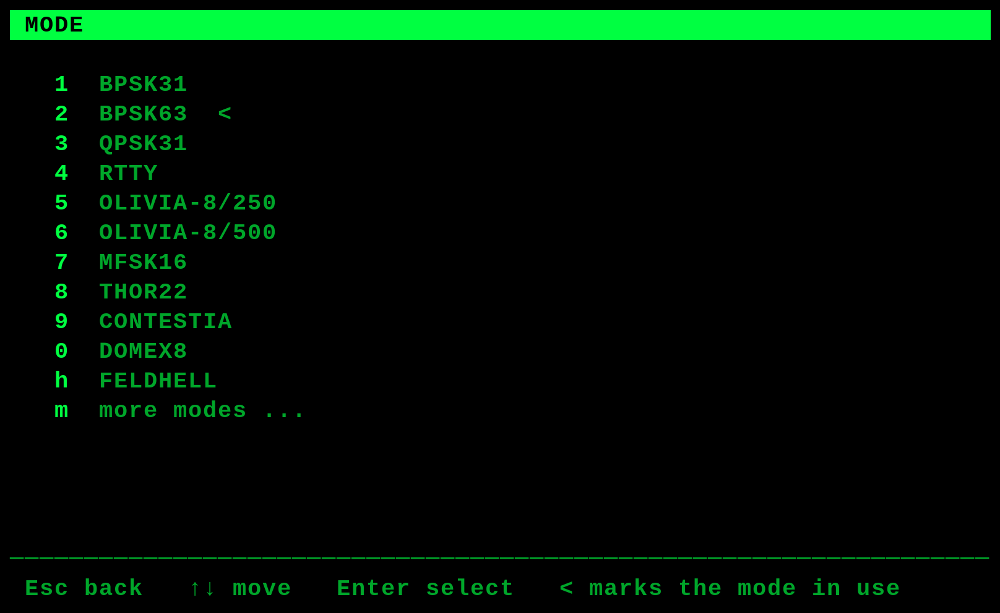

Eleven curated conversational modes with the current one marked `<`. `m` opens
the full list — 97 conversational modems, paginated, single-key selection.

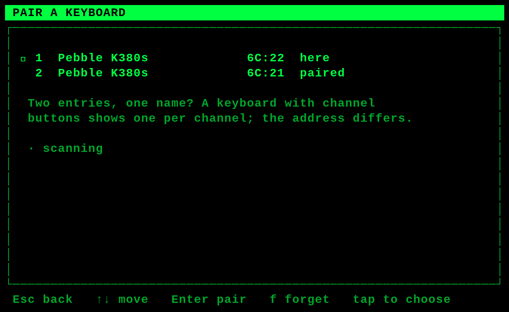

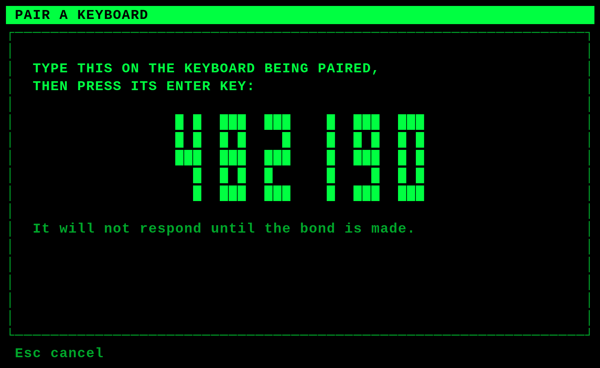

Pairing needs no SSH: the deck scans, you tap, and it shows the passkey to
type on the keyboard being paired. A keyboard with channel buttons appears
once per channel under one name, so the address tail is what distinguishes
them. See §17 of the design document.

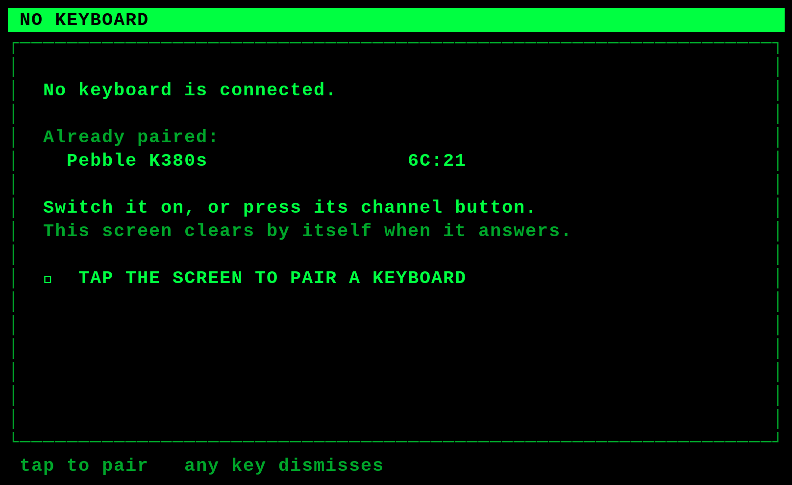

Raised by the deck itself when nothing is connected — the one situation it
cannot be told about, since every other way in is behind `F1`.

## Keys

| Key | Action |
|---|---|
| `F1` | Menu |
| `F2` | Tuning screen, from anywhere; again to come back |
| `F3` | Mode picker, from anywhere, including **AUTO (RSID)**; again to come back |
| `F4` | Cycle the color scheme, five of them |
| `←` `→` `↑` `↓` | Edit the line: cursor, and recall previous overs |
| `Ctrl-A` `Ctrl-D` | Carrier −10 / +10 Hz, without leaving the transcript |
| `Ctrl-W` `Ctrl-S` | Search for the next signal, up / down |
| `F5`–`F12` | Insert a message memory at the cursor; `Ctrl-Z` undoes it |
| `Ctrl-T` | Start the over — send the buffer and key the rig |
| `Ctrl-Y` | Hand back — drop to receive when the buffer drains |
| `Ctrl-C` | Abort transmit immediately |
| `Ctrl-I` | Toggle transmit inhibit |
| `Ctrl-X` | Clear the transcript |
| `Ctrl-L` | Redraw the screen |
| `PgUp` / `PgDn` | Scroll the transcript — or drag it on the touchscreen |
| `Ctrl-Q` | Restart the terminal; asks for confirmation |
| `Esc` | Close a menu |

Menus take arrow keys as well as their single-key shortcuts: `↑` `↓` move a
`▸` marker, `Enter` chooses. Transmit starts **inhibited** at every power-on;
`Ctrl-I` arms it. Command keys are case-folded, so they work with Caps Lock on
— which is how RTTY is operated, since Baudot has no lowercase.

**Pairing a keyboard needs no SSH.** `F1` → `7` → `b`, or just switch the
deck on with nothing bonded — it notices and shows the screen itself, since
every other way in is behind `F1` and `F1` needs the keyboard that is missing.
Put the keyboard into pairing mode, tap the panel, and type the passkey it
shows. A keyboard with channel buttons appears once per channel under one
name; the address tail is what tells them apart.

**WiFi is set from the panel too.** `F1` → `7` → `w` lists what is in range,
with the connected network marked `✓`, ones already known marked `·`, signal
as four blocks, and the security named on the right — blank for an open
network.

Every glyph on that screen is one already proven on a shipped screen. The panel
runs a console font, not a desktop one, so a character it lacks is a blank
column: the first version used geometric shapes for the signal bars and an
emoji padlock, neither of which a console font has. `Enter` or a tap
joins; a known network needs no passphrase, because the deck already wrote it
down. `n` joins a network by name for one that does not broadcast it, `f`
forgets a saved one, `s` scans again, and `r` switches the radio off and on.

Passphrases are masked as they are typed and go to NetworkManager, never to
the deck's own state file — the one thing edited on this deck that is not
written to the card. `^R` shows the passphrase and hides it again, which a
long key typed onto a panel showing nothing back genuinely needs; it starts
hidden every time, since whether to reveal it depends on the room.

**A wrong passphrase can simply be retyped.** `nmcli` saves the profile on its
way to failing, so without help a bad key becomes a saved network and every
later `Enter` reuses it silently — the only way out being to forget the
network first. A failed join now removes the profile it created, and `Enter`
on the failure offers the passphrase again. A network that was already saved
before the attempt is left alone, because the failure may be range rather than
the key.

It needs `polkit/10-cyberdeck-networkmanager.rules`, which a flashed card gets
at build time. Without it the screen lists networks normally and refuses every
key on it, because listing needs no authorisation and everything else does —
and it is not about group membership. NetworkManager's stock policy grants
those actions to an active local session, and the terminal is a systemd
service with no seat and no session.

Switching the radio off is a normal way to run rather than a fault state.
With the real-time clock fitted the deck keeps time without NTP, so a field
session can have the WiFi off from the start and still stamp every line
correctly.

**The three screens are a flat set, not a tree.** `F2` and `F3` reach the
tuning screen and the mode picker from wherever you are, and each key is its
own way back, so tune → mode → tune is one keystroke each way. Identifying an
unknown signal is exactly that loop, and a navigation that needs `Esc` between
each step is the wrong shape for it.

**`Ctrl-Q` does not shut the deck down.** The systemd unit restarts it, so it
is a restart of the terminal and nothing more — there is no desktop underneath
to return to. It confirms first, because an unannounced few seconds of dark
screen is indistinguishable from a crash.

| `F1` | |
|---|---|
| `1` Mode | Twelve modes plus **AUTO (RSID)** and the full list |
| `2` Tune Settings | AFC, squelch and level, RSID, TXID, reverse, park carrier, the receive hold after an over |
| `3` Band | Eleven presets, 80 m to 70 cm, low to high |
| `4` Display | The five color schemes, timestamps |
| `5` Memories | Eight message memories, edited in place |
| `6` Station | Callsign, name, QTH, grid, rig — edited in place |
| `7` System | Pair a Bluetooth keyboard, WiFi, transmit inhibit, clear transcript, quit |

`Ctrl-I` and `Tab` are the same byte — ASCII 9 — so `Tab` also toggles the
inhibit. Watch the status line if you hit it by accident.

## How it is put together

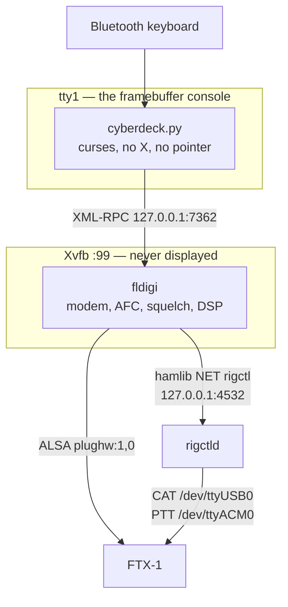

### Layout

```
src/      the application — installed flat into /opt/cyberdeck on the deck
tests/    standalone scripts; six drive the real program through a pty
tools/    build, flash, development and documentation scripts
docs/     design, runbook, operating tutorial, screenshots
refs/     the FTX-1 manuals, including the CAT reference
```

`src/` installs flat because the systemd unit runs
`/opt/cyberdeck/cyberdeck.py` and the modules import each other by bare name.
Nothing else in the repository reaches the deck.

| File | What it is |
|---|---|
| [`src/cyberdeck.py`](src/cyberdeck.py) | The terminal: curses, key handling, the main loop |
| [`src/fldigi_client.py`](src/fldigi_client.py) | The XML-RPC boundary. Never raises at the caller |
| [`src/session.py`](src/session.py) | Transcript, compose buffer, line editing, the shape of an over |
| [`src/render.py`](src/render.py) | Layout as pure functions, so it can be tested at any width |
| [`src/menus.py`](src/menus.py) | Menu structure and rendering |
| [`src/colors.py`](src/colors.py) | The five schemes, console palette and ANSI fallback |
| [`src/touch.py`](src/touch.py) | The panel's touchscreen, read from evdev. Absent hardware is not an error |
| [`src/btpair.py`](src/btpair.py) | Pairing a keyboard over BlueZ, on one long-lived D-Bus connection |
| [`src/wifi.py`](src/wifi.py) | Joining networks through `nmcli`. Long operations do not block the panel |
| [`src/config.py`](src/config.py) | `cyberdeck.conf` — the station's own settings, message memories, remembered state |
| [`src/rigctld_client.py`](src/rigctld_client.py) | Unused. Documents a hamlib bug and a raw-CAT workaround |
| [`tools/build_deck_image.sh`](tools/build_deck_image.sh) | Builds and flashes the Pi's SD card |
| [`tools/configure_fldigi.py`](tools/configure_fldigi.py) | Sets fldigi's audio and rig control without its GUI |
| [`tools/dev-fldigi.sh`](tools/dev-fldigi.sh) | fldigi headless under Xvfb, for development |
| [`tests/test_console_keys.py`](tests/test_console_keys.py) | Keys as `TERM=linux` delivers them, which is not how xterm does |
| [`tests/test_screen_toggles.py`](tests/test_screen_toggles.py) | `F2` and `F3` moving between the three screens |
| [`tests/test_state.py`](tests/test_state.py) | What survives a restart |
| [`tests/test_pair.py`](tests/test_pair.py) | The pairing and no-keyboard screens, and refusing where BlueZ is absent |
| [`tests/test_wifi.py`](tests/test_wifi.py) | The WiFi screen, nmcli's terse output, and the row a tap resolves to |
| [`tests/test_cold_boot.py`](tests/test_cold_boot.py) | Starting before fldigi does, against a stand-in that arrives late |
| [`tests/test_colors.py`](tests/test_colors.py) | The schemes, and the two properties that were real faults |
| [`tests/test_sequences.py`](tests/test_sequences.py) | Over, hand and abort pressed in orders nobody designed for |
| [`tools/bt_agent_probe.py`](tools/bt_agent_probe.py) | Proves a BlueZ agent survives a scan, before any of it is built on |
| [`tools/run_tests.sh`](tools/run_tests.sh) | The whole suite, one command |
| [`docs/deploy_cyberdeck_instructions.md`](docs/deploy_cyberdeck_instructions.md) | The full runbook, blank card to on the air |
| [`docs/operating_tutorial.md`](docs/operating_tutorial.md) | How to actually work someone, for a first-timer |
| `deck.conf` | How to build that card: hostname, panel, keyboard, radio |

## Running it on a laptop, with your own radio

Everything except the panel and the Bluetooth keyboard works on a laptop, over
SSH or in a terminal window. This is how it is developed, and it is a
perfectly good way to use it permanently.

**Most of this repository is about the deck, and none of it is needed here.**
Skip the SD card image, `deck.conf`, `deck.secrets`, `build_deck_image.sh`, the
Bluetooth pairing sections, the touchscreen, the real-time clock and the whole
deployment runbook. What a laptop needs is fldigi running and one file:

```bash
./src/cyberdeck.py
```

That is the entire installation. The first operator other than the author
described the process as reading enough of the documentation to work out that
nothing else was required, starting fldigi, and running that — which is the
intended experience, and the reason for saying so this bluntly here.

**The radio is fldigi's problem, not this program's.** The application opens no
sound card and no serial port — it talks to fldigi over XML-RPC on the loopback
interface and nothing else. So any rig fldigi already works with is a
candidate, and the rule is simple: if fldigi decodes and keys your radio from
its own window, the terminal inherits that; if it does not, fix that first.

The FTX-1 below is the worked example because it is the radio this was built
against and the only one it has been run against. Substitute your own ports,
baud rate and hamlib model. [The runbook has a fuller, radio-agnostic
walkthrough](docs/deploy_cyberdeck_instructions.md#running-it-on-a-laptop-with-your-own-radio),
including which parts of this repository you can ignore.

**1. fldigi must have a working configuration directory.** It crashes on an
empty one — an assertion failure during first-run setup. Run fldigi once on a
desktop, set your callsign and audio device, and quit.

**2. Connect the FTX-1.** One USB-C cable presents three devices. These values
are proven on this radio:

| Function | Device | Setting |
|---|---|---|
| CAT | `/dev/ttyUSB0` (CP2105) | 38400 baud, hamlib rig **1051** |
| PTT | `/dev/ttyACM0` | a separate port from CAT |
| Audio | `plughw:1,0` (C-Media) | mono in and out |

The two-serial-port arrangement is the awkward part: hamlib takes one port per
rig, so `rigctld` bridges both and fldigi connects to it as *Hamlib NET
rigctl* on `localhost:4532`.

```bash
rigctld -m 1051 -r /dev/ttyUSB0 -s 38400 -p /dev/ttyACM0 -P RIG -t 4532 &
```

**Model 1051 needs hamlib 4.7.1 or later, built from source on most
distributions.** Model 1035 is the FT-991 backend and is the obvious thing to
reach for — it reads the FTX-1 correctly, which is exactly what makes it
dangerous. It cannot *set* the frequency: it sends a command one digit short of
what the radio requires and the radio discards it without an error, so the
display tracks the dial while every band preset silently fails. See Known
limitations below.

Then point fldigi at it **without using its dialogs** — the deck has no pointer
and often no screen, so everything that has to be right is set from the command
line:

```bash
python3 tools/configure_fldigi.py --show          # what is set now
python3 tools/configure_fldigi.py --list-audio    # PortAudio's device names
python3 tools/configure_fldigi.py --rigctld --audio "USB Audio Device" --call KD3CCO
```

`--rigctld` is the important one. The FTX-1 presents CAT and PTT on two separate
serial ports and fldigi's hamlib configuration has room for one, which is why
`rigctld` bridges both. Pointing fldigi straight at the CAT port instead means
it and `rigctld` fight over the same device and one of them loses.

**3. Start fldigi headless and the terminal.**

```bash
git clone <this repo> && cd keyboard-to-keyboard-cyberdeck
cp cyberdeck.conf.example cyberdeck.conf   # set CALLSIGN and the rest
tools/dev-fldigi.sh                        # Xvfb + fldigi, seeded config
python3 src/cyberdeck.py
```

`tools/dev-fldigi.sh` copies `~/.fldigi` into `fldigi-config/` the first time,
because of the empty-config crash above.

**Turn the squelch on before you operate.** With it open fldigi decodes the
noise floor continuously and the transcript fills with random characters within
seconds. `F2`, then `s`.

## Running it on a Raspberry Pi 3A+ with the FTX-1

> The condensed version is below. For the step-by-step with recovery
> procedures, follow
> **[deploy_cyberdeck_instructions.md](docs/deploy_cyberdeck_instructions.md)**.

The deck proper: a 3A+, a 5" DSI panel, a Bluetooth keyboard, and the FTX-1 on
the single USB port.

**That port is spent on the radio.** The 3A+ has one USB-A socket wired
straight to the SoC with no hub chip, which is why the keyboard is Bluetooth
and the panel attaches by DSI rather than USB.

### Configure the build

Two files, in the same form as the iGate project's:

```bash
cp deck.conf.example deck.conf          # the machine
cp deck.secrets.example deck.secrets    # credentials — gitignored
```

`deck.conf` carries the hostname, the account, the DSI overlay, the console
font, the radio's device paths, and **the Bluetooth keyboard**:

```
DECK_BT_KEYBOARD = 34:88:5D:1A:2B:3C
DECK_BT_KEYBOARD_NAME = Logitech K380
DECK_BT_PAIR_TIMEOUT = 120
```

Find the address with `bluetoothctl scan on` on any Linux machine with the
keyboard in pairing mode. The build refuses to proceed with the example
address still in place: a headless deck whose keyboard will not pair, with its
only USB port holding a radio, has no way in but SSH.

### The real-time clock

A Raspberry Pi has no clock of its own. From power-on its time is whatever
`fake-hwclock` saved at the last shutdown, until NTP corrects it — so a field
session with no WiFi is timestamped wrong from end to end, and those stamps are
what the status line and every transcript line are drawn from.

`DECK_RTC` in `deck.conf` makes a flashed card come up with the clock already
working. It names the chip as the `i2c-rtc` overlay does:

```
DECK_RTC = ds3231
```

The build then writes `dtparam=i2c_arm=on` and `dtoverlay=i2c-rtc,ds3231` into
`config.txt`, and first boot removes `fake-hwclock` and writes the system time
into the chip once NTP reports synchronized. Leave it blank for no RTC.

Tested on an **Adafruit PiRTC, product 4282** — a DS3231 that plugs onto header
pins 1-10 with nothing to wire. Prefer a board like it over a common ZS-042
module: those trickle-charge their coin cell, which is wrong for the
non-rechargeable CR2032 usually found in one, in a deck that lives in a bag.

It also loosens something the design settled for reluctantly. WiFi stayed on
partly because NTP was the only correct clock; with an RTC the radio can be
switched off in the field to save power without losing the time.

Verified on the deck: with NTP switched off and the power pulled, it came back
up with the right time, the kernel logging `setting system clock to ...` from
the chip. Switching NTP off is what makes that test mean anything — with it on,
`WIFI_ON_START` restores the radio at boot and the network sets the clock
within seconds of an RTC that might be doing nothing.

To check it after the first boot:

```bash
timedatectl                    # "RTC time" is now a real line
sudo hwclock -r                # what the chip itself holds
cat /sys/class/rtc/rtc0/name   # rtc-ds1307 1-0068
```

`hwclock` itself is in the **`util-linux-extra`** package on Debian Bookworm and
later, not in `util-linux`. The image build installs it; on a card built before
that it is `sudo apt install -y util-linux-extra`, and until then every
`hwclock` call reports `command not found`.

`rtc-ds1307` for a DS3231 is correct and not a sign of the wrong overlay: one
driver covers the whole DS1307/1337/1339/3231 family. The `1-0068` is the bus
and address.

`i2cdetect` is the other obvious check and it needs a step that nothing else
does — `/dev/i2c-1` is created by the `i2c-dev` module, which neither the
overlay nor `dtparam=i2c_arm=on` loads:

```bash
sudo modprobe i2c-dev
sudo i2cdetect -y 1            # UU at 0x68 — claimed by the driver
```

Without the modprobe it reports `Could not open file /dev/i2c-1`, and without
`sudo` it reports `Permission denied`. **Neither means the clock is broken.**
The RTC driver binds inside the kernel and never uses `/dev/i2c-1`, so the chip
can be keeping perfect time while `i2cdetect` claims the bus does not exist.
`/sys/class/rtc/rtc0/name` is the check that does not lie.

On a new board the first boot logs two messages that look like faults and are
not:

```
rtc-ds1307 1-0068: SET TIME!
rtc-ds1307 1-0068: hctosys: unable to read the hardware clock
```

Both say the same thing — the chip has never been set, so the kernel would not
take the time from it. They stop after the first `hwclock -w`. If they come
back after a power cycle, the coin cell is dead or not seated.

`deck.secrets` carries the account password and the WiFi networks. Both the
image and the finished card contain these in recoverable form — Raspberry Pi
OS has no disk encryption and the card pulls out with a fingernail.

### Build and flash

```bash
tools/build_deck_image.sh check              # validate both files
tools/build_deck_image.sh units              # review the systemd units first
tools/build_deck_image.sh build              # produce deck-build/cyberdeck.img
lsblk                                        # find the card
tools/build_deck_image.sh flash /dev/sdX     # asks you to type the path twice
```

`/dev/sdX` is not a real device. Check `lsblk` and use what it tells you.

### What the build does

The card is customized offline on your laptop, not on the Pi, so it boots
straight into a working terminal with no console session at any point:

* WiFi profiles, the user account with a hashed password, SSH and your key.
* `src/` into `/opt/cyberdeck`, with `cyberdeck.conf` alongside.
* The Bluetooth pairing service, its retry timer, and the first-boot installer.
* A **seeded fldigi configuration** — an empty one crashes.
* `config.txt`: the DSI panel overlay.
* `cmdline.txt`: quiet boot, no cursor, no login prompt — the screen stays
  blank until the terminal appears.
* The console font that sets the character grid.
* Six systemd units: Xvfb, fldigi, rigctld, the terminal on tty1, and the
  Bluetooth pairing service with its retry timer.
* `run/` on tmpfs, so the card is not written during normal operation.

### First boot

The Pi joins WiFi, installs fldigi, Xvfb, hamlib and Python, pairs the
keyboard, and starts the terminal. Allow five to ten minutes.

Put the keyboard in pairing mode before powering the deck on. If it is not
found, `cyberdeck-btpair.timer` retries every five minutes rather than giving
up, and the deck is still reachable at `ssh deck@cyberdeck.local`.

## Tests

```bash
tools/dev-fldigi.sh        # fldigi must be running; three tests drive it
tools/run_tests.sh
```

436 checks. `test_screen.py`, `test_menu_nav.py`, `test_menu_arrows.py`,
`test_console_keys.py`, `test_screen_toggles.py` and `test_state.py` fork
a pseudo-terminal, run the real application, and read the screen back with a
terminal emulator, so the tests assert on what the deck looks like rather than
on functions in isolation.

Each file is also a standalone script — `python3 tests/test_session.py` — which
is the quickest way to work on one area.

Regenerate the screenshots with `python3 tools/capture_png.py`, which renders the
screens at each scheme's own hex values. `tools/capture_screens.py` produces the
same screens as text, in `docs/screens.md`.

## Status

**The deck works. It has made contacts.**

First two QSOs on **2026-09-19**, 80 m RTTY, during an RTTY sprint:
**N3QE** and **K4ZW**, worked from the deck's own screen and Bluetooth
keyboard. Tuned with the `F2` screen, squelch set just above the noise floor,
and the mark/space reverse toggle — which RTTY on a DATA-U path needs, and
which had been added hours earlier.

Then **BPSK31 on 2026-09-20**, 20 m, 14.070 MHz, 5 W: **N0DLR** in Brooklyn
Center, Minnesota, and a ragchew with **KC3FL** in Inverness, Florida. PSK31 is
the mode the deck was designed around, and these were the first overs sent in
it. Both were found with `Ctrl-W` / `Ctrl-S` rather than a waterfall — §8's
premise, tested against a live band.

Then **DX**: **FM4TI** in **Martinique**, 40 m BPSK31 on 7.070 MHz,
2026-09-21 at 0246Z, answering his CQ DX at 20 W — about 2,100 miles from
central Pennsylvania, and the first contact made above QRP.

That closes the loop the project set out to prove: a Pi 3A+, a 5" panel, a
Bluetooth keyboard and an FTX-1, with no window manager, no mouse and nothing
on the screen but the terminal.

Working end to end:

* `tools/build_deck_image.sh build` and `flash` — run through, and the resulting card
  verifies before boot (`docs/deploy_cyberdeck_instructions.md`, phase 2 step 4).
* The Waveshare 5" DSI panel on a 3A+, with `dtoverlay=vc4-kms-dsi-7inch`.
* WiFi, NTP, first-boot package installation, SSH.
* The Bluetooth keyboard, after a one-time manual bonding (see below).
* fldigi 4.2.06 under Xvfb, driven over XML-RPC. Receive proven on real
  signals; transmit proven by the four contacts above, in RTTY and BPSK31.
* The over model in use: compose while receiving, `Ctrl-T` to send, `Ctrl-Y`
  to hand back, `Ctrl-C` verified to drop a live carrier.
* Line editing with history recall, eight message memories with token
  substitution, and station fields editable on the deck — no SSH, no config
  file, and both kept across restarts.
* **Rig control, reads and writes.** Frequency and mode track the radio, and
  the band presets and the tuning screen's VFO keys move the dial — with
  hamlib 4.7.2 built from source and rig model 1051. See below.

**Known limitations**

* **Hamlib has to be built from source**, and the first boot does it. Raspberry
  Pi OS Trixie ships 4.6.2, which has no FTX-1 backend at all; every model that
  *does* read this radio sends a frequency command one digit short of what it
  requires, and the radio discards it without an error — so the deck displays
  the right frequency while being unable to change it ([Hamlib
  #2219](https://github.com/Hamlib/Hamlib/issues/2219)). Hamlib 4.7.1 added a
  native FTX-1 backend, **model 1051**, still marked Beta. The build takes
  20–30 minutes on a 3A+, which is why a first boot is long.
* **`src/rigctld_client.py` is dead code**, kept only until the Beta backend has
  some hours on it. It documents the bug and carries a raw-CAT workaround that
  is no longer wired in.
* **Pairing still needs the passkey typed on the keyboard being paired**, and
  always will: an LE keyboard delivers no input over an unbonded link, and
  typing the code is what proves the device is a keyboard. What is no longer
  needed is another computer — the deck shows the passkey itself. Only one
  keyboard model has been through it, which is an argument for generality
  rather than a report of it.
* `main.rx_only` does not inhibit fldigi's `main.tune`; the transmit inhibit is
  enforced in the terminal instead.
* Transmit is proven on the air but lightly exercised: five contacts across
  three sessions, on 80, 40 and 20 m, in RTTY and BPSK31, at 5 W and 20 W. The
  longest session so far is an evening, and nothing is known about how the deck
  behaves over hours or away from mains.

**Fixed along the way**, recorded because each cost real time:

* **"Is a keyboard attached" was true forever.** The check looked for the
  kernel's `kbd` handler, which on this deck is carried permanently by the
  radio's USB audio codec — USB audio exposes HID volume controls — and by the
  HDMI CEC remote input. It means "can send a key event to a console", not "is
  a keyboard". The key bitmap is what separates them: a keyboard reports the
  whole top letter row and a volume rocker does not.
* **Pairing was reachable only with the keyboard it exists to attach.** It
  lived behind `F1`, so the feature was useless in exactly the case it was
  built for. The deck now notices and raises the screen itself.
* **A multi-line over corrupted the display while it was going out.** `_wrap`
  split on spaces only, so a newline — which `Enter` inserts by design —
  stayed inside the string handed to `addstr` and moved the cursor mid-row.
  The second line blanked halfway and the third resumed. It struck the
  transient TX echo, the one path that carries the operator's newlines
  verbatim rather than split into transcript entries, so it only appeared
  while transmitting three or more lines.
* **A restart came back on an old carrier and mode.** The state file was
  written only from menu actions and recorded whatever was live at that
  instant; tuning with the search and nudge keys never wrote anything. The
  restore worked perfectly on a snapshot of the wrong moment. The mode and
  carrier are now written once they have held still for ten seconds, however
  they were reached.
* **A state file that could not be written said nothing.** Every remembered
  setting appeared to work and then reverted at the next start. Reported on
  the panel now.
* **Handing back and immediately starting another over truncated the first.**
  `Ctrl-Y` queues fldigi's "receive when drained" mark, which cannot be
  recalled; a second over queued behind it is split by a mark that is no
  longer visible. A new over is now refused while the previous one is still
  going out, and says to wait for `RX` or `Ctrl-C`.
* **`Ctrl-I` mid-over looked like a stop and was not.** The inhibit blocks the
  *next* over; it cannot end the one running. It now says so instead of
  leaving it to be inferred from a radio that stays keyed.
* **A handed-back over could stay on the air with the screen showing `RX`.**
  Three faults in series: `Ctrl-Y` set the session to receive and cleared the
  transmit time-out, disarming the only software backstop for exactly the
  window in which the radio is still draining; the status line showed the
  session's state rather than fldigi's, so the panel read `RX` while the
  transmitter ran; and `hand_back()` never checked whether its XML-RPC call
  landed, so a lost `^r` unkeyed nothing and told no one. The time-out now
  runs until fldigi confirms it stopped, the status line shows the radio's
  own state including `DRAIN`, a failed hand back is reported, and a drain
  still running after 20 seconds says so in the transcript.
* **`Ctrl-T` did nothing, silently, whenever the two transmit states drifted
  apart.** The session's idea of transmitting is set by the operator's keys
  and fldigi's by the radio; nothing reconciled them, and `start_over()`
  returned `None` without a word when it thought an over was already running.
  It now says why, and `poll()` corrects the drift.
* **A mode chosen minutes before a power cut was lost.** The remembered state
  was written and renamed but never `fsync`ed, and the deck is switched off by
  pulling its power — so a clean restart restored it and a power cycle did
  not, which reads as "sometimes it works".
* **`Ctrl-Z` reached no handler on the panel while working perfectly over
  SSH.** `TERM=linux` defines `kspd=^Z`, so ncurses consumes byte 26 and
  returns `KEY_SUSPEND` (407) instead; `TERM=xterm` defines no `kspd` and the
  byte arrives as 26. A dispatch written as `ch == 26` is therefore correct on
  every terminal the tests used and dead on the only one the deck uses.
  `tests/test_console_keys.py` now runs the application under `TERM=linux` for
  this class of fault; `kspd` is the only capability in that entry which
  captures a control byte the deck binds.
* Raspberry Pi OS ships the Pi 3's WiFi *and* Bluetooth radios rfkill-blocked.
  Setting the regulatory domain does not clear it. The build now unblocks both
  before NetworkManager starts — without that, first boot installs nothing and
  the keyboard never pairs, which presents as four unrelated faults.
* `curses.wrapper` leaves the terminal in `cbreak`, where `Ctrl-C` raises
  `KeyboardInterrupt` instead of reaching the handler — on the one key whose
  job is to stop a transmission. The terminal now runs in `raw` mode and drops
  PTT on every exit path.
* The status bar rendered as an unreadable solid block: `A_REVERSE` combined
  with `A_BOLD` put the bold intensity on the background. Reverse-video pairs
  are now defined as black-on-hue outright.

## License

MIT — see [LICENSE](LICENSE). Use it, change it, no warranty.
