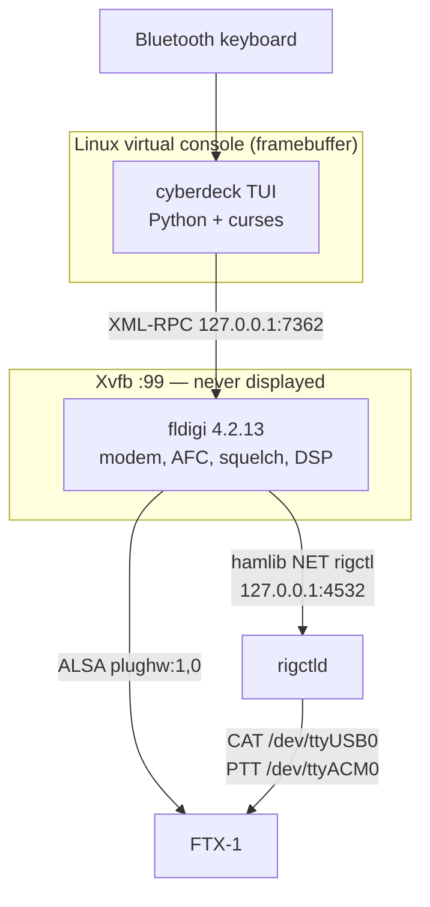
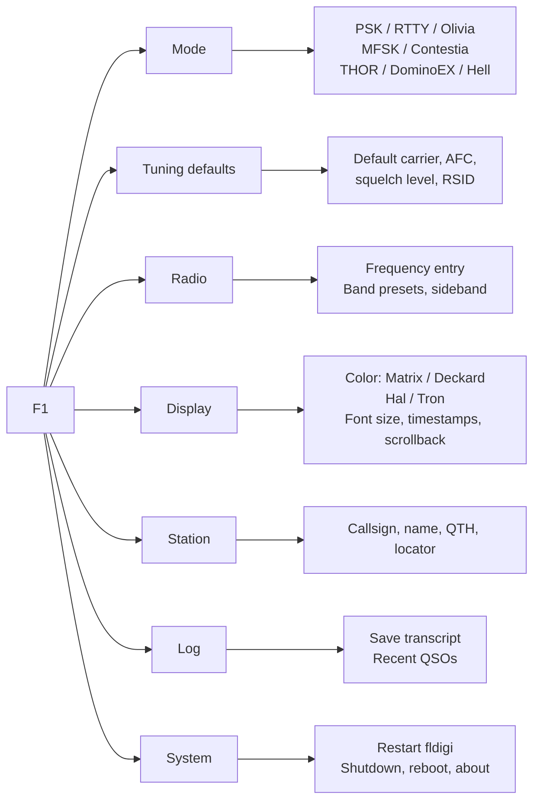

# Keyboard-to-Keyboard Cyberdeck — Design

A self-contained HF/VHF text terminal: a repurposed Raspberry Pi 3A+, a screen, a
Bluetooth keyboard, and a Yaesu FTX-1 on the Pi's single USB port. fldigi runs
headless and does the modem work. A purpose-built terminal front end is the only
thing on the screen.

The target is the feel of a dedicated 1980s packet terminal — monochrome text on
black, no window manager, no mouse, no pointer, nothing to click — over modern
digital modes.

**Status: built, and running on the hardware.** The deck boots on a Pi 3A+ with
its panel, a bonded Bluetooth keyboard, fldigi under Xvfb and audio decoding.
It has not yet transmitted.

Nine modules and six test files, 120 checks, all passing against a live fldigi.
`test_screen.py`, `test_menu_nav.py` and `test_menu_arrows.py` drive the real
application through a pseudo-terminal and read the screen back with a terminal
emulator, so the tests assert on what the deck looks like rather than on
functions in isolation.

Rig control is complete: the band presets and the tuning keys move the radio's
VFO. That needed hamlib 4.7.2 built from source and its native FTX-1 backend,
model 1051 — the packaged 4.6.2 has neither, and the nearest models cannot tune
this radio at all (§7.1).

Section 14 separates what has been verified on the hardware from what is still
assumed, and records three faults that cost real time and are easy to hit
again. Section 15 records the decisions already made and the ones still open.
Section 16 is where to start when this is picked back up.

---

## 1. Purpose

One machine that does one thing: conversational keyboard-to-keyboard QSOs in
fldigi's digital modes, driven entirely from a keyboard, on a screen that shows
the conversation rather than a waterfall and forty widgets.

## 2. Scope

In scope:

* Conversational text modes — PSK, RTTY, Olivia, MFSK, Contestia, THOR,
  DominoEX, Feld Hell.
* Mode switching, carrier tuning, and rig frequency control from the keyboard.
* A transcript of sent and received text, timestamped.
* Four monochrome color schemes, switchable at runtime.

Out of scope for the first build, and worth stating so the design does not drift
toward them: contest logging, ADIF export beyond a plain transcript, WSJT-X-class
weak-signal modes (different workflow entirely), waterfall display, image modes
(wefax, MFSK image), APRS or packet (the other Pi does that), and networked
operation of any kind beyond the radio.

## 3. Hardware

### 3.1 The Raspberry Pi 3A+ and its one USB port

The 3A+ has a single USB-A port wired directly to the SoC's OTG controller, with
no hub chip. This is established from the iGate project on the same board: the
port is sensitive to non-compliant USB-A-to-C adapters, and a Digirig Lite was
not detected on it at all, in either plug orientation, until a powered hub was
added. The FTX-1, by contrast, enumerates on that port directly.

That single port is therefore spent on the radio, and nothing else may need USB.
This is why the keyboard is Bluetooth rather than USB, and why the display must
attach by DSI, HDMI, or GPIO rather than USB.

Other constraints of the board: 512 MB of RAM, no Ethernet, 2.4 GHz WiFi and
Bluetooth 4.2 on board.

### 3.2 The radio

The FTX-1 presents three devices over one USB-C cable. The values below are not
estimates; they are the working configuration from the iGate project on this
same radio and board:

| Function | Device | Setting |
|---|---|---|
| CAT | `/dev/ttyUSB0` (CP2105) | 38400 baud, hamlib rig model 1035 |
| PTT | `/dev/ttyACM0` | separate port from CAT |
| Audio codec | `plughw:1,0` (C-Media) | mono capture and playback |

The two-serial-port arrangement is the awkward part. hamlib's rig initialization
takes one port, so PTT on a second port needs either hamlib's separate-PTT
support or a `rigctld` instance bridging both, which is the approach already
proven on this radio.

### 3.3 Display

**Decided: a 5" capacitive touch DSI panel, 800×480.** It attaches by DSI ribbon,
so it costs neither the USB port nor HDMI.

800×480 on a 5" diagonal is a 5:3 panel roughly 109 mm wide by 65 mm high, a pixel
pitch of 0.136 mm and about 186 DPI. That density is the constraint the layout has
to respect: the obvious 8×16 console font yields 100×30 characters at 1.09 mm per
character cell, which is approximately 3-point type and not readable at any normal
distance.

The console font therefore sets the grid:

| Console font | Grid | Cell width | Roughly |
|---|---|---|---|
| 8×16 | 100 × 30 | 1.09 mm | too small to read |
| 10×20 | 80 × 24 | 1.36 mm | the classic VT100 grid; small but legible |
| **12×24** | **66 × 20** | **1.63 mm** | **proposed default** |
| 16×32 | 50 × 15 | 2.17 mm | very legible, very cramped |

12×24 at 66×20 is the proposed default, with 10×20 and 16×32 offered in the
Display menu. Terminus provides all three sizes as console fonts, applied with
`setfont`. The layout in section 5 is written to adapt to the column count rather
than assume one, so changing font at runtime reflows rather than breaks.

Two consequences of this specific panel:

* **The touchscreen is not used.** A Linux virtual console has no concept of
  pointer input, and adding one would mean X, which the design exists to avoid.
  The touch controller is left unconfigured. This is a deliberate non-use of
  available hardware rather than an oversight; see question 2.
* **Panel power and DSI support both need verifying before anything else is
  built.** Panels in this family commonly draw 5 V from the 40-pin header rather
  than over the ribbon, and DSI panel support on Raspberry Pi OS varies by panel
  and kernel version. A panel that needs USB power would conflict with the radio
  for the single port and would change the hardware plan entirely.

### 3.4 Keyboard

Bluetooth, paired once and reconnecting at boot. Two problems follow from a
headless appliance with no pointer:

* **Pairing** has no UI. Either the pairing is done once during the build and
  baked into the image, or the terminal grows a pairing screen driving
  `bluetoothctl`.
* **Recovery** when Bluetooth fails has no path, because the one USB port holds
  the radio. Unplugging the radio to plug in a keyboard is the fallback, and it
  should be documented rather than discovered.

### 3.5 Power

Undecided; see question 4. A 3A+ with a DSI panel and Bluetooth draws
appreciably more than the iGate build, and a portable deck implies a battery and
a shutdown path that does not corrupt the card.

## 4. Software architecture



### 4.1 Why fldigi runs under Xvfb

fldigi is an FLTK application with no headless mode. It is also thirty years of
well-tested modem work that nothing else replicates. Running it against a virtual
X server costs a few tens of megabytes and gives the whole modem library, its
AFC, its squelch, and its RSID.

The alternative — reimplementing PSK31 and Olivia — is not a first-build
proposition.

### 4.2 The XML-RPC boundary

fldigi exposes 176 XML-RPC methods on `127.0.0.1:7362`. The terminal needs
roughly twenty of them. The full list below was read from fldigi 4.2.13 with
`fldigi --xmlrpc-list`, not from documentation:

| Purpose | Methods |
|---|---|
| Mode | `modem.get_names`, `modem.set_by_name`, `modem.get_name` |
| Carrier and tuning | `modem.get_carrier`, `modem.set_carrier`, `modem.inc_carrier`, `modem.search_up`, `modem.search_down`, `modem.get_quality`, `modem.get_bandwidth` |
| AFC and squelch | `main.get_afc`, `main.set_afc`, `main.get_squelch`, `main.set_squelch`, `main.get_squelch_level`, `main.set_squelch_level` |
| Received text | `text.get_rx_length`, `text.get_rx(start, length)`, `text.clear_rx` |
| Transmitted text | `text.add_tx`, `text.add_tx_queu`, `text.clear_tx` |
| Transmit control | `main.tx`, `main.rx`, `main.abort`, `main.get_trx_state`, `main.rx_only` |
| Status readouts | `main.get_status1` (S/N), `main.get_status2` (IMD) |
| Rig | `rig.get_frequency`, `rig.set_frequency`, `rig.get_mode`, `rig.get_modes` |
| Lifecycle | `fldigi.name_version`, `fldigi.terminate` |

`text.get_rx` returns base64 (XML-RPC type `6`), so received text is decoded
rather than used directly.

`main.rx_only` is the transmit inhibit for section 9.

### 4.3 The terminal front end

Python 3 with `curses`, running on a Linux virtual console against the
framebuffer. No X, no terminal emulator, no window manager. The console is where
the retro look comes from for free: a fixed character grid, a hardware text
cursor, and a sixteen-color palette that can be redefined.

A single process with two threads: one polling fldigi, one reading the keyboard.
Polling rather than pushing, because XML-RPC has no subscription mechanism —
`text.get_rx_length` is cheap, and a poll every 200 ms is imperceptible in a
conversation typed at 30 words per minute.

## 5. The interface

### 5.1 Layout

At the proposed 66×20 grid. These are rendered from the running code, not
drawn by hand: `capture_screens.py` produces the text and `capture_png.py`
renders it to PNG using each scheme's own colors.


`[RX 47]` is the buffer indicator described in section 5.4: 47 characters
composed while receiving, not yet transmitted.

Three regions, fixed:

1. **Status line**, one row, always visible.
2. **Transcript**, everything between, scrolling upward.
3. **Compose**, one to three rows at the bottom with the cursor in it.

### 5.2 Status line fields

Left to right: own callsign, rig frequency, modem name, audio carrier, S/N,
transmit state, UTC.

Sideband and IMD are cut to fit 66 columns; both are available in the tuning
screen, which has room. At 80 or 100 columns they return. Transmit state is the
one field that changes appearance rather than only content — see section 9.

### 5.3 Transcript

Received text arrives character by character, so a line is rendered as it
arrives rather than buffered until complete. Sent text is interleaved in the same
column layout, distinguished by the callsign column rather than by color, since
the display is monochrome.

Timestamps in UTC without colons — `2114Z` — because it reads as a radio log and
saves two columns.

Scrollback is bounded in lines, held in memory, with `PgUp`/`PgDn` to review and
any keypress in the compose line returning to the live tail.

### 5.4 Compose, and how an over works

**Decided: the over-based model, which is both fldigi's norm and the on-air
norm.** It is not line-and-Enter, and the reasoning is worth recording because
line-and-Enter is the intuitive guess.

HF digital is half-duplex with long overs. One station transmits a paragraph and
hands back; the other cannot type meanwhile, and every turnaround costs seconds of
transmitter and receiver settling. Sending a line at a time would key the rig
dozens of times per QSO to no purpose. The convention across PSK, RTTY, Olivia,
MFSK and the rest is identical — there is no per-mode default to inherit.

The cycle:

| Step | Key | What happens |
|---|---|---|
| Compose while receiving | — | Text accumulates in the buffer. Nothing is transmitted. `Enter` inserts a newline; it does not send |
| Start the over | `Ctrl-T` | `text.add_tx` sends the buffer to fldigi, `main.tx` keys the rig. Typing continues to go out live, character by character |
| Hand back | `Ctrl-K` | Appends fldigi's inline `^r` control, which drops to receive once the buffer has drained rather than cutting it off |
| Abort | `Ctrl-C` | `main.abort`, immediately |

The live-typing half of step 2 is the thing that makes this keyboard-to-keyboard
rather than messaging: the other operator watches the text appear as it is typed,
corrections included.

**Latency varies by mode even though the mechanism does not.** PSK31 and RTTY put
characters on the air essentially as typed. Olivia and MFSK interleave across
several seconds, so text arrives at the far end in lumps regardless. The status
line shows transmit state; it cannot show how far behind the far end is.

The compose region carries a buffer indicator — `[RX 47]` while receiving with 47
characters composed, `[TX]` while the buffer is going out — so the state is never
ambiguous. Question 5 asks whether a local-only chat variant is wanted for VHF
work, where Enter-sends is reasonable because turnarounds are cheap.

### 5.5 Key bindings

| Key | Action |
|---|---|
| `F1` | Menu |
| `F2` | **Toggle chat screen / tuning screen** |
| `F3` | Mode picker |
| `F4` | Cycle color scheme |
| `Ctrl-T` | Start the over |
| `Ctrl-K` | Hand back — append `^r`, drop to receive when the buffer drains |
| `Ctrl-C` | Abort transmit immediately |
| `PgUp` / `PgDn` | Scroll the transcript |
| `Ctrl-L` | Redraw |
| `Esc` | Close any panel; from the tuning screen, back to chat |

`F2` is a full-screen mode toggle rather than an overlay, for the reason in
section 8: on a 66-column panel a tuning display worth reading does not fit
alongside a conversation worth reading.

Function keys beyond `F4` are unassigned and are the natural home for macros
(question 8).

### 5.6 Menu tree



Menus are full-screen overlays with single-key selection, not nested pointers.


### 5.7 Color schemes

Four, each a single hue on black:

| Scheme | Hue | Bright | Dim | Evokes |
|---|---|---|---|---|
| **Matrix** | green | `#00FF41` | `#00A62A` | the digital rain; a more saturated green than P1 phosphor |
| **Deckard** | amber | `#FFB000` | `#B27B00` | P3 phosphor, the Esper and the VDUs around it |
| **Hal** | red | `#FF3B30` | `#A62018` | the 9000-series eye; also the night-vision scheme |
| **Tron** | cyan-blue | `#00D9FF` | `#0089A8` | the Grid |

Two of these carry a legibility caveat worth recording rather than discovering.

**Hal is the least legible of the four.** Red has the lowest luminance of any
saturated hue, so red-on-black has the poorest contrast here even at full
brightness. That is inherent to the choice and is also the point — it is the
scheme for operating at night without wrecking dark adaptation. It is not the one
to default to.

**Tron is cyan-shifted deliberately.** A true blue on black (`#0000FF`) is close
to unreadable as body text: the eye has few blue-sensitive cones near the fovea
and the shorter wavelength focuses differently from the rest of the image, so
blue text on black shimmers. Pulling it toward cyan keeps the Tron look and gives
it luminance to work with.

**Matrix is the proposed default** — green on black has the best contrast of the
four and the longest history as a terminal phosphor.

The same screen in each, rendered at the schemes' own hex values rather than a
terminal emulator's approximation of them:

| | |
|---|---|
| Matrix | Deckard |
|  |  |
| Hal | Tron |
|  |  |

Monochrome means one hue, not one intensity. Emphasis comes from the dim
variant and from reverse video: the status line is reverse, own transmissions
and received text are full brightness, timestamps and the callsign column are
dim.

**Two corrections from running it on the panel**, both the same mistake:

* Reverse video must be a colour pair defined outright as **black on the hue**,
  not a normal pair plus `A_REVERSE`, and never with `A_BOLD`. Combining the
  two puts the bold intensity on what becomes the background, and the status
  line renders as a solid block of colour with text the same hue as the bar it
  sits on — unreadable, and indistinguishable from an empty bar.
* **Menu selection is not reverse video.** Even done correctly it disappeared
  into its own highlight on this panel. Selection is a `▸` marker plus a step
  from dim to bright, which carries the same information without depending on
  how a console renders an attribute.

* **The palette redefinition was addressing nothing.** `apply()` wrote the
  `OSC P` sequences for slots 8 and 9, then built its color pairs out of
  `scheme["ansi"]` — so nothing ever drew with the slots it had just defined.
  Every scheme rendered as its ANSI approximation. Matrix, Hal and Tron
  survived that, because ANSI green, red and cyan are close enough to the
  intent; **Deckard did not**, because amber is precisely the hue ANSI cannot
  approximate. This document predicted that outcome as the fallback behaviour
  and then the code delivered it everywhere. The pairs now name slots 8 and 9
  directly when the console reports 16 colors, and the intensity attributes
  are dropped in that mode — on a Linux console `A_BOLD` shifts the foreground
  into the 8-15 range, which would move text straight back off the slot the
  scheme had just defined.

The general rule the panel taught: on a console whose attribute handling is not
under test, encode state in *characters and intensity*, and use filled bars
only where the contrast is defined explicitly.

A second rule, from all three of these: **the PNG screenshots cannot catch
them.** `capture_png.py` draws with the schemes' hex values directly, so it
renders what was intended rather than what the console produces. It is a
design record, not a test. Every one of these three faults was invisible in the
screenshots and obvious on the panel.

Each scheme redefines two Linux console palette entries — one bright, one dim —
with `OSC P` escape sequences (`\033]P<index><rrggbb>`), leaving black as
background. This is what allows a true amber and a true Matrix green rather than
the ANSI approximations of yellow and green, and it is why switching schemes at
runtime is a matter of emitting four escape sequences rather than repainting.
Verification is pending; see section 14.

`F4` cycles Matrix → Deckard → Hal → Tron. The Display menu selects directly, and
`COLOR` in the configuration file sets the scheme at boot.

## 6. Modes

fldigi 4.2.13 reports 169 modems, of which 64 are conversational. Offering all 64
in a menu makes the menu the problem. The proposal is a curated first tier with
the rest reachable under "more":

| Tier | Modems | Rationale |
|---|---|---|
| First | BPSK31, BPSK63, QPSK31, RTTY, Olivia 8/250, Olivia 8/500, MFSK16, THOR22, Contestia, DominoEX (DOMEX8), Feld Hell, CW | Covers ordinary HF keyboard work |
| More | The rest, grouped by family | Complete, and never in the way |

**CW was missing from both tiers and that was a bug, not a choice.** The family
filter that builds the full list had no `CW` prefix, so the mode was
unreachable from the deck at all while "more modes" claimed to be the complete
conversational set. CW is keyboard-to-keyboard operating — the original form of
it — and fldigi offers it as a modem like any other.

Selecting it does **not** put the radio into CW mode: `RIG_MODE` is applied at
startup and on band change, not on modem change, so fldigi sends an audio tone
through the data path. That is workable and common, but it does not use the
radio's CW filters. Making a modem change drive the rig mode is a plausible
future behaviour and is deliberately not done yet — it would mean the deck
reaching for the radio's controls on every menu selection.

Mode changes take effect immediately via `modem.set_by_name` and are recorded in
the transcript as a marker line, since a mode change mid-QSO is part of the
conversation.

## 7. Rig control

`rigctld` runs as a separate service on `127.0.0.1:4532` with rig model 1035, CAT
on `/dev/ttyUSB0` at 38400, and PTT on `/dev/ttyACM0`. fldigi connects to it as
hamlib "NET rigctl" rather than opening the serial ports itself.

This reuses a configuration already proven on this radio, keeps the two-port PTT
arrangement in one place, and means the terminal can read frequency through
fldigi rather than opening a second connection to the radio.

### 7.1 The shipped hamlib cannot tune this radio — resolved

Reading is sound: frequency, mode and the signal figures track the radio, and
turning the VFO knob moves the deck's display.

Setting frequency does not work at all on hamlib 4.6.2, which is what
Raspberry Pi OS Trixie ships. `newcat_set_freq` under model 1035 builds

    FA14075000;

— `FA` and **eight** digits. The FTX-1's CAT manual specifies nine,
zero-padded, and the radio's own replies use nine (`FA014070000;`). The short
form is discarded silently: no error, no change, and the deck's display reverts
to the radio's real frequency on the next poll, which presents as the deck
fighting the radio rather than as a malformed command.

Every frequency path is affected — the band presets, the tuning screen's VFO
keys, and anything fldigi attempts through hamlib.

This is [Hamlib issue #2219](https://github.com/Hamlib/Hamlib/issues/2219).
The cause is that `width_frequency` falls back to 0 when lazy initialization
through `newcat_get_vfo_mode()` fails — and on this radio it does fail, with a
protocol error, immediately before the malformed command. Models 1042 and 1049
are affected identically, which is why trying the FT-710 changed nothing.

**The fix is hamlib 4.7.1 or later, and a different model.** 4.7.1 added a
native FTX-1 backend — `rigs/yaesu/ftx1.c`, **model 1051**, still marked Beta —
with separate modules for frequency, mode, filters, memory and the clarifier.
4.7.2 carries further FTX-1 fixes. Neither is packaged for Trixie, so §13's
first-boot step builds 4.7.2 from source.

Confirmed on the deck: `rigctl -m 1051` sets the frequency and the dial moves,
and `F1 3 1` from the deck's own keyboard now tunes the radio.

Three things were each individually necessary and each silently ineffective
alone:

* **The binary.** `/usr/bin/rigctld` is still the packaged 4.6.2.
* **`LD_LIBRARY_PATH=/usr/local/lib`.** `ldconfig` is not enough: the cache
  lists the multiarch directory ahead of `/usr/local/lib`, so a freshly built
  `rigctl` reported `4.6.2` and offered no FTX-1 model until the path was
  forced. This is the easiest of the three to miss, because everything looks
  installed.
* **The model.** 1051 does not exist before 4.7.1.

**A footnote on how this was nearly mis-diagnosed.** An early test on hamlib
4.6.5 against a simulated rig produced a correctly padded command, which looked
like evidence that any newer version would do. It was not: the simulator
answered `newcat_get_vfo_mode()` successfully, and that success is exactly what
the real radio does not provide. The lesson is narrow and worth keeping — a
test fixture that does not reproduce the failing condition proves nothing about
the failure.

`rigctld_client.py` carries a workaround from before the backend was found:
rigctld's `w` (send_cmd) forwards a raw CAT string, so the deck could send the
documented nine-digit form itself. It is **not wired in** and should be deleted
once 1051 has some hours on it. It is kept for now only because the FTX-1
backend is Beta.

## 8. Tuning

Two different things get tuned, and conflating them is what made this look like
the hardest problem in the design. It is not.

**1. Where the receiver's passband sits — the radio's job.** The FTX-1 has its
own spectrum scope and waterfall, and rendering a spectrum on an 800×480 panel
from a 512 MB Pi was never going to beat it. Choosing a band segment and seeing
whether 14.070 is busy happens on the radio's display, where it has always
happened.

**2. Which signal inside the passband fldigi decodes — the deck's job.** fldigi
demodulates one narrow signal at one audio frequency within the 3 kHz passband.
The radio's waterfall shows RF and cannot set that audio carrier.

The operating technique that connects the two, and makes the second one nearly
free:

> Park fldigi's carrier at a fixed audio offset — 1500 Hz — and leave it there.
> Use the radio's waterfall and VFO to bring the wanted signal to that offset.
> AFC holds it once it is close.

### 8.1 That technique does not survive contact with the radio

It is ordinary practice with narrow filters and it reads well. In use it is the
wrong way round.

The FTX-1's narrowest waterfall span is about **5 kHz**. Across a few hundred
pixels that is tens of hertz per pixel, and a BPSK31 signal is 31 Hz wide — one
pixel, perhaps two. Landing that on a specific audio offset by turning a knob
and watching a display at that scale is not a task the operator should be given.

The inversion is this: **hold the VFO still and move the carrier.** fldigi's own
`modem.search_up` / `search_down` find the next signal in the received audio
and land the carrier on it to the hertz, which no amount of knob-turning
matches. The dial is then set once per band and left alone, and the VFO knob is
for changing bands or for reaching activity outside the current passband.

So the deck binds `↑` `↓` to search and `←` `→` to a ten-hertz nudge, and binds
them **on the conversation screen as well as the tuning screen**. That second
part matters more than it looks: the tuning screen shows the carrier but hides
the transcript, so tuning there is done blind. A carrier number that looks
right while nothing decodes is not tuned. The decoded text is the only
confirmation that counts, so the keys have to work where the text is.

The consequence for the operator is a shorter procedure than the original
technique: set the band, press `↑`, read.

Two things the deck has to say out loud, because there is no waterfall to make
them obvious:

* A carrier move produces **nothing** on the radio — no dial change, no
  waterfall shift. Without a spectrum display, a key that changes an invisible
  number is indistinguishable from a dead key.
* A search that finds nothing has to say so. `search up: nothing found above
  the squelch; still 1832 Hz` separates a quiet band from a broken binding.

Three fldigi facilities back it up when the offset technique is inconvenient:

* **RSID** (`main.set_rsid`) acts on a Reed-Solomon Identifier: a short burst a
  station sends ahead of its over encoding the mode *and* the audio frequency.
  With it on, the deck switches to match, which on a quiet band is the whole
  problem solved without touching anything.

  It is the nearest thing fldigi has to automatic mode detection, and the
  distinction matters: **nothing is deduced from the signal itself**. A station
  that sends no identifier is not followed, and a mode has to be found by hand
  as before. fldigi has no blind mode recognizer.

  **TXID** (`main.set_txid`) is the other half and a separate setting: it sends
  an identifier ahead of the deck's own overs so that others can follow it.
  Both are exposed on the tuning screen, `r` and `x`. Leaving RSID on while
  TXID is off is taking without giving.
* **`modem.search_up` / `search_down`** step to the next detected signal within
  the passband.
* **`modem.get_quality`**, 0–100, gives a number to peak against — tuning by
  meter rather than by eye.

**No software spectrum is built.** fldigi's XML-RPC does not expose its FFT, so
rendering one would mean reading the audio separately, which would mean sharing
the ALSA capture device with fldigi through `dsnoop`. That complexity buys a
worse version of a display the radio already has.

### 8.2 The tuning screen

`F2` toggles the whole screen between chat and tuning, rather than overlaying a
panel. On 66 columns a tuning display worth reading and a conversation worth
reading do not coexist.

Since §8.1 moved tuning onto the conversation screen, this screen's job has
narrowed: it is for **reading the numbers**, not for tuning. Carrier, signal
width, S/N, IMD and the quality bar in one place, for answering *how good is
this decode* — a question the transcript alone does not answer.


The quality bar refreshes several times a second. Almost everything here is a
readout from fldigi or `rigctld`, with one exception worth naming:
**signal width is partly computed by the deck**, because `modem.get_bandwidth`
returns 0 for every fixed-bandwidth mode — BPSK31, RTTY, Olivia — and a figure
only where bandwidth is a settable modem parameter, such as Hell. Displaying
that 0 asserts BPSK31 is zero hertz wide. The deck substitutes the definitional
figures only: the PSK family from its symbol rate, Olivia and Contestia from
the name, where the second number *is* the bandwidth. Everything else shows an
em dash rather than a number quoted from memory.

Received text continues to accumulate in the transcript while the tuning screen
is up, and the transcript is intact on return.

## 9. Transmit safety

A keyboard-driven transmitter with no pointer needs its transmit state to be
unmistakable and its stop path to be immediate.

* **State is visible without reading.** On transmit, the status line inverts
  across the full width. A dim screen with one bright bar is legible from across
  a room.
* **`Ctrl-C` aborts** via `main.abort`, at any time, from any panel, including
  while a menu is open.

  This did not work as written, and the failure was the worst possible shape.
  `curses.wrapper` leaves the terminal in `cbreak`, where the driver still
  turns `Ctrl-C` into `SIGINT` — so it never reached the handler waiting for
  byte 3, and Python unwound with a `KeyboardInterrupt` traceback. On the one
  key whose entire job is to stop a transmission. The terminal now runs in
  `raw` mode, and the main loop drops PTT in a `finally` so that a crash, a
  clean exit and a signal all leave the radio unkeyed.

* **Transmit starts inhibited at every power-on.** A deck that lives in a bag
  should not come up able to key a radio attached to an unknown antenna; an
  extra keystroke before the first over is a small price. `INHIBIT_ON_START`.
* **A transmit time-out.** If transmit has been active longer than a configured
  limit, the terminal calls `main.abort` and records it. The radio's own
  time-out timer is the backstop, not the primary.
* **Inhibit, enforced locally.** The terminal refuses to key at all while
  inhibited: `start_over` returns without calling fldigi. fldigi's own
  `main.rx_only` is set as well, but is not relied on — it was observed not to
  stop `main.tune`, which keyed for ten consecutive samples with the inhibit
  set. A safety property that depends on another process behaving as
  documented is not a safety property.
* **Startup is receive-only** until the rig reports a frequency, so a
  misconfigured rig cannot be keyed blind.

## 10. Boot and service model

Three systemd units, mirroring the iGate's structure:

| Unit | Does |
|---|---|
| `cyberdeck-fldigi.service` | Xvfb, then fldigi against it, with a seeded config directory |
| `cyberdeck-rigctld.service` | `rigctld` for the FTX-1 |
| `cyberdeck-ui.service` | The terminal on `tty1`, `Restart=always` |

The terminal starts on `tty1` with no login, no getty, and no console messages —
`quiet loglevel=0 vt.global_cursor_default=0` on the kernel command line, so the
boot is blank and the terminal simply appears.

An SD card treated as the iGate's is: runtime state in RAM, journal volatile,
swap in compressed RAM. The iGate's experience adds one lesson to carry over
deliberately — a volatile journal means a reboot destroys the evidence of
whatever went wrong, so anomalies worth diagnosing later are written to a small
file outside the tmpfs.

## 11. Configuration

One file, `cyberdeck.conf`, read at start, in the same `KEY = value` form as the
iGate's configuration so the two projects read alike:

```
CALLSIGN = KD3CCO
NAME = Don
QTH = State College, PA
LOCATOR = FN10cs

DEFAULT_MODE = BPSK31
DEFAULT_CARRIER = 1500
COLOR = matrix          # matrix | deckard | hal | tron

RIG_MODEL = 1035
CAT_DEVICE = /dev/ttyUSB0
CAT_BAUD = 38400
PTT_DEVICE = /dev/ttyACM0
AUDIO_DEVICE = plughw:1,0

TX_TIMEOUT = 180
SCROLLBACK = 2000
POLL_MS = 200
```

## 12. Failure modes

| Failure | Symptom | Handling |
|---|---|---|
| fldigi dies | Status line shows `NO MODEM`, transcript keeps its history | Terminal reconnects on a timer; systemd restarts fldigi |
| XML-RPC stops answering while fldigi lives | Status line freezes | Call timeout of 2 s, then reconnect; never block the keyboard thread |
| Bluetooth keyboard drops | No input | Status line shows `NO KBD`; terminal keeps running and reconnects |
| Radio unplugged | fldigi loses its audio device | Status line shows `NO RADIO`; transmit inhibited until it returns |
| rigctld dies | Frequency field shows `----` | Terminal keeps working; mode and carrier are unaffected |
| SD card full | Transcript writes fail | Transcript is in RAM; a bounded file is flushed on QSO end only |

The principle throughout: the keyboard and the transcript keep working even when
the radio side does not, because a terminal that freezes is worse than one that
says what is missing.

## 13. Build phases

Each phase ends with something demonstrable.

| Phase | Ends with | |
|---|---|---|
| 1 | fldigi headless under Xvfb, answering XML-RPC | **done**, laptop and deck |
| 2 | A Python client that prints received text and sends a typed line | **done** |
| 3 | The curses layout with live status, transcript and compose | **done** |
| 4 | The four color schemes and the F1 menu tree | **done** |
| 5 | Running on the deck's own screen and Bluetooth keyboard, autostarting at boot | **done** |
| 6 | The tuning panel and RSID, evaluated on the air | receive only; see §7.1 |
| 7 | An image build script producing the card unattended, as the iGate has | **done**, run end to end |

Phase 6 is the only one outstanding, and it is blocked on rig control rather
than on anything in this document: frequency cannot be set on the shipped
hamlib (§7.1), and nothing has been transmitted.

## 14. Verified, and assumed

Separated deliberately, because the difference decides what can break late.

**Verified on this laptop, against fldigi 4.2.13:**

* `main.rx_only` does **not** inhibit `main.tune`: with the inhibit set, tune
  keyed and stayed keyed across ten consecutive state samples. §9 was written
  assuming otherwise and has been corrected.

* fldigi runs under `Xvfb` with no display attached and answers XML-RPC on
  `127.0.0.1:7362`.
* 169 modems are available, of which 64 are conversational text modes; the first
  tier in section 6 all exist under those exact names.
* The method inventory in section 4.2 is real, read from `--xmlrpc-list`.
* `modem.get_carrier`, `main.get_trx_state`, `text.get_rx_length` and
  `modem.get_quality` answer correctly on a running instance.
* **fldigi crashes on a fresh, empty config directory** — an assertion failure in
  `std::string` during first-run setup, reproducible twice. A working config
  directory must be seeded into the image. This would otherwise have been found
  on the first boot of the finished deck.

**Verified previously, on this radio and this board, in the iGate project:**

* The FTX-1 enumerates on a Pi 3A+'s single USB port and presents CAT on
  `/dev/ttyUSB0`, PTT on `/dev/ttyACM0`, and audio on `plughw:1,0`.
* hamlib rig model 1035 drives it.
* The 3A+'s OTG port is sensitive to adapters and cannot power some devices.

**Verified on the deck itself, on the first build:**

* **The Waveshare 5" DSI panel drives a framebuffer console on a 3A+**, using
  `dtoverlay=vc4-kms-dsi-7inch`. The name is not a mistake: Waveshare's 800×480
  DSI panels match the official 7" panel's timing and share its overlay. There
  is no `5_0_inch` parameter under `vc4-kms-dsi-waveshare-panel`, which covers
  their panels that are *not* 800×480.
* **The panel takes its power from the DSI connector**, about 1.2 W. It does
  not compete for the USB port.
* fldigi under Xvfb, Python and the terminal **fit 512 MB** with the radio
  attached and services running.
* Bluetooth keyboard latency on a 3A+ is fine for typing.
* The whole first-boot install — fldigi, Xvfb, hamlib, fonts — completes over
  WiFi in about five minutes.
* Raspberry Pi OS Trixie ships **fldigi 4.2.06**, not the 4.2.13 this was
  developed against. Every XML-RPC method the deck uses is present in both.

**Discovered on the deck, and not anticipated anywhere in this document:**

* **Both radios ship rfkill-blocked on a Pi 3.** `/var/lib/systemd/rfkill/`
  holds `platform-3f300000.mmcnr:wlan` and
  `platform-soc-amba-3f201000.serial:bluetooth`, both set to `1`. Setting the
  regulatory domain does **not** clear the block. The symptom is four apparently
  separate faults — no package install, no fldigi, no keyboard, no mDNS, wrong
  clock — all from one cause. §10 now unblocks both before NetworkManager.

* **An LE keyboard will not deliver input over an unbonded link.** The pairing
  script reported success on `Connected: yes` while `Paired: no, Bonded: no`,
  and the keyboard typed nothing. HID over LE requires an encrypted, bonded
  link, and bonding a keyboard requires a passkey displayed by the host and
  typed on the keyboard — which cannot be automated, and should not be: it is
  what proves the device is a keyboard. First bonding is therefore a manual
  step, and the service's real job is reconnecting an already-bonded keyboard.
  The script also ran each `bluetoothctl` command as a separate process, so the
  agent it registered was gone before pairing began.

* **Hamlib 4.6.2 cannot tune this radio, and has no backend for it.** With
  model 1035 (FT-991), the closest model that reads the FTX-1 correctly,
  `newcat_set_freq` builds `FA14075000;` — eight digits where the CAT manual
  specifies nine, zero-padded. Discarded with no error; reads unaffected.
  Models 1049 and 1042 fail identically. Resolved by building hamlib 4.7.2,
  whose native FTX-1 backend is model 1051 (§7.1). Three separate things had to
  be right — the binary, the library search path, and the model — and each was
  silently ineffective alone.

* **Power-cycling the radio renumbers its serial ports.** The CP2105 detaches
  and the kernel assigns the next free numbers on re-attach, so CAT moves from
  `ttyUSB0` to `ttyUSB1`. Every path in this project now uses
  `/dev/serial/by-id/`, where `-if00` and `-if01` also distinguish the two
  otherwise identical UARTs — something matching on USB vendor:product cannot
  do.

**Still assumed, and not yet tested:**

* **Terminus 12×24, 10×20 and 16×32 console fonts** switch at runtime with
  `setfont` without disturbing a running curses application. The 12×24 default
  renders; the others have not been tried.
* `OSC P` palette redefinition works on this panel's console, so a true amber
  is available rather than the ANSI approximation of yellow.
* Whether `main.tx` keys reliably under XML-RPC control. Nothing has been
  transmitted from the deck at all. The design does not depend on the answer,
  since the inhibit is enforced in the terminal, but every transmit path is
  untested against a radio.

---

## 15. Decisions and open questions

### 15.1 Settled

| Decision | Resolution | Section |
|---|---|---|
| Display | 5" capacitive touch DSI, 800×480, at 12×24 giving a 66×20 grid | 3.3 |
| Transmit model | Over-based: compose while receiving, `Ctrl-T` to start, `Ctrl-K` to hand back. `Enter` is a newline, not a send | 5.4 |
| Tuning | The radio's own waterfall for RF; a parked audio carrier with AFC and RSID for the modem. No software spectrum | 8 |
| Color schemes | Matrix, Deckard, Hal, Tron — four hues on black, Matrix the default | 5.7 |
| Modem engine | fldigi headless under Xvfb, driven over XML-RPC | 4 |
| Front end | Python curses on a bare framebuffer console. No X, no window manager, no pointer | 4.3 |
| Rig control | `rigctld`, model 1035, reusing the iGate's proven FTX-1 configuration | 7 |

### 15.1a Found while building

**Squelch is not optional.** With the squelch open, fldigi decodes the noise
floor continuously and the transcript fills with random characters within
seconds — observed on the bench with no radio attached at all. It is not a
fault and it is not cosmetic: a terminal whose conversation is buried under
decoded noise is unusable. The deck should start with squelch on, and the
tuning screen already exposes the level. Whether to enforce a minimum at
startup is an open question.

**`main.rx_only` does not inhibit `main.tune`.** See §9 and §14; the inhibit is
now enforced in the terminal instead.

**The hint line has to shed bindings, not be truncated.** At 66 columns the
full list of seven overflows by one character and renders as `^C abor`, which
is worse than showing fewer hints. `render.hint_line` drops whole bindings in
priority order down to 12 columns.

### 15.2 Open

#### Hardware

**1. Which console font size is the default?** 12×24 gives 66×20 and is proposed.
10×20 gives the classic 80×24 and is noticeably smaller on a 5" panel; 16×32
gives 50×15, very legible, and leaves about twelve lines of conversation. Worth
deciding by looking at the panel rather than on paper.

**2. The panel is capacitive touch and the design does not use it.** A console has
no pointer, and using touch would mean X. Leave it unused, or is there one thing
worth having it for — scrolling the transcript, or a keyboard-free abort?

**3. Which Bluetooth keyboard, and should the deck be able to pair one itself?**
Baking a pairing into the image is simpler; a pairing screen is more useful if the
keyboard is ever replaced away from home.

**4. Battery or mains?** A battery changes the design: a charge indicator in the
status line, a low-battery shutdown, and a case that holds a pack.

#### Interface

**5. Is a local chat variant wanted?** On VHF simplex with a strong signal,
turnarounds are cheap and Enter-sends-immediately is a reasonable way to work —
closer to messaging than to an HF QSO. Worth a switchable behavior, or does one
model for everything keep it honest?

**6. Is 1500 Hz the right parking offset?** It is the common default and sits
comfortably inside any SSB passband. A fixed offset is what makes the
radio's-waterfall technique work, so it wants choosing once and leaving alone.

**7. Should the transcript separate the two stations into columns, or interleave
them?** Interleaved with a callsign column is proposed. A split screen — remote
above, own below — is the other tradition, and is easier to read at a glance on a
small display.

**8. Macros.** `F5`–`F12` are free. Worth defining CQ, a signal report, a brag
tape, and a sign-off? If so, what text, and should they be editable on the deck or
only in the configuration file?

**9. What belongs in the status line at 66 columns?** Section 5.2 currently cuts
sideband and IMD to fit. What gets cut next if something else has to go in?

#### Operation

**10. Should the deck log QSOs?** A plain text transcript per QSO is cheap. ADIF
that can be merged into a main log is more work and implies capturing callsign,
RST and times, which implies fields to fill in, which implies more interface.

**11. Band and frequency control.** Should the menu carry presets for the usual
digital watering holes — 14.070, 7.070, 3.580, 10.142, 21.070 — or is direct
numeric entry enough?

**12. Transmit time-out.** What limit? 180 seconds is proposed, which is long for
a keyboard QSO and short enough to matter if something hangs.

#### Scope

**13. Does the deck need WiFi at all once built?** Leaving it off is one less
radio in the case and one less attack surface; leaving it on means updates and
SSH without opening anything.

**14. Is a second radio ever in scope?** The design assumes the FTX-1 exclusively.
Making the radio a profile, as the iGate does, costs little now and a great deal
later.

---

## 16. Picking this back up

Everything the original version of this section listed as a gating unknown has
been answered. The panel works, the overlay is `vc4-kms-dsi-7inch`, the panel
draws its 1.2 W from the DSI connector, and the deck boots to its terminal with
the keyboard bonded and fldigi decoding.

**Nothing is blocked. In order:**

1. **Make a contact.** Nothing has been transmitted from this deck. The over
   model, PTT, the transmit time-out and `Ctrl-C` against a live carrier are
   all written and unit-tested and none has keyed a radio. Test into a dummy
   load first, and confirm `Ctrl-C` unkeys before relying on it.
2. **Confirm the transmit audio path.** Receive is proven; transmit is not.
   Set the radio to its data mode, set drive for zero ALC, and check IMD.
3. **The remaining console-font question:** 10×20 and 16×32 at runtime via
   `setfont`, without disturbing the running curses application. The 12×24
   default renders correctly.
4. **Verify the color schemes on the panel — Deckard especially.** The palette
   redefinition was addressing nothing until it was corrected (§5), so every
   scheme was rendering as its ANSI approximation and the amber came out as a
   washed yellow. The corrected version has **not yet been seen on the panel**;
   the PNG screenshots cannot confirm it, since they draw from the hex values
   directly.

**Worth doing when convenient:**

* Set a timezone in the build. The deck defaults to Europe/London, so journal
  timestamps sit an hour off local without anything being wrong. The deck's own
  clock is UTC by design and is unaffected.
* A `DECK_PERSISTENT_JOURNAL` setting. The build puts the journal in RAM to
  spare the card, which is right for normal use and exactly wrong while
  bringing hardware up — the boot that failed left no log to read.
* An RTC. The 3A+ has none, so the clock is wrong until NTP, and wrong for the
  whole session anywhere without WiFi. That matters for logging.

**What not to re-derive**, because it cost time to find and is easy to hit
again: the rfkill block on both radios, the LE bonding passkey requirement, and
the eight-digit frequency command. All three are in §14.
