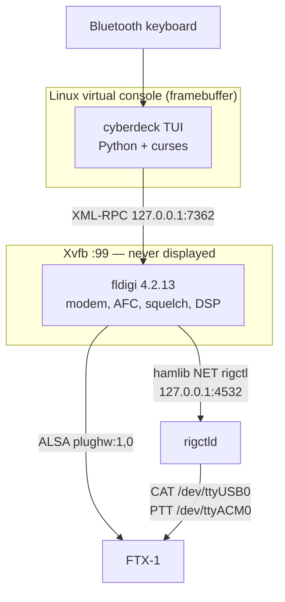
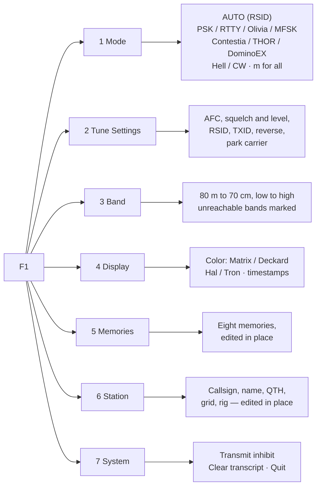
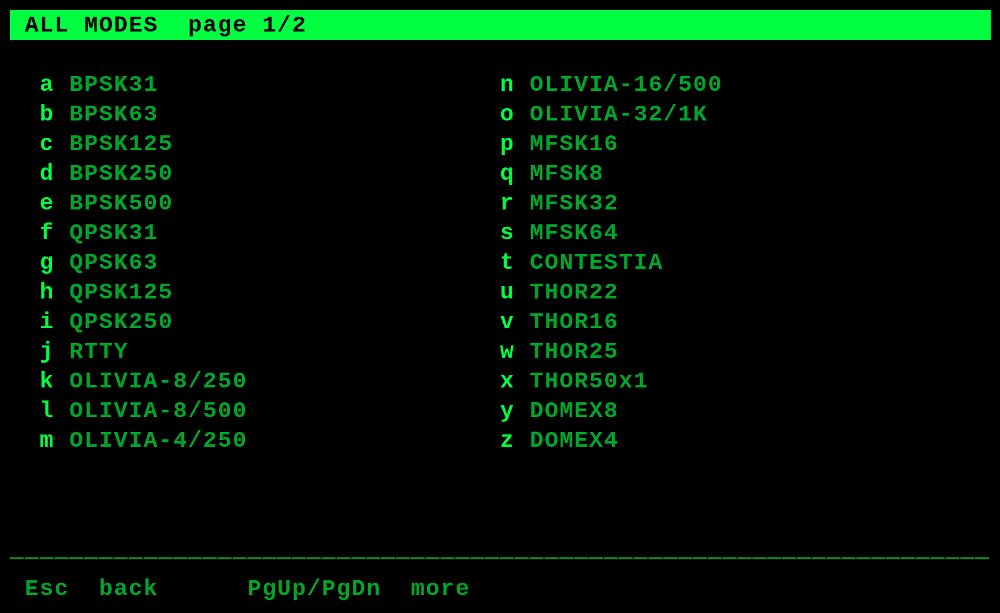

# Keyboard-to-Keyboard Cyberdeck — Design

A self-contained HF/VHF text terminal: a repurposed Raspberry Pi 3A+, a screen, a
Bluetooth keyboard, and a Yaesu FTX-1 on the Pi's single USB port. fldigi runs
headless and does the modem work. A purpose-built terminal front end is the only
thing on the screen.

The target is the feel of a dedicated 1980s packet terminal — monochrome text on
black, no window manager, no mouse, no pointer, nothing to click — over modern
digital modes.

**Status: working, and on the air.** The deck boots on a Pi 3A+ with its panel,
a bonded Bluetooth keyboard, fldigi under Xvfb, rig control in both directions,
and five contacts to its name: **N3QE** and **K4ZW** on 80 m RTTY, 2026-09-19;
**N0DLR** and **KC3FL** on 20 m BPSK31, 2026-09-20; and **FM4TI** in
Martinique on 40 m BPSK31, 2026-09-21 — the first DX, and the first contact
above QRP.

Eleven modules and thirteen test files, **436 checks**, all passing against a live
fldigi (`tools/run_tests.sh`). Six of them — `test_screen.py`,
`test_menu_nav.py`, `test_menu_arrows.py`, `test_console_keys.py`,
`test_screen_toggles.py` and `test_state.py` — drive the real application
through a pseudo-terminal and read the screen back with a terminal emulator,
so the tests assert on what the deck looks like rather than on functions in
isolation. `test_console_keys.py` runs it under `TERM=linux` rather than
xterm, and `test_state.py` runs it twice against one state file.

Rig control is complete: the band presets and the tuning keys move the radio's
VFO. That needed hamlib 4.7.2 built from source and its native FTX-1 backend,
model 1051 — the packaged 4.6.2 has neither, and the nearest models cannot tune
this radio at all (§7.1).

Section 14 separates what has been verified on the hardware from what is still
assumed, and records three faults that cost real time and are easy to hit
again. Section 15 records the decisions already made and the ones still open.
Section 16 is where to start when this is picked back up.

---


## Contents

- [1. Purpose](#1-purpose)
- [2. Scope](#2-scope)
- [3. Hardware](#3-hardware)
  - [3.1 The Raspberry Pi 3A+ and its one USB port](#31-the-raspberry-pi-3a-and-its-one-usb-port)
  - [3.2 The radio](#32-the-radio)
  - [3.3 Display](#33-display)
  - [3.4 Keyboard](#34-keyboard)
  - [3.5 Power](#35-power)
- [4. Software architecture](#4-software-architecture)
  - [4.1 Why fldigi runs under Xvfb](#41-why-fldigi-runs-under-xvfb)
  - [4.2 The XML-RPC boundary](#42-the-xml-rpc-boundary)
  - [4.3 The terminal front end](#43-the-terminal-front-end)
- [5. The interface](#5-the-interface)
  - [5.1 Layout](#51-layout)
  - [5.2 Status line fields](#52-status-line-fields)
  - [5.3 Transcript](#53-transcript)
  - [5.4 Compose, and how an over works](#54-compose-and-how-an-over-works)
  - [5.5 Showing a transmission as it goes out](#55-showing-a-transmission-as-it-goes-out)
  - [5.6 Message memories](#56-message-memories)
  - [5.7 Key bindings](#57-key-bindings)
  - [5.8 Menu tree](#58-menu-tree)
  - [5.9 Color schemes](#59-color-schemes)
- [6. Modes](#6-modes)
- [7. Rig control](#7-rig-control)
  - [7.1 The shipped hamlib cannot tune this radio — resolved](#71-the-shipped-hamlib-cannot-tune-this-radio--resolved)
  - [7.2 Transmit drive, and why the ALC setting is sharper than it looks](#72-transmit-drive-and-why-the-alc-setting-is-sharper-than-it-looks)
- [8. Tuning](#8-tuning)
  - [8.1 That technique does not survive contact with the radio](#81-that-technique-does-not-survive-contact-with-the-radio)
  - [8.2 The tuning screen](#82-the-tuning-screen)
  - [8.3 Band presets](#83-band-presets)
  - [8.4 The decode preview](#84-the-decode-preview)
  - [8.5 The receive hold after an over](#85-the-receive-hold-after-an-over)
- [9. Transmit safety](#9-transmit-safety)
- [10. Boot and service model](#10-boot-and-service-model)
- [11. Configuration](#11-configuration)
  - [11.1 Repository layout](#111-repository-layout)
- [12. Failure modes](#12-failure-modes)
- [13. Build phases](#13-build-phases)
- [14. Verified, and assumed](#14-verified-and-assumed)
- [15. Decisions and open questions](#15-decisions-and-open-questions)
  - [15.1 Settled](#151-settled)
  - [15.1a Found while building](#151a-found-while-building)
  - [15.2 Answered by the operator](#152-answered-by-the-operator)
- [16. Picking this back up](#16-picking-this-back-up)
- [17. Touch, and pairing a keyboard without SSH](#17-touch-and-pairing-a-keyboard-without-ssh)
  - [17.1 Touch is not a pointer, and does not need X](#171-touch-is-not-a-pointer-and-does-not-need-x)
  - [17.2 Pairing is a lifetime problem, not a permissions one](#172-pairing-is-a-lifetime-problem-not-a-permissions-one)
  - [17.3 The bootstrap problem](#173-the-bootstrap-problem)
  - [17.4 What counts as a keyboard](#174-what-counts-as-a-keyboard)
  - [17.5 Multi-channel keyboards](#175-multi-channel-keyboards)

---

## 1. Purpose

One machine that does one thing: conversational keyboard-to-keyboard QSOs in
fldigi's digital modes, driven entirely from a keyboard, on a screen that shows
the conversation rather than a waterfall and forty widgets.

## 2. Scope

In scope:

* Conversational text modes — PSK, RTTY, Olivia, MFSK, Contestia, THOR,
  DominoEX, Feld Hell.
* Mode switching, carrier tuning, and rig frequency control from the keyboard.
* A transcript of sent and received text, timestamped.
* Four monochrome color schemes, switchable at runtime.

Out of scope for the first build, and worth stating so the design does not drift
toward them: contest logging, ADIF export beyond a plain transcript, WSJT-X-class
weak-signal modes (different workflow entirely), waterfall display, image modes
(wefax, MFSK image), APRS or packet (the other Pi does that), and networked
operation of any kind beyond the radio.

## 3. Hardware

### 3.1 The Raspberry Pi 3A+ and its one USB port

The 3A+ has a single USB-A port wired directly to the SoC's OTG controller, with
no hub chip. This is established from the iGate project on the same board: the
port is sensitive to non-compliant USB-A-to-C adapters, and a Digirig Lite was
not detected on it at all, in either plug orientation, until a powered hub was
added. The FTX-1, by contrast, enumerates on that port directly.

That single port is therefore spent on the radio, and nothing else may need USB.
This is why the keyboard is Bluetooth rather than USB, and why the display must
attach by DSI, HDMI, or GPIO rather than USB.

Other constraints of the board: 512 MB of RAM, no Ethernet, 2.4 GHz WiFi and
Bluetooth 4.2 on board.

### 3.2 The radio

The FTX-1 presents three devices over one USB-C cable. The values below are not
estimates; they are the working configuration from the iGate project on this
same radio and board:

| Function | Device | Setting |
|---|---|---|
| CAT | `/dev/ttyUSB0` (CP2105) | 38400 baud, hamlib rig model 1051 (§7.1) |
| PTT | `/dev/ttyACM0` | separate port from CAT |
| Audio codec | `plughw:1,0` (C-Media) | mono capture and playback |

The two-serial-port arrangement is the awkward part. hamlib's rig initialization
takes one port, so PTT on a second port needs either hamlib's separate-PTT
support or a `rigctld` instance bridging both, which is the approach already
proven on this radio.

### 3.3 Display

**Decided: a 5" capacitive touch DSI panel, 800×480.** It attaches by DSI ribbon,
so it costs neither the USB port nor HDMI.

800×480 on a 5" diagonal is a 5:3 panel roughly 109 mm wide by 65 mm high, a pixel
pitch of 0.136 mm and about 186 DPI. That density is the constraint the layout has
to respect: the obvious 8×16 console font yields 100×30 characters at 1.09 mm per
character cell, which is approximately 3-point type and not readable at any normal
distance.

The console font therefore sets the grid:

| Console font | Grid | Cell width | Roughly |
|---|---|---|---|
| 8×16 | 100 × 30 | 1.09 mm | too small to read |
| 10×20 | 80 × 24 | 1.36 mm | the classic VT100 grid; small but legible |
| **12×24** | **66 × 20** | **1.63 mm** | **proposed default** |
| 16×32 | 50 × 15 | 2.17 mm | very legible, very cramped |

12×24 at 66×20 is the proposed default, with 10×20 and 16×32 offered in the
Display menu. Terminus provides all three sizes as console fonts, applied with
`setfont`. The layout in section 5 is written to adapt to the column count rather
than assume one, so changing font at runtime reflows rather than breaks.

Two consequences of this specific panel:

* **The touchscreen is not used.** A Linux virtual console has no concept of
  pointer input, and adding one would mean X, which the design exists to avoid.
  The touch controller is left unconfigured. This is a deliberate non-use of
  available hardware rather than an oversight; see question 2.
* **Panel power and DSI support both need verifying before anything else is
  built.** Panels in this family commonly draw 5 V from the 40-pin header rather
  than over the ribbon, and DSI panel support on Raspberry Pi OS varies by panel
  and kernel version. A panel that needs USB power would conflict with the radio
  for the single port and would change the hardware plan entirely.

### 3.4 Keyboard

Bluetooth, paired once and reconnecting at boot. Two problems follow from a
headless appliance with no pointer:

* **Pairing** has no UI. Either the pairing is done once during the build and
  baked into the image, or the terminal grows a pairing screen driving
  `bluetoothctl`.
* **Recovery** when Bluetooth fails has no path, because the one USB port holds
  the radio. Unplugging the radio to plug in a keyboard is the fallback, and it
  should be documented rather than discovered.

### 3.5 Power

5 V over USB, from whatever is already powering the station. The deck carries
no cell of its own.

A 3A+ with a DSI panel and Bluetooth draws appreciably more than the iGate
build, which is an argument for sizing the source rather than for putting a
source inside the deck. In the field the radio is already fed by a USB power
bank or a LiFePO4 box; the deck shares it, so a portable setup has one source
to charge, monitor and replace instead of one per device. A deck with an
internal pack would also have to be declared as a lithium cell in luggage,
where a panel and a board are neither.

What this defers rather than solves is the shutdown path. An external source
can be disconnected as abruptly as an internal one can go flat, so the card
still has to survive losing power without warning — a filesystem question, and
one nothing in this document currently answers. The deck writes little (config,
remembered state), which reduces the exposure without removing it.

## 4. Software architecture



### 4.1 Why fldigi runs under Xvfb

fldigi is an FLTK application with no headless mode. It is also thirty years of
well-tested modem work that nothing else replicates. Running it against a virtual
X server costs a few tens of megabytes and gives the whole modem library, its
AFC, its squelch, and its RSID.

The alternative — reimplementing PSK31 and Olivia — is not a first-build
proposition.

### 4.2 The XML-RPC boundary

fldigi exposes 176 XML-RPC methods on `127.0.0.1:7362`. The terminal needs
roughly twenty of them. The full list below was read from fldigi 4.2.13 with
`fldigi --xmlrpc-list`, not from documentation:

| Purpose | Methods |
|---|---|
| Mode | `modem.get_names`, `modem.set_by_name`, `modem.get_name` |
| Carrier and tuning | `modem.get_carrier`, `modem.set_carrier`, `modem.inc_carrier`, `modem.search_up`, `modem.search_down`, `modem.get_quality`, `modem.get_bandwidth` |
| AFC and squelch | `main.get_afc`, `main.set_afc`, `main.get_squelch`, `main.set_squelch`, `main.get_squelch_level`, `main.set_squelch_level` |
| Received text | `text.get_rx_length`, `text.get_rx(start, length)`, `text.clear_rx` |
| Transmitted text | `text.add_tx`, `text.add_tx_queu`, `text.clear_tx` |
| Transmit control | `main.tx`, `main.rx`, `main.abort`, `main.get_trx_state`, `main.rx_only` |
| Status readouts | `main.get_status1` (S/N), `main.get_status2` (IMD) |
| Rig | `rig.get_frequency`, `rig.set_frequency`, `rig.get_mode`, `rig.get_modes` |
| Lifecycle | `fldigi.name_version`, `fldigi.terminate` |

`text.get_rx` returns base64 (XML-RPC type `6`), so received text is decoded
rather than used directly.

`main.rx_only` is the transmit inhibit for section 9.

### 4.3 The terminal front end

Python 3 with `curses`, running on a Linux virtual console against the
framebuffer. No X, no terminal emulator, no window manager. The console is where
the retro look comes from for free: a fixed character grid, a hardware text
cursor, and a sixteen-color palette that can be redefined.

A single process with two threads: one polling fldigi, one reading the keyboard.
Polling rather than pushing, because XML-RPC has no subscription mechanism —
`text.get_rx_length` is cheap, and a poll every 200 ms is imperceptible in a
conversation typed at 30 words per minute.

## 5. The interface

### 5.1 Layout

At the proposed 66×20 grid. These are rendered from the running code, not
drawn by hand: `tools/capture_screens.py` produces the text and `tools/capture_png.py`
renders it to PNG using each scheme's own colors.


`[RX 47]` is the buffer indicator described in section 5.4: 47 characters
composed while receiving, not yet transmitted.

Three regions, fixed:

1. **Status line**, one row, always visible.
2. **Transcript**, everything between, scrolling upward.
3. **Compose**, one to three rows at the bottom with the cursor in it.

### 5.2 Status line fields

Left to right: own callsign, rig frequency, modem name, audio carrier, S/N,
transmit state, UTC.

Sideband and IMD are cut to fit 66 columns; both are available in the tuning
screen, which has room. At 80 or 100 columns they return. Transmit state is the
one field that changes appearance rather than only content — see section 9.

**The transmit state reports the radio, not this program.** Four values:

| | |
|---|---|
| `RX` | Receiving |
| `TX` | Transmitting, with an over still being composed into it |
| `DRAIN` | Handed back, and the buffer is still going out — the radio is keyed |
| `INH` | Transmit inhibited |

`DRAIN` exists because the field used to be derived from the session's state,
which is a record of what the operator asked for. `Ctrl-Y` does not unkey the
radio: it marks fldigi's buffer "receive when drained", and everything already
composed still has to be sent, which at 31 baud is minutes for a long over.
Showing `RX` for that window told the operator the radio was silent while it
was transmitting, and made a stuck transmission invisible (§9).

### 5.3 Transcript

Received text arrives character by character, so a line is rendered as it
arrives rather than buffered until complete. Sent text is interleaved in the same
column layout, distinguished by the callsign column rather than by color, since
the display is monochrome.

Timestamps in UTC without colons — `2114Z` — because it reads as a radio log and
saves two columns.

Scrollback is bounded in lines, held in memory, with `PgUp`/`PgDn` to review and
any keypress in the compose line returning to the live tail.

### 5.4 Compose, and how an over works

**Decided: the over-based model, which is both fldigi's norm and the on-air
norm.** It is not line-and-Enter, and the reasoning is worth recording because
line-and-Enter is the intuitive guess.

HF digital is half-duplex with long overs. One station transmits a paragraph and
hands back; the other cannot type meanwhile, and every turnaround costs seconds of
transmitter and receiver settling. Sending a line at a time would key the rig
dozens of times per QSO to no purpose. The convention across PSK, RTTY, Olivia,
MFSK and the rest is identical — there is no per-mode default to inherit.

The cycle:

| Step | Key | What happens |
|---|---|---|
| Compose while receiving | — | Text accumulates in the buffer. Nothing is transmitted. `Enter` inserts a newline; it does not send |
| Start the over | `Ctrl-T` | `text.add_tx` sends the buffer to fldigi, `main.tx` keys the rig. Typing continues to go out live, character by character |
| Hand back | `Ctrl-Y` | Appends fldigi's inline `^r` control, which drops to receive once the buffer has drained rather than cutting it off |
| Abort | `Ctrl-C` | `main.abort`, immediately |

The live-typing half of step 2 is the thing that makes this keyboard-to-keyboard
rather than messaging: the other operator watches the text appear as it is typed,
corrections included.

**Latency varies by mode even though the mechanism does not.** PSK31 and RTTY put
characters on the air essentially as typed. Olivia and MFSK interleave across
several seconds, so text arrives at the far end in lumps regardless. The status
line shows transmit state; it cannot show how far behind the far end is.

The compose region carries a buffer indicator — `[RX 47]` while receiving with 47
characters composed, `[TX]` while the buffer is going out — so the state is never
ambiguous. Question 5 asks whether a local-only chat variant is wanted for VHF
work, where Enter-sends is reasonable because turnarounds are cheap.

### 5.5 Showing a transmission as it goes out

fldigi echoes transmitted text back through its RX buffer. That was listed as
an open question in §14 and answered on the air: it does. Read naively it puts
every over in the transcript twice — once from the keyboard, once as though a
correspondent had sent it — which is how it was first noticed.

The echo is not noise, though. It is the only confirmation of what has
**actually reached the air**, arriving character by character at the modem's
own rate, and on an abort it is the only record of how much went out before
`Ctrl-C`. Three ways to present it were considered.

**A. Both lines, permanently.** The over as typed, attributed to this station,
and a `TX` line beneath it built from the echo. Simple, and the two lines can
disagree — which is exactly what you want to see on an abort or a stalled
buffer. The cost is screen: every over takes twice the transcript on a
20-row panel, roughly 13 rows of visible history, so an exchange that fits
today scrolls away. Once an over completes the two lines are usually
identical and the second has stopped earning its place.

**B. Transient progress — implemented.** The over as typed appears at
`Ctrl-T`. Beneath it, a `TX` line built from the echo grows while fldigi
sends, and **disappears when the over completes**, leaving one clean entry.
Live progress and divergence-detection while it matters; a compact log
afterwards. The `TX` line is not a session entry at all — it is assembled at
draw time from a string held by the terminal, so nothing has to be removed
from the transcript later.

The exception is an abort: `Ctrl-C` writes what was actually sent into the
transcript as a marker (`aborted — sent: ...`) before clearing the transient
line, because that is the one case where intent and reality differ and the
difference is worth keeping.

**C. Echo only.** No line at `Ctrl-T`; the transcript entry is built solely
from the echo. The most truthful — the log shows what reached the air and
nothing else — and the most compact. It was rejected because it gives no
acknowledgement that `Ctrl-T` registered until the first character comes back,
and no record of intent to compare against.

Switching between these is small: A is B without clearing `_tx_echo` on
completion and with the transient line promoted to a real entry; C is removing
the `_append` from `Session.start_over()` and `Session.type()` and writing the
echo through a `sent()` method instead.

**How the end of an over is known.** Not `Ctrl-Y` — that only stops adding to
the buffer, and fldigi keeps transmitting until it drains. The signal is
fldigi's own `main.get_trx_state` returning to `RX`, which is also what gates
the echo handling. The transcript marks it `sent`.

### 5.6 Message memories

`F5` to `F12` insert stored text at the cursor. `Ctrl-Z` removes the last
insert and restores the cursor with it.

**Why at the cursor rather than appended.** A memory is usually part of an
over, not the whole of it — a callsign dropped into a sentence, a station
description added after a greeting. Appending would make the operator retype
around it.

**Why `{call}` rather than the callsign.** Memories are substituted from the
station settings at insert time, so changing `CALLSIGN` does not mean editing
eight stored messages. An unknown token is left alone rather than raising: a
memory with a typo in it still inserts, which is better than a key that does
nothing.

**Why there is no text-entry screen.** Setting a memory stores whatever is in
the compose buffer. The operator types the message the ordinary way — with the
line editing, the history recall and the transcript visible — looks at it, and
then puts it in a slot. Building a second, worse editor inside a menu to do
the same job would be the wrong trade on a 66-column screen.

Memories are runtime state: `cyberdeck.conf` provides the starting set, and
anything stored on the deck overrides it and persists (§11).

Mid-over an insert is **sent**, not buffered, exactly as typing is — and
therefore cannot be undone. `undo()` refuses rather than pretending.

### 5.7 Key bindings

| Key | Action |
|---|---|
| `F1` | Menu |
| `F2` | **Tuning screen, from any screen; again to return to the conversation** |
| `F3` | **Mode picker, from any screen; again to return to the conversation** |
| `F4` | Cycle color scheme |
| `F5`–`F12` | Insert message memory 5-12 at the cursor |
| `Ctrl-T` | Start the over |
| `Ctrl-Y` | Hand back — append `^r`, drop to receive when the buffer drains |
| `Ctrl-C` | Abort transmit immediately |
| `Ctrl-Z` | Undo the last memory insert |
| `Ctrl-A` `Ctrl-D` | Carrier −10 / +10 Hz |
| `Ctrl-W` `Ctrl-S` | Search for the next signal, up / down |
| `Ctrl-I` | Transmit inhibit — **also `Tab`**, the same byte |
| `Ctrl-X` | Clear the transcript |
| `←` `→` `Home` `End` | Move within the composed line |
| `↑` `↓` | Recall previously sent overs |
| `PgUp` / `PgDn` | Scroll the transcript |
| `Ctrl-L` | Redraw |
| `Ctrl-Q` | Restart the terminal, after a confirmation |
| *drag* | Scroll the transcript on the touchscreen (§17.1) |
| *tap* | Choose, on the pairing and no-keyboard screens only |
| `Esc` | Close any panel; from the tuning screen, back to chat |

`F2` is a full-screen mode toggle rather than an overlay, for the reason in
section 8: on a 66-column panel a tuning display worth reading does not fit
alongside a conversation worth reading.

**The three screens are a flat set, not a tree.** Conversation, tuning and mode
are reachable from each other in one keystroke, and `F2` and `F3` are each
their own way back. The operating loop that motivates it is signal
identification: hear something unfamiliar, tune it, try a mode, look at the
decode, try another. That is tune → mode → tune → mode, and a navigation where
each step needs `Esc` first turns a two-key loop into a four-key one. Selecting
a mode returns to whichever screen the picker was opened from, so the loop
closes where it started.

**`Ctrl-Q` is a restart, and says so.** On the deck the systemd unit is
`Restart=always`, so leaving the main loop does not stop anything: the process
exits, the panel goes dark for `RestartSec`, and the terminal comes back. There
is no desktop underneath to return to and no way to relaunch from the panel, so
quitting for good is not something the deck can offer. Unannounced, that is a
few seconds of blank screen indistinguishable from a crash — it was read as
one. It now asks for a second `Ctrl-Q` and names what will happen. The
confirmation read has to set its own timeout: with the main loop's `POLL_MS`
still in force it returns `-1` within a fifth of a second and cancels itself.

**Tuning on `Ctrl-W/A/S/D`, not on `Ctrl`+arrows.** The Linux console cannot
report a modified arrow at all — `TERM=linux` defines no `kUP5` or `kLFT5`, so
ncurses sees a plain `KEY_UP` whether or not Ctrl is held. That binding would
have worked over SSH from a terminal emulator and silently failed on the
panel, which is worse than not offering it. The WASD cluster sits under the
left hand while the right stays on the text.

**These four are not on the hint line.** There is not room at 66 columns for
everything, and they are listed in Tune Settings (`F1` → `2`) instead —
beside the settings they relate to.

**A memory is stored on one line and may be sent as several.** Both places it
can live are line-based — `cyberdeck.conf` is `KEY = value`, and the on-deck
editor takes Enter to mean save — so a literal newline cannot be typed into
either. `\n` is expanded at the moment of insertion, which keeps the stored
form single-line everywhere and leaves the editor showing exactly what was
typed. Multi-line memories are how PSK31 is actually worked: a station
description arrives as a formatted block, not as one long line the far end has
to unwrap.

**Command keys are case-folded.** RTTY is Baudot and has no lowercase, so
every RTTY operator works with Caps Lock on; a command key that stops working
in the mode the deck is most used for is not an edge case. §14 records the
evening this cost.

### 5.8 Menu tree



Menus are full-screen overlays, not nested pointers. Every entry takes a
single key, and the arrows walk a `▸` marker with `Enter` to choose — both
paths dispatch through the same code, so they cannot drift apart.

**Two menus edit in place** rather than sending the operator to a config file:
Memories and Station both open the same line editor on `Enter`. That editor is
the deck's only text-entry surface outside the compose line, and it is
deliberately the same shape: a cursor, `Ctrl-U` to clear, `Enter` to keep,
`Esc` to discard.

**Station shows each field beside its token** — `Callsign {call} : KD3CCO` —
because the moment an operator wants to know that `{grid}` exists is the
moment they are looking at what the grid is set to.




### 5.9 Color schemes

Five, each a single hue on black — or in one case no hue at all:

| Scheme | Hue | Bright | Dim | Evokes |
|---|---|---|---|---|
| **Matrix** | green | `#00FF41` | `#00A62A` | the digital rain; a more saturated green than P1 phosphor |
| **Deckard** | amber | `#FFB000` | `#B27B00` | P3 phosphor, the Esper and the VDUs around it |
| **Hal** | red | `#FF3B30` | `#A62018` | the 9000-series eye; also the night-vision scheme |
| **Tron** | cyan-blue | `#00D9FF` | `#0089A8` | the Grid |
| **Ripley** | none | `#FFFFFF` | `#A0A0A0` | the Nostromo's own screens; plain white on black |

**Ripley is the oldest meaning of monochrome**: one intensity axis and no hue,
which makes it the most legible of the five in daylight and the obvious choice
for anyone who finds a colored console tiring. It is also the only scheme that
redefines the console's *own* default foreground — entry 7, and 15 through
`A_BOLD` — rather than a color the console was not otherwise using. That is
safe here because the deck owns `tty1` and `colors.restore()` puts the table
back on exit, but it is the reason the restore exists at all rather than being
merely tidy.

Two of the colored schemes carry a legibility caveat worth recording rather
than discovering.

**Hal is the least legible of them.** Red has the lowest luminance of any
saturated hue, so red-on-black has the poorest contrast here even at full
brightness. That is inherent to the choice and is also the point — it is the
scheme for operating at night without wrecking dark adaptation. It is not the one
to default to.

**Tron is cyan-shifted deliberately.** A true blue on black (`#0000FF`) is close
to unreadable as body text: the eye has few blue-sensitive cones near the fovea
and the shorter wavelength focuses differently from the rest of the image, so
blue text on black shimmers. Pulling it toward cyan keeps the Tron look and gives
it luminance to work with.

**Matrix is the proposed default** — green on black has the best contrast of the
four and the longest history as a terminal phosphor.

The same screen in each, rendered at the schemes' own hex values rather than a
terminal emulator's approximation of them:

| | |
|---|---|
| Matrix | Deckard |
|  |  |
| Hal | Tron |
|  |  |

Monochrome means one hue, not one intensity. Emphasis comes from the dim
variant and from reverse video: the status line is reverse, own transmissions
and received text are full brightness, timestamps and the callsign column are
dim.

**Two corrections from running it on the panel**, both the same mistake:

* Reverse video must be a color pair defined outright as **black on the hue**,
  not a normal pair plus `A_REVERSE`, and never with `A_BOLD`. Combining the
  two puts the bold intensity on what becomes the background, and the status
  line renders as a solid block of color with text the same hue as the bar it
  sits on — unreadable, and indistinguishable from an empty bar.
* **Menu selection is not reverse video.** Even done correctly it disappeared
  into its own highlight on this panel. Selection is a `▸` marker plus a step
  from dim to bright, which carries the same information without depending on
  how a console renders an attribute.

* **The palette redefinition was addressing nothing.** `apply()` wrote the
  `OSC P` sequences for entries 8 and 9, then built its color pairs out of
  `scheme["ansi"]` — so nothing ever drew with the entries it had just
  defined. Every scheme rendered as its ANSI approximation. Matrix, Hal and
  Tron survived that, because ANSI green, red and cyan are close enough to the
  intent; **Deckard did not**, because amber is precisely the hue ANSI cannot
  approximate. This document predicted that outcome as the fallback and then
  the code delivered it everywhere.

  The correct entries are not free choice. On the Linux console a color pair
  can only name entries **0-7**; 8-15 are reachable for a foreground only via
  `A_BOLD`, which the console implements by adding 8, and are not reachable at
  all for a background. So the two entries a scheme must redefine are the ANSI
  index itself, for dim text, and that index **+ 8**, for bright:

  | Scheme | ANSI | dim entry | bright entry |
  |---|---|---|---|
  | Matrix | 2 | 2 | 10 |
  | Deckard | 3 | 3 | 11 |
  | Hal | 1 | 1 | 9 |
  | Tron | 6 | 6 | 14 |

  A first attempt at this fix gated on `curses.COLORS >= 16` so it could name
  entries 8 and 9 directly. `TERM=linux` reports **8** colors, so that gate is
  always false and the correction would have changed nothing — the same bug
  with a new guard. Caught before it shipped only by checking the terminfo.

* **`OSC P` does not work on this panel at all**, which is why none of the
  above could have helped on its own. It is a VGA-console feature; the panel
  runs fbcon on the vc4 DRM driver, which ignores the sequence. Proven by
  writing it straight to `/dev/tty1` and watching nothing change — and that
  result explains the original symptom completely: every scheme had been
  rendering as the stock console palette since the beginning. Red and cyan
  passed as acceptable because the console's defaults are close to the intent;
  green read as dull and entry 3's brown-to-yellow pair was never going to
  look like amber.

  The working mechanism is the **`PIO_CMAP` ioctl**, which is what
  `setvtrgb(1)` uses. It takes all sixteen entries at once as 48 bytes of
  R,G,B, so `colors.py` reads the current table, replaces three entries and
  writes it back. `OSC P` is kept as a fallback for a console that honors it.

  §14 listed "OSC P palette redefinition works on this panel's console" as
  assumed and untested. It is now tested, and it was false.

  The reverse-video bar gets **its own entry**. A background cannot reach
  8-15, but it can name any of 0-7, so the bar is not obliged to share the
  scheme's dim entry: entry **5** is given over to it and redefined to the
  scheme's bright hex. The status bar is therefore full brightness while dim
  text stays dim. Entry 5 is free — the schemes use 1, 2, 3 and 6 — and this
  program owns the console.

* **Changing a scheme did not recolor the screen.** Redefining a palette entry
  recolors nothing already drawn: fbcon resolves a glyph's color when it is
  written to the framebuffer, not at scan-out. And ncurses rewrites a cell only
  when its character or its *attribute* changed — where an attribute carries
  the color-pair **number**, not the pair's definition. Redefining pair 3 in
  place therefore left every cell byte-identical, so ncurses skipped them all.

  The symptom was unmistakable once seen: after switching to Hal, only the
  digits that happened to change value came out red, while the rest of the
  status bar stayed the previous scheme's green. Body text appeared to work,
  because a transcript changes constantly; the status bar did not, because its
  text is static.

  `clearok()` was tried first and was not reliable. The fix is to give **each
  scheme its own pair numbers** — Matrix 1-3, Deckard 4-6, Hal 7-9, Tron 10-12
  — so that switching scheme changes every cell's attribute and ncurses has no
  choice but to rewrite the screen.

The general rule the panel taught: on a console whose attribute handling is not
under test, encode state in *characters and intensity*, and use filled bars
only where the contrast is defined explicitly.

A second, sharper rule from the palette work: **on this console a color change
is only ever applied to glyphs drawn after it.** Anything that changes colors
must also force the affected cells to be rewritten.

A second rule, from all three of these: **the PNG screenshots cannot catch
them.** `tools/capture_png.py` draws with the schemes' hex values directly, so it
renders what was intended rather than what the console produces. It is a
design record, not a test. Every one of these three faults was invisible in the
screenshots and obvious on the panel.

Each scheme redefines two Linux console palette entries — one bright, one dim —
with `OSC P` escape sequences (`\033]P<index><rrggbb>`), leaving black as
background. This is what allows a true amber and a true Matrix green rather than
the ANSI approximations of yellow and green, and it is why switching schemes at
runtime is a matter of emitting four escape sequences rather than repainting.
Verification is pending; see section 14.

`F4` cycles Matrix → Deckard → Hal → Tron. The Display menu selects directly, and
`COLOR` in the configuration file sets the scheme at boot.

## 6. Modes

fldigi 4.2.13 reports 169 modems, of which 64 are conversational. Offering all 64
in a menu makes the menu the problem. The proposal is a curated first tier with
the rest reachable under "more":

| Tier | Modems | Rationale |
|---|---|---|
| First | BPSK31, BPSK63, QPSK31, RTTY, Olivia 8/250, Olivia 8/500, MFSK16, THOR22, Contestia, DominoEX (DOMEX8), Feld Hell, CW | Covers ordinary HF keyboard work |
| More | The rest, grouped by family | Complete, and never in the way |

**CW was missing from both tiers and that was a bug, not a choice.** The family
filter that builds the full list had no `CW` prefix, so the mode was
unreachable from the deck at all while "more modes" claimed to be the complete
conversational set. CW is keyboard-to-keyboard operating — the original form of
it — and fldigi offers it as a modem like any other.

Selecting it does **not** put the radio into CW mode: `RIG_MODE` is applied at
startup and on band change, not on modem change, so fldigi sends an audio tone
through the data path. That is workable and common, but it does not use the
radio's CW filters. Making a modem change drive the rig mode is a plausible
future behavior and is deliberately not done yet — it would mean the deck
reaching for the radio's controls on every menu selection.

Mode changes take effect immediately via `modem.set_by_name` and are recorded in
the transcript as a marker line, since a mode change mid-QSO is part of the
conversation.

## 7. Rig control

`rigctld` runs as a separate service on `127.0.0.1:4532` with rig model 1051,
CAT on `/dev/ttyUSB0` at 38400, and PTT on `/dev/ttyACM0`. fldigi connects to it
as hamlib "NET rigctl" rather than opening the serial ports itself.

The model was 1035, the FT-991 backend, until frequency writes were found to
fail silently under it. §7.1 records why, and why 1051 needs hamlib built from
source.

This reuses a configuration already proven on this radio, keeps the two-port PTT
arrangement in one place, and means the terminal can read frequency through
fldigi rather than opening a second connection to the radio.

### 7.1 The shipped hamlib cannot tune this radio — resolved

Reading is sound: frequency, mode and the signal figures track the radio, and
turning the VFO knob moves the deck's display.

Setting frequency does not work at all on hamlib 4.6.2, which is what
Raspberry Pi OS Trixie ships. `newcat_set_freq` under model 1035 builds

    FA14075000;

— `FA` and **eight** digits. The FTX-1's CAT manual specifies nine,
zero-padded, and the radio's own replies use nine (`FA014070000;`). The short
form is discarded silently: no error, no change, and the deck's display reverts
to the radio's real frequency on the next poll, which presents as the deck
fighting the radio rather than as a malformed command.

Every frequency path is affected — the band presets, the tuning screen's VFO
keys, and anything fldigi attempts through hamlib.

This is [Hamlib issue #2219](https://github.com/Hamlib/Hamlib/issues/2219).
The cause is that `width_frequency` falls back to 0 when lazy initialization
through `newcat_get_vfo_mode()` fails — and on this radio it does fail, with a
protocol error, immediately before the malformed command. Models 1042 and 1049
are affected identically, which is why trying the FT-710 changed nothing.

**The fix is hamlib 4.7.1 or later, and a different model.** 4.7.1 added a
native FTX-1 backend — `rigs/yaesu/ftx1.c`, **model 1051**, still marked Beta —
with separate modules for frequency, mode, filters, memory and the clarifier.
4.7.2 carries further FTX-1 fixes. Neither is packaged for Trixie, so §13's
first-boot step builds 4.7.2 from source.

Confirmed on the deck: `rigctl -m 1051` sets the frequency and the dial moves,
and `F1 3 1` from the deck's own keyboard now tunes the radio.

Three things were each individually necessary and each silently ineffective
alone:

* **The binary.** `/usr/bin/rigctld` is still the packaged 4.6.2.
* **`LD_LIBRARY_PATH=/usr/local/lib`.** `ldconfig` is not enough: the cache
  lists the multiarch directory ahead of `/usr/local/lib`, so a freshly built
  `rigctl` reported `4.6.2` and offered no FTX-1 model until the path was
  forced. This is the easiest of the three to miss, because everything looks
  installed.
* **The model.** 1051 does not exist before 4.7.1.

**A footnote on how this was nearly mis-diagnosed.** An early test on hamlib
4.6.5 against a simulated rig produced a correctly padded command, which looked
like evidence that any newer version would do. It was not: the simulator
answered `newcat_get_vfo_mode()` successfully, and that success is exactly what
the real radio does not provide. The lesson is narrow and worth keeping — a
test fixture that does not reproduce the failing condition proves nothing about
the failure.

`src/rigctld_client.py` carries a workaround from before the backend was found:
rigctld's `w` (send_cmd) forwards a raw CAT string, so the deck could send the
documented nine-digit form itself. It is **not wired in** and should be deleted
once 1051 has some hours on it. It is kept for now only because the FTX-1
backend is Beta.

### 7.2 Transmit drive, and why the ALC setting is sharper than it looks

The deck does not set transmit drive. fldigi's audio goes out through the USB
codec and into the radio's modulator, and how hard it drives is a radio
setting. It is recorded here because getting it wrong produces a signal that
looks fine from this end and is splattering at the far end, and because the
adjustment turned out to behave in a way that misleads.

**The arrangement.** In DATA-U the FTX-1 takes audio over USB. Three gain
stages sit in series: fldigi's own transmit level, the ALSA playback mixer for
the C-Media codec, and the radio's `USB MOD GAIN` (range 0–100, default 50).
Adjusting more than one of them at a time makes the result impossible to
attribute, so the first two stay at their defaults and `USB MOD GAIN` is the
control that is moved.

**The target is no ALC movement at all.** ALC is a limiter. Any deflection
means the radio is clamping because drive exceeds what it can produce cleanly
at the current `RF POWER`, and clamping a phase-modulated signal produces
intermodulation — splatter into the adjacent few hundred hertz, which on a
band segment as crowded as 14.070 lands on somebody. RF POWER sets a ceiling;
drive sets what is actually produced.

**What was expected, and was wrong.** Reasoning from a single measurement —
`USB MOD GAIN` 45 giving 4 W with no ALC movement — suggested the two goals
were in tension: that clean meant low power, and that reaching 20 W would
necessarily mean accepting some ALC action. The response curve was assumed to
be gentle.

**What the radio actually does.** The knee is sharp and sits within one or two
counts of the default:

| `USB MOD GAIN` | Result |
|---|---|
| 50 (default) | ALC deflects |
| 49 | No ALC movement |
| 48 | No ALC movement, with margin — and full output |
| 45 | No ALC movement, 4 W |

So the clean setting is not a compromise. It is two counts below the default,
it delivers the power asked for, and the 4 W at 45 was not the shape of a
trade-off but a point far down the curve past the knee.

**The rule that follows:** find the knee by measurement, not by inference.
Reduce `USB MOD GAIN` one count at a time from the default until ALC movement
stops, then take one or two more counts as margin. A curve cannot be
extrapolated from a single point on it, and on this radio the interesting
region is three counts wide.

**The setting is not permanent.** The ALC threshold moves with band, antenna
impedance and supply voltage, so it is worth re-checking on a band change or a
different power source rather than treating one number as settled.

**Duty cycle is the other half.** RTTY and PSK are near 100% duty cycle where
SSB voice averages perhaps a quarter of peak, so a given wattage heats the
finals far harder than the same figure on voice suggests. The radio can display
**final amplifier temperature**; at 20 W on a continuous mode that belongs on
the meter during the contact, not consulted after it.

## 8. Tuning

Two different things get tuned, and conflating them is what made this look like
the hardest problem in the design. It is not.

**1. Where the receiver's passband sits — the radio's job.** The FTX-1 has its
own spectrum scope and waterfall, and rendering a spectrum on an 800×480 panel
from a 512 MB Pi was never going to beat it. Choosing a band segment and seeing
whether 14.070 is busy happens on the radio's display, where it has always
happened.

**2. Which signal inside the passband fldigi decodes — the deck's job.** fldigi
demodulates one narrow signal at one audio frequency within the 3 kHz passband.
The radio's waterfall shows RF and cannot set that audio carrier.

The operating technique that connects the two, and makes the second one nearly
free:

> Park fldigi's carrier at a fixed audio offset — 1500 Hz — and leave it there.
> Use the radio's waterfall and VFO to bring the wanted signal to that offset.
> AFC holds it once it is close.

### 8.1 That technique does not survive contact with the radio

It is ordinary practice with narrow filters and it reads well. In use it is the
wrong way round.

The FTX-1's narrowest waterfall span is about **5 kHz**. Across a few hundred
pixels that is tens of hertz per pixel, and a BPSK31 signal is 31 Hz wide — one
pixel, perhaps two. Landing that on a specific audio offset by turning a knob
and watching a display at that scale is not a task the operator should be given.

The inversion is this: **hold the VFO still and move the carrier.** fldigi's own
`modem.search_up` / `search_down` find the next signal in the received audio
and land the carrier on it to the hertz, which no amount of knob-turning
matches. The dial is then set once per band and left alone, and the VFO knob is
for changing bands or for reaching activity outside the current passband.

So the deck binds `↑` `↓` to search and `←` `→` to a ten-hertz nudge, and binds
them **on the conversation screen as well as the tuning screen**. That second
part matters more than it looks: the tuning screen shows the carrier but hides
the transcript, so tuning there is done blind. A carrier number that looks
right while nothing decodes is not tuned. The decoded text is the only
confirmation that counts, so the keys have to work where the text is.

The consequence for the operator is a shorter procedure than the original
technique: set the band, press `↑`, read.

Two things the deck has to say out loud, because there is no waterfall to make
them obvious:

* A carrier move produces **nothing** on the radio — no dial change, no
  waterfall shift. Without a spectrum display, a key that changes an invisible
  number is indistinguishable from a dead key.
* A search that finds nothing has to say so. `search up: nothing found above
  the squelch; still 1832 Hz` separates a quiet band from a broken binding.

Three fldigi facilities back it up when the offset technique is inconvenient:

* **RSID** (`main.set_rsid`) acts on a Reed-Solomon Identifier: a short burst a
  station sends ahead of its over encoding the mode *and* the audio frequency.
  With it on, the deck switches to match, which on a quiet band is the whole
  problem solved without touching anything.

  It is the nearest thing fldigi has to automatic mode detection, and the
  distinction matters: **nothing is deduced from the signal itself**. A station
  that sends no identifier is not followed, and a mode has to be found by hand
  as before. fldigi has no blind mode recognizer.

  **TXID** (`main.set_txid`) is the other half and a separate setting: it sends
  an identifier ahead of the deck's own overs so that others can follow it.
  Both are exposed on the tuning screen, `r` and `x`. Leaving RSID on while
  TXID is off is taking without giving.
* **`modem.search_up` / `search_down`** step to the next detected signal within
  the passband.
* **`modem.get_quality`**, 0–100, gives a number to peak against — tuning by
  meter rather than by eye.

**No software spectrum is built.** fldigi's XML-RPC does not expose its FFT, so
rendering one would mean reading the audio separately, which would mean sharing
the ALSA capture device with fldigi through `dsnoop`. That complexity buys a
worse version of a display the radio already has.

### 8.2 The tuning screen

`F2` toggles the whole screen between chat and tuning, rather than overlaying a
panel. On 66 columns a tuning display worth reading and a conversation worth
reading do not coexist.

Since §8.1 moved tuning onto the conversation screen, this screen's job has
narrowed: it is for **reading the numbers**, not for tuning. Carrier, signal
width, S/N, IMD and the quality bar in one place, for answering *how good is
this decode* — a question the transcript alone does not answer.


### 8.3 Band presets

Eleven, low to high, from 80 m to 70 cm. The HF entries are the long-standing
PSK31 watering holes; 6 m, 2 m and 70 cm are the PSK31 calling frequencies —
50.290, 144.144 and 432.200.

**A band the radio cannot reach is shown, marked, not hidden.** A list that
silently varies with the hardware leaves the operator unable to tell "this
deck does not know about 70 cm" from "this radio cannot do 70 cm". Which band
belongs to which is `RIG_BANDS` in `cyberdeck.conf`; empty means all of them,
which is right for the FTX-1.

**It is configured rather than probed.** hamlib can report a rig's frequency
ranges through `dump_caps`, which would make this automatic. It is not used:
the parsing is untested against real hardware, and a wrong answer here hides a
band the operator can actually use — a failure that looks like the deck being
broken rather than like a bad guess.

The VHF and UHF entries sit in the weak-signal SSB segments, so the radio must
be in USB rather than FM. `RIG_MODE = PKTUSB` covers it, which is one more
reason that setting exists.

### 8.4 The decode preview

The screen's last two lines are a tail of what is being decoded, live. Text
fills the lower row; when it reaches the edge the row above takes what came
before and the lower one starts again empty.

**The preview is emptied on every visit to the screen.** Carrying the last
visit's text in means the first thing shown while tuning is copy from a
different frequency, which is worse than showing nothing: the point of the
display is to answer what is being demodulated *now*.

Two lines rather than one because half a line of words is not a result. A full
line either reads as English or it does not, and that judgement is the whole
purpose of the display.

It exists because the numbers on this screen cannot answer the two questions
tuning actually poses. Signal quality and S/N say a signal is present and
strong; they say nothing about whether it is being *demodulated correctly*. On
RTTY through a DATA-U path the mark and space tones arrive swapped, and the
result is a confident quality bar over a stream of plausible letters that never
form words — indistinguishable, by the numbers, from good copy.

So the instrument for that is the text itself:

| What the line shows | What it means |
|---|---|
| Words | Tuned, and the sense is right |
| Plausible letters, no words | Press `v` — mark/space reversed |
| Noise, or nothing | The carrier is not on a signal; search again |

This also closes the loop on squelch, which `+` and `-` adjust from this screen
for the same reason: setting it just above the noise floor is what separates
fragments from copy, and it is far quicker done while watching the decode than
guessed at from a menu. Both were learned on the air before they were built —
§14 records the first two contacts, where exactly these two adjustments were
what made them possible.

The quality bar refreshes several times a second. Almost everything here is a
readout from fldigi or `rigctld`, with one exception worth naming:
**signal width is partly computed by the deck**, because `modem.get_bandwidth`
returns 0 for every fixed-bandwidth mode — BPSK31, RTTY, Olivia — and a figure
only where bandwidth is a settable modem parameter, such as Hell. Displaying
that 0 asserts BPSK31 is zero hertz wide. The deck substitutes the definitional
figures only: the PSK family from its symbol rate, Olivia and Contestia from
the name, where the second number *is* the bandwidth. Everything else shows an
em dash rather than a number quoted from memory.

Received text continues to accumulate in the transcript while the tuning screen
is up, and the transcript is intact on return.

### 8.5 The receive hold after an over

RTTY is the mode that forces this. Baudot has no error detection at all — five
bits between a start and a stop bit — so any noise that fits the frame decodes
as a character. When PTT drops the receiver unmutes and the AGC recovers, and
the modem turns that transient into text. It is real audio and fldigi is right
to decode it; it is simply nobody's transmission. The tail of the deck's own
echo lands in the same window.

A fixed timer is the obvious instrument and the wrong one on its own. Long
enough to cover the transient on a quiet band is long enough to swallow the
opening characters of a fast reply in a contest, and a timer cannot tell those
apart. So the timer is only the floor:

* below `RX_HOLD_MS`, always discard — at PTT drop even the quality metric is
  still settling, so there is nothing trustworthy to gate on;
* after that, discard until the modem reports a real signal on two consecutive
  polls. A decaying transient does not sustain; a correspondent answering does;
* give up at `RX_HOLD_MAX_MS`, so a band with nothing on it returns to normal
  behavior instead of blanking indefinitely.

`RX_HOLD_MAX_MS = 0` disables the quality gate and leaves exactly the fixed
window, which is what this did before. Both bounds are adjustable from Tune
Settings — `[` `]` for the floor, `{` `}` for the ceiling — and are kept
ordered, so the pair cannot describe a window that is impossible.

The threshold for "a real signal" is fldigi's own squelch level when squelch is
on, since that is the operator's statement of what counts as one here; a
constant stands in when it is off. The transient has to hold above it rather
than merely touch it, which is what the consecutive-poll count is for.

Nothing is cleared when the hold releases. `poll_rx()` drains and this
discards, so the chunk delivered on release holds only what arrived since the
last poll. Calling `clear_rx()` there would throw away the opening of the very
reply that ended the hold.

## 9. Transmit safety

A keyboard-driven transmitter with no pointer needs its transmit state to be
unmistakable and its stop path to be immediate.

* **State is visible without reading.** On transmit, the status line inverts
  across the full width. A dim screen with one bright bar is legible from across
  a room.
* **`Ctrl-C` aborts** via `main.abort`, at any time, from any panel, including
  while a menu is open.

  This did not work as written, and the failure was the worst possible shape.
  `curses.wrapper` leaves the terminal in `cbreak`, where the driver still
  turns `Ctrl-C` into `SIGINT` — so it never reached the handler waiting for
  byte 3, and Python unwound with a `KeyboardInterrupt` traceback. On the one
  key whose entire job is to stop a transmission. The terminal now runs in
  `raw` mode, and the main loop drops PTT in a `finally` so that a crash, a
  clean exit and a signal all leave the radio unkeyed.

* **Transmit starts inhibited at every power-on.** A deck that lives in a bag
  should not come up able to key a radio attached to an unknown antenna; an
  extra keystroke before the first over is a small price. `INHIBIT_ON_START`.
* **A transmit time-out, armed until the radio says it stopped.** If transmit
  has been active longer than `TX_TIMEOUT`, the terminal calls `main.abort` and
  records it. The radio's own time-out timer is the backstop, not the primary.

  The timer is disarmed by fldigi confirming receive, and by nothing else.
  Keying it to the session's state — which `hand_back()` sets to `RX`
  immediately — disarmed it at the exact moment it was needed, because the
  radio stays keyed through the drain. An over that never finished draining
  then ran with nothing watching it. The operator's keys say what should
  happen; only the radio says what did, and only the radio may stop the clock.

* **A hand back that fails is reported.** `Ctrl-Y` appends fldigi's `^r` mark
  over XML-RPC. That call was made and its result discarded, so a lost mark
  left the radio keyed, the panel showing receive, and no one told. It now
  returns whether fldigi took it, and a failure says `Ctrl-C` drops the
  carrier.

* **A drain that does not end says so.** Twenty seconds after a hand back with
  the radio still keyed, and at widening intervals after that, the transcript
  says how long it has been and which key stops it. Deliberately a notice and
  not an intervention: a long over legitimately takes minutes to go out, and
  aborting on a timer would cut off real transmissions. `TX_TIMEOUT` remains
  the thing that acts.

* **A new over is refused while the last one is still going out.** `Ctrl-Y`
  has already placed fldigi's "receive when drained" mark in the transmit
  buffer, and it cannot be recalled. Text queued behind it is split by a mark
  the operator can no longer see: some goes out with the first over and the
  rest waits for a key-up that may never come. Which half arrives depends on
  how fldigi treats text after the mark, and a terminal should not have
  behavior that depends on that — so the answer is "wait for `RX`, or `Ctrl-C`
  to cut it short", said rather than implied. This is the sequence that
  produced a truncated over in use: hand back, then immediately start another
  to add a line before the buffer emptied.

* **Transmit inhibit is an interlock against starting, not a stop button.**
  `Ctrl-I` during an over cannot end it — `main.rx_only` is set but is not
  relied on, having been observed not to inhibit `main.tune` — so the over
  runs to completion. The control now says so rather than leaving it to be
  inferred from a radio that stays keyed after what looks like a stop. `Ctrl-C`
  is the stop.

* **The two transmit states are reconciled.** This side's state is set by the
  operator's keys and fldigi's by the radio, and they can part company — a
  `start_over()` whose XML-RPC call failed leaves the session transmitting and
  the radio idle. Every later `Ctrl-T` was then refused, silently, because
  `start_over()` returned `None` without a word. It now says why, and after
  five polls of fldigi reporting receive while this side reports transmit, the
  terminal corrects itself and records it.
* **Inhibit, enforced locally.** The terminal refuses to key at all while
  inhibited: `start_over` returns without calling fldigi. fldigi's own
  `main.rx_only` is set as well, but is not relied on — it was observed not to
  stop `main.tune`, which keyed for ten consecutive samples with the inhibit
  set. A safety property that depends on another process behaving as
  documented is not a safety property.
* **Startup is receive-only** until the rig reports a frequency, so a
  misconfigured rig cannot be keyed blind.

## 10. Boot and service model

Three systemd units, mirroring the iGate's structure:

| Unit | Does |
|---|---|
| `cyberdeck-fldigi.service` | Xvfb, then fldigi against it, with a seeded config directory |
| `cyberdeck-rigctld.service` | `rigctld` for the FTX-1 |
| `cyberdeck-ui.service` | The terminal on `tty1`, `Restart=always` |

The terminal starts on `tty1` with no login, no getty, and no console messages —
`quiet loglevel=0 vt.global_cursor_default=0` on the kernel command line, so the
boot is blank and the terminal simply appears.

An SD card treated as the iGate's is: runtime state in RAM, journal volatile,
swap in compressed RAM. The iGate's experience adds one lesson to carry over
deliberately — a volatile journal means a reboot destroys the evidence of
whatever went wrong, so anomalies worth diagnosing later are written to a small
file outside the tmpfs.

## 11. Configuration

One file, `cyberdeck.conf`, read at start, in the same `KEY = value` form as the
iGate's configuration so the two projects read alike:

```
CALLSIGN = KD3CCO
NAME = Don
QTH = State College, PA
LOCATOR = FN10cs
RIG = FTX-1

DEFAULT_MODE = BPSK31
DEFAULT_CARRIER = 1500
COLOR = matrix          # matrix | deckard | hal | tron
RIG_MODE = PKTUSB       # the radio's data mode; USB for plain sideband
RIG_BANDS =             # empty: this radio covers every band listed

TIMESTAMPS = yes        # timestamp column in the transcript
TOUCH = yes             # drag the transcript to scroll (§17.1)
TOUCH_DEVICE =          # empty: find the touchscreen by capability
TOUCH_ROW_PIXELS = 24   # the console cell height
PAIR_ON_NO_KEYBOARD = yes   # show NO KEYBOARD when none is attached (§17.3)
INHIBIT_ON_START = yes
RSID_ON_START = yes
REMEMBER_STATE = yes
STATE_PATH = ~/.local/state/cyberdeck.json

MEMORY_5 = CQ CQ CQ DE {call} {call} {call} PSE K
MEMORY_6 = DE {call} {call} K
...                     # through MEMORY_12

TX_TIMEOUT = 180
RX_HOLD_MS = 1000       # always discard decodes for this long after an over
RX_HOLD_MAX_MS = 4000   # keep discarding, up to here, until a real signal (§8.5)
SCROLLBACK = 2000
POLL_MS = 200
```

**The file is a starting point, not the source of truth.** Message memories
and station fields are editable on the deck, and what is set there is written
to `STATE_PATH` and wins over this file on the next start. The mode, carrier,
color scheme, timestamp setting and both receive-hold bounds are remembered the
same way.

**What is remembered is written when it settles, not when a menu is pressed.**
`_save_state` originally ran only from discrete actions — a mode change, a
colour change, a memory edit — and recorded the mode and carrier live at that
instant. Tuning with the search and nudge keys triggered nothing at all, so the
file held a snapshot of an unrelated moment: a deck tuned to 1500 Hz and
restarted came back on a carrier from an hour earlier, with a mode to match.
It presented as the restore being broken, and the restore was working
perfectly on the wrong data.

The mode and carrier are now compared against what the file says on every
poll, and written once they have held still for `STATE_SETTLE_S` — ten
seconds. Settling rather than saving on every change is what keeps this off
the card: the carrier moves continuously while a signal is being hunted, and
only where it comes to rest is worth recording. It also captures a mode or
carrier reached any other way than a menu, which is the whole point.

**A save that fails says so.** The write was wrapped in a bare `except OSError:
pass`, so a state file that could not be written — wrong owner, full card —
made every remembered setting appear to work and then revert at the next
start, with the deck restoring whatever was last written successfully. The
failure is now reported on the panel, once per distinct error rather than on
every save.

**Remembering has to survive a power cut, not just a restart.** The deck is
switched off by removing its power, so the state file is written to a temporary
name, `fsync`ed, renamed, and the containing directory `fsync`ed as well.
Without the flushes the rename lands while the contents are still in the page
cache: a clean restart restores the setting, because the cache is flushed on
the way out, and a power cycle loses it. That asymmetry presents as "it
sometimes remembers", which is a far harder report to act on than "it never
does".

That is a deliberate shift. The deck began as a machine configured from a
laptop and reflashed to change anything; it is becoming one an operator
configures from its own keyboard. `cyberdeck.conf` describes how a *freshly
flashed* deck should behave.

**`FONT` in this file does nothing.** It is in the schema, it validates, and
no code reads it. The console font is set by the systemd unit's
`ExecStartPre=setfont`, from `DECK_CONSOLE_FONT` in `deck.conf` — a build-time
property of the machine, not a runtime one, because changing the font changes
the character grid under a running curses application. The key is left in place
rather than removed only so that an existing `cyberdeck.conf` carrying it still
loads; it should be deleted once nothing in the wild sets it. A setting that
appears to work and does not is worse than no setting.

**Transmit inhibit is the exception and does not persist.** It re-asserts on
every power-on regardless of how it was left. A deck that comes out of a bag
able to key a radio attached to an unknown antenna is the failure this
prevents, and convenience does not get a vote.

### 11.1 Repository layout

```
src/      the application. Installed FLAT into /opt/cyberdeck
tests/    standalone scripts; six drive the real program through a pty
tools/    build, flash, development and documentation scripts
docs/     this document, the runbook, the operating tutorial, screenshots
refs/     the FTX-1 manuals, including the CAT reference
```

`src/` installs flat because the systemd unit runs
`/opt/cyberdeck/cyberdeck.py` and the modules import one another by bare name.
Only `src/` reaches the deck, with one exception: `configure_fldigi.py` goes
too, because the PortAudio device name embeds an ALSA card index and the Pi
numbers the radio differently than the build machine does, so the audio device
has to be re-chosen on the deck itself.

`config.py` looks for `cyberdeck.conf` beside the modules first and then one
level up, so the same code works installed flat on the deck and from a
checkout where the configuration sits at the project root.

## 12. Failure modes

| Failure | Symptom | Handling |
|---|---|---|
| fldigi dies | Status line shows `NO MODEM`, transcript keeps its history | Terminal reconnects on a timer; systemd restarts fldigi |
| XML-RPC stops answering while fldigi lives | Status line freezes | Call timeout of 2 s, then reconnect; never block the keyboard thread |
| Bluetooth keyboard drops | No input | Status line shows `NO KBD`; terminal keeps running and reconnects |
| Radio unplugged | fldigi loses its audio device | Status line shows `NO RADIO`; transmit inhibited until it returns |
| rigctld dies | Frequency field shows `----` | Terminal keeps working; mode and carrier are unaffected |
| SD card full | Transcript writes fail | Transcript is in RAM; a bounded file is flushed on QSO end only |

The principle throughout: the keyboard and the transcript keep working even when
the radio side does not, because a terminal that freezes is worse than one that
says what is missing.

## 13. Build phases

Each phase ends with something demonstrable.

| Phase | Ends with | |
|---|---|---|
| 1 | fldigi headless under Xvfb, answering XML-RPC | **done**, laptop and deck |
| 2 | A Python client that prints received text and sends a typed line | **done** |
| 3 | The curses layout with live status, transcript and compose | **done** |
| 4 | The color schemes and the F1 menu tree | **done** |
| 5 | Running on the deck's own screen and Bluetooth keyboard, autostarting at boot | **done** |
| 6 | The tuning panel and RSID, evaluated on the air | **done**, both |
| 7 | An image build script producing the card unattended, as the iGate has | **done**, run end to end |
| 8 | Touch, and pairing a keyboard with no SSH | **done**, §17 |

Every phase is complete.

**The tuning panel is evaluated and works.** Used on the air across RTTY on
80 m, BPSK31 on 20 m and 40 m: signal search, carrier nudging, the squelch
level, the reverse toggle and the decode preview have each done their job in a
contact. §8.1 records the technique it arrived at.

**RSID and TXID are tested and work**, confirmed against a second station on
2026-09-22. Both directions: a mode change announced by TXID switched the far
end's modem, and theirs switched this one.

**They also moved the carrier, which is not wanted.** Both stations were tuned
to 700 Hz; each mode change dragged the other end to 1500. The cause is not
RSID but `STARTATSWEETSPOT`, which makes fldigi start every new modem at its
sweet spot — the same behavior the deck already works around for a mode change
the operator makes (§7.2 note in `_set_mode`), firing here for one fldigi makes
by itself, where a workaround in the terminal cannot reach it.

The seeded configuration now sets both halves of "the carrier is the
operator's":

| Key | Set to | Effect |
|---|---|---|
| `STARTATSWEETSPOT` | 0 | No sweet-spot reset when the modem changes |
| `DISABLERSIDFREQCHANGE` | 1 | A received RSID switches mode but cannot retune |

The second is a preference rather than a fix. Leaving it enabled would let RSID
retune to where the identifier was actually heard, which is defensible — but
searching and nudging the carrier are deliberate acts on this deck, and a
signal arriving should not undo them. `tools/configure_fldigi.py --keep-carrier`
sets both, and the image build applies it to the card.

**A note on false detections.** With squelch open on noise and `RSID_ERRORS`
allowing a bit error, fldigi reports RSIDs that were never sent — observed on
the bench with no antenna attached, logging `Before RSID: <<… QPSK-250 @ …>>`
repeatedly. Each one changes the modem, and the changed modem is then written
to the remembered state. That is the most likely explanation for a deck found
in CW at power-on having never been put there, and it is an argument for the
question §15.2 leaves open about whether an RSID-chosen mode should be
remembered at all.

## 14. Verified, and assumed

Separated deliberately, because the difference decides what can break late.

**Verified on this laptop, against fldigi 4.2.13:**

* `main.rx_only` does **not** inhibit `main.tune`: with the inhibit set, tune
  keyed and stayed keyed across ten consecutive state samples. §9 was written
  assuming otherwise and has been corrected.

* fldigi runs under `Xvfb` with no display attached and answers XML-RPC on
  `127.0.0.1:7362`.
* 169 modems are available, of which 64 are conversational text modes; the first
  tier in section 6 all exist under those exact names.
* The method inventory in section 4.2 is real, read from `--xmlrpc-list`.
* `modem.get_carrier`, `main.get_trx_state`, `text.get_rx_length` and
  `modem.get_quality` answer correctly on a running instance.
* **fldigi crashes on a fresh, empty config directory** — an assertion failure in
  `std::string` during first-run setup, reproducible twice. A working config
  directory must be seeded into the image. This would otherwise have been found
  on the first boot of the finished deck.

**Verified previously, on this radio and this board, in the iGate project:**

* The FTX-1 enumerates on a Pi 3A+'s single USB port and presents CAT on
  `/dev/ttyUSB0`, PTT on `/dev/ttyACM0`, and audio on `plughw:1,0`.
* hamlib rig model 1035 reads it. It cannot set its frequency — §7.1, and the
  reason model 1051 and a source build of hamlib are required.
* The 3A+'s OTG port is sensitive to adapters and cannot power some devices.

**Verified on the deck itself, on the first build:**

* **The Waveshare 5" DSI panel drives a framebuffer console on a 3A+**, using
  `dtoverlay=vc4-kms-dsi-7inch`. The name is not a mistake: Waveshare's 800×480
  DSI panels match the official 7" panel's timing and share its overlay. There
  is no `5_0_inch` parameter under `vc4-kms-dsi-waveshare-panel`, which covers
  their panels that are *not* 800×480.
* **The panel takes its power from the DSI connector**, about 1.2 W. It does
  not compete for the USB port.
* fldigi under Xvfb, Python and the terminal **fit 512 MB** with the radio
  attached and services running.
* Bluetooth keyboard latency on a 3A+ is fine for typing.
* The whole first-boot install — fldigi, Xvfb, hamlib, fonts — completes over
  WiFi in about five minutes.
* Raspberry Pi OS Trixie ships **fldigi 4.2.06**, not the 4.2.13 this was
  developed against. Every XML-RPC method the deck uses is present in both.

**Proven on the air, 2026-09-19:**

Two RTTY contacts on 80 m during a sprint — **N3QE** and **K4ZW** — worked
from the deck's own panel and Bluetooth keyboard at 5 W. What that exercised,
end to end and for the first time:

* The over model against a real correspondent: compose while receiving,
  `Ctrl-T`, `Ctrl-Y`.
* PTT through `rigctld`, and `Ctrl-C` against a live carrier.
* The `F2` tuning screen, used to find and hold a signal.
* The **mark/space reverse toggle**, which RTTY through a DATA-U path
  requires — added the same evening, after the first partial decodes came out
  as plausible letters that never formed words.
* Squelch set by hand to just above the noise floor, which is what made the
  difference between fragments and copy.

**Proven on the air, 2026-09-20:**

Two BPSK31 contacts on 20 m at 14.070 MHz — **N0DLR** and **KC3FL** — again at
5 W from the deck's own panel and keyboard. PSK31 is the mode §1 names as the
design target, and this was the first time it was transmitted. What the session
added over the RTTY one:

* **A conversational QSO rather than a contest exchange.** The KC3FL contact ran
  seven minutes of free text in both directions, which is the load the compose
  buffer and the transcript were sized for and the sprint never applied.
* **`Ctrl-W` / `Ctrl-S` as the only means of acquiring a signal.** Both contacts
  were found by signal search from the conversation screen, without the `F2`
  screen and without a waterfall — §8's premise, exercised against a live band
  rather than argued.
* **The notice lines carrying the result.** A search that finds nothing reports
  the frequency it left the carrier on; the operator's next keystroke depends on
  that, and it is the reason the notices exist (§8.3).
* **Message memories in a real exchange**, inserted at the cursor mid-compose.
* **Lowercase.** BPSK31 is not Baudot, so the session ran without Caps Lock —
  the opposite of the RTTY case the command keys were case-folded for (§9.4).

**Proven on the air, 2026-09-21:**

One BPSK31 contact on 40 m at 7.070 MHz — **FM4TI**, Martinique, roughly 2,100
miles — answering a CQ DX at **20 W**. What this session added:

* **Operation above QRP**, with the drive set so the ALC never moves (§7.2).
  Everything before it had been at 5 W.
* **A third band**, and the band presets used to get there rather than the
  radio's own dial.
* **Nothing new in the terminal.** The contact exercised no path the two
  earlier sessions had not, which is the result worth recording: the deck was
  not the thing being tested by then.

The operating technique that worked is the one §8.1 arrived at: set the band,
leave the VFO alone, and tune with the carrier.

**Built after the first contacts, because operating showed what was missing:**

Everything in this group came from an evening on the air rather than from
design. It is recorded together because the pattern is the point: none of it
was obvious from a desk.

* **A decode preview on the tuning screen.** Signal quality and S/N say a
  signal is present and strong; they say nothing about whether it is being
  demodulated correctly. On RTTY through a DATA-U path the tones arrive
  swapped and the result is a confident quality bar over plausible letters
  that never form words. The text itself is the only instrument for that
  (§8.4).

* **Squelch adjustment where the tuning happens.** Setting it just above the
  noise floor is what separated fragments from copy in both contacts, and
  doing it from a menu while the signal is elsewhere is guesswork.

* **Message memories, edited on the deck.** A contest exchange is repetitive
  and typing it at 66 columns under time pressure is not the point of the
  project. They insert at the cursor rather than appending, because a memory
  is usually part of an over rather than the whole of it (§5.6).

* **Line editing and history recall.** The compose line began as
  append-and-backspace. A callsign mistyped three characters back cost the
  whole line.

* **Case-folded command keys.** RTTY is Baudot and has no lowercase, so every
  RTTY operator works with Caps Lock on — exactly when the tuning controls are
  wanted. The deck received `65 (A)`, matched nothing, and the keys looked
  dead while the code was correct. Found by logging unhandled keys rather than
  by reasoning, which is now permanent on both screens: a key that appears
  dead is otherwise indistinguishable from one whose handler ran and did
  nothing visible.

**Discovered on the deck, and not anticipated anywhere in this document:**

* **Both radios ship rfkill-blocked on a Pi 3.** `/var/lib/systemd/rfkill/`
  holds `platform-3f300000.mmcnr:wlan` and
  `platform-soc-amba-3f201000.serial:bluetooth`, both set to `1`. Setting the
  regulatory domain does **not** clear the block. The symptom is four apparently
  separate faults — no package install, no fldigi, no keyboard, no mDNS, wrong
  clock — all from one cause. §10 now unblocks both before NetworkManager.

* **An LE keyboard will not deliver input over an unbonded link.** The pairing
  script reported success on `Connected: yes` while `Paired: no, Bonded: no`,
  and the keyboard typed nothing. HID over LE requires an encrypted, bonded
  link, and bonding a keyboard requires a passkey displayed by the host and
  typed on the keyboard — which cannot be automated, and should not be: it is
  what proves the device is a keyboard. First bonding is therefore a manual
  step, and the service's real job is reconnecting an already-bonded keyboard.
  The script also ran each `bluetoothctl` command as a separate process, so the
  agent it registered was gone before pairing began.

* **Hamlib 4.6.2 cannot tune this radio, and has no backend for it.** With
  model 1035 (FT-991), the closest model that reads the FTX-1 correctly,
  `newcat_set_freq` builds `FA14075000;` — eight digits where the CAT manual
  specifies nine, zero-padded. Discarded with no error; reads unaffected.
  Models 1049 and 1042 fail identically. Resolved by building hamlib 4.7.2,
  whose native FTX-1 backend is model 1051 (§7.1). Three separate things had to
  be right — the binary, the library search path, and the model — and each was
  silently ineffective alone.

* **fldigi echoes transmitted text back through its RX buffer.** §14 listed
  this as an open ten-minute question; it was answered on the air instead, by
  every over appearing in the transcript twice — once attributed to this
  station from the keyboard, once as though a correspondent had sent it. The
  deck now drains the RX buffer while transmitting and discards what it reads.
  Draining rather than skipping matters: `poll_rx()` advances its read
  position, so leaving the echo in place would deliver the whole over in one
  lump on return to receive. The gate is fldigi's `main.get_trx_state`, not
  the session's state — `Ctrl-Y` ends the over immediately while fldigi keeps
  sending until its buffer drains, and the echo arrives for that whole tail.

* **Command keys must be case-folded.** Every letter binding on the tuning
  screen and in the menus compared against a lowercase character, so with
  Caps Lock on the deck received `65 (A)` and matched nothing — the keys
  looked dead while the code was correct. This is not an edge case: RTTY is
  Baudot and has no lowercase, so **every RTTY operator works with Caps Lock
  on**, which is exactly when the tuning controls are wanted.

  It was found by logging unhandled keys to stderr rather than by reasoning.
  That reporting is now permanent: a key that appears dead is otherwise
  indistinguishable from a key whose handler ran and did nothing visible.

* **Power-cycling the radio renumbers its serial ports.** The CP2105 detaches
  and the kernel assigns the next free numbers on re-attach, so CAT moves from
  `ttyUSB0` to `ttyUSB1`. Every path in this project now uses
  `/dev/serial/by-id/`, where `-if00` and `-if01` also distinguish the two
  otherwise identical UARTs — something matching on USB vendor:product cannot
  do.

**Found by operating, after the deck was working:**

These were reported as "quirks" across a single evening's use. None was
reproducible from a test, and all but one turned out to be software.

* **A handed-back over could stay on the air with the panel showing `RX`.**
  Three faults in series, each of which alone would have been survivable:
  `hand_back()` cleared the transmit time-out, disarming the backstop for the
  drain window; the status line reported the session's state rather than
  fldigi's, so the panel said receive while the transmitter ran; and the `^r`
  mark was sent without checking whether the call landed. Resolved in §9. The
  status line's `DRAIN` state exists because of this.

* **`Ctrl-T` did nothing at all, silently, after a CW over.** CW sends far
  slower than PSK, so the window in which an over looks finished and is not is
  long. Switching mode inside it left the session transmitting and fldigi not,
  and `start_over()` refused every subsequent over by returning `None` without
  a note. Changing mode is now refused while the radio is keyed, the refusal
  is reported, and the two states are reconciled (§9).

* **The mode was not restored after a power cycle, but was after a restart.**
  `fsync`, §11.

* **A line wrapped early, once, after a reboot.** `KEY_RESIZE` was unhandled,
  so a console that changed size after curses started kept the original width
  for the life of the process. Consistent with the panel or `setfont` settling
  after the terminal came up, and unreproducible afterwards — which is what a
  one-shot size change looks like.

* **The deck came up in CW.** Working as designed and arguably wrong: the
  remembered mode is whatever fldigi was in when state was last written, which
  includes a mode RSID adopted from a passing signal rather than one the
  operator chose. Left as it is, and recorded here as a question rather than a
  fault.

* **`Ctrl-Q` appeared to freeze it.** It did not; `Restart=always` means the
  panel goes dark for a few seconds and returns. Now confirmed and announced
  (§5.7).

**Still assumed, and not yet tested:**

* ~~RSID switches the mode automatically on a received identifier~~ —
  **answered: it does**, in both directions, against a second station on
  2026-09-22. It also moved the carrier, which is a separate fldigi setting
  and is now turned off (§13).
* **Terminus 12×24, 10×20 and 16×32 console fonts** switch at runtime with
  `setfont` without disturbing a running curses application. The 12×24 default
  renders; the others have not been tried.
* ~~`OSC P` palette redefinition works on this panel's console~~ — **tested,
  and false.** The panel ignores it; the palette is set through the `PIO_CMAP`
  ioctl instead (§5).
* ~~Whether `main.tx` keys reliably under XML-RPC control~~ — **answered: it
  does.** Four contacts were made from the deck across two sessions, and
  `Ctrl-C` was verified against a live carrier.
* ~~Whether PSK31 — the design target — works on the air~~ — **answered: it
  does.** Two BPSK31 contacts on 2026-09-20, and DX on 2026-09-21 (§14).
* ~~Whether the deck is usable above QRP~~ — **answered: it is**, at 20 W with
  the ALC clear (§7.2). What remains untested is duration: nothing has run at
  that power for longer than a few minutes, and no temperature was recorded.

---

## 15. Decisions and open questions

### 15.1 Settled

| Decision | Resolution | Section |
|---|---|---|
| Display | 5" capacitive touch DSI, 800×480, at 12×24 giving a 66×20 grid | 3.3 |
| Transmit model | Over-based: compose while receiving, `Ctrl-T` to start, `Ctrl-Y` to hand back. `Enter` is a newline, not a send | 5.4 |
| Tuning | The radio's own waterfall for RF; a parked audio carrier with AFC and RSID for the modem. No software spectrum | 8 |
| Color schemes | Matrix, Deckard, Hal, Tron and Ripley — four hues on black plus white, Matrix the default | 5.8 |
| Modem engine | fldigi headless under Xvfb, driven over XML-RPC | 4 |
| Front end | Python curses on a bare framebuffer console. No X, no window manager, no pointer | 4.3 |
| Rig control | `rigctld` on 127.0.0.1:4532, bridging the FTX-1's separate CAT and PTT ports. Model **1051**, which supersedes the 1035 the iGate used: 1035 reads but cannot tune | 7, 7.1 |
| Power | 5 V over USB from the station's own source — a power bank or LiFePO4 box — and no internal battery | 3.5 |
| Console size | 12×24 on the 5" panel, giving 66×20. Revisited only for a larger panel | 15.2 |
| Touch | Two uses: transcript scrolling, and pairing a keyboard when none is paired. No touch menu | 15.2, 16 |
| Local chat variant | Not built. One transmit model for every band | 15.2 |
| QSO logging | Not built. The transcript holds what a log would draw from | 15.2 |
| Bands | Eleven presets, 80 m to 70 cm, ordered by frequency | 8.3, 15.2 |
| WiFi | Stays, and gains a toggle. The 3A+ has no RTC, so NTP is the only correct clock | 15.2, 16 |
| A second radio | In scope eventually, as per-rig profiles. Not now | 15.2 |
| Touch | Two gestures and no pointer: drag scrolls, tap chooses on the pairing screens only. No X | 17.1 |
| Pairing a keyboard | On the deck, no SSH. One D-Bus connection holds the agent; the terminal drives it from its own loop | 17.2 |
| Noticing there is no keyboard | The deck raises a screen by itself, since it cannot be told | 17.3 |

### 15.1a Found while building

**Squelch is not optional.** With the squelch open, fldigi decodes the noise
floor continuously and the transcript fills with random characters within
seconds — observed on the bench with no radio attached at all. It is not a
fault and it is not cosmetic: a terminal whose conversation is buried under
decoded noise is unusable. The deck should start with squelch on, and the
tuning screen already exposes the level. Whether to enforce a minimum at
startup is an open question.

**`main.rx_only` does not inhibit `main.tune`.** See §9 and §14; the inhibit is
now enforced in the terminal instead.

**The terminal type the tests run under is part of what they test.** `Ctrl-Z`
shipped dead on the panel: `TERM=linux` defines `kspd=^Z`, so ncurses consumes
byte 26 and returns `KEY_SUSPEND` (407), while `TERM=xterm` — what a pty test
and an SSH session provide — defines no `kspd` and delivers 26. `undo()` was
correct and the dispatch never reached it. The pty tests all ran under xterm,
so the suite could not see it. `tests/test_console_keys.py` runs the
application under `linux` and reads the capabilities from terminfo rather than
hard-coding escape sequences. `kspd` is the only capability in that entry which
captures a control byte the deck binds, and `kbs=^?` is already handled, so the
exposure is bounded — but it was invisible from xterm.

**A test that passes when the pty closes is not testing the exit path.** The
harness ended each run by sending `Ctrl-Q` and closing the pseudo-terminal.
Closing it kills the child regardless, so every test passed whether or not the
program actually left its main loop — and when `Ctrl-Q` grew a confirmation
that could never be answered, nothing noticed. The harness now waits on the
process *before* closing the pty and records whether it exited on its own.

**Two states describing the same thing will drift, and the one that is right
is the one nearer the hardware.** The session's transmit state and fldigi's
disagreed in both directions, and each direction had its own fault: the
session stuck in transmit refused every over in silence, and the session in
receive while the radio was keyed hid a live transmitter behind an `RX`
indicator. Both are now resolved the same way — fldigi is asked, and what it
says is what the operator sees (§9).

**Durability is not the same as atomicity.** The remembered state was written
to a temporary file and renamed, which is atomic against a crash only once the
data is on the card. The deck is switched off by pulling its power, so the
setting survived every clean restart and some power cycles. `fsync` on the
file and on its directory is the difference (§11).

**ncurses keeps the terminal size it first saw.** Without handling
`KEY_RESIZE` a console that changes size after startup — a late `setfont`, a
panel settling at boot — leaves every wrap width wrong for the life of the
process, which presents as text breaking early for no reason.

**The console palette outlives the process that set it.** `PIO_CMAP` changes
the kernel's palette, not a property of this program, so quitting left the
deck's hues on whatever owned tty1 next. The original is now read once and put
back on exit.

**A capability is not the same as a capability being used for what its name
suggests.** The check for "is a keyboard attached" looked for the kernel's
`kbd` handler, which on this deck is carried permanently by the radio's USB
audio codec and by the HDMI CEC remote — so it was true forever and could
never report a keyboard missing. The handler means "can send a key event to a
console", not "is a keyboard". What distinguishes them is the key bitmap:
a keyboard reports the whole top letter row and a volume rocker does not
(§17.4). The first version of the touchscreen check made the mirror-image
mistake in the other direction, guessing at a Goodix part by name when the
panel carries an FT5x06.

**A renderer has to know about the characters the operator can type.**
`_wrap` split on spaces only, so a newline stayed inside the string handed to
`addstr`, which moved the cursor and painted the rest of the buffer over
whatever was below. `Enter` inserts a newline by design (§5.4), so this was
reachable from the keyboard on any over of three or more lines. The path it
actually broke was the transient TX echo: sent and received text reach the
transcript already split into one entry per line, while the echo is fldigi's
stream wrapped in a synthetic entry and carries newlines verbatim. Symptom —
the second line blanking halfway and the third resuming — and only while
transmitting.

Fixing it required the cursor accounting too: a break swallows the character
it broke at, whether that is a space or a newline, so `_wrap_spans` reports
what each line consumed from the source and the caret is placed from that
rather than from the visible lengths.

**The hint line has to shed bindings, not be truncated.** At 66 columns the
full list of seven overflows by one character and renders as `^C abor`, which
is worse than showing fewer hints. `render.hint_line` drops whole bindings in
priority order down to 12 columns.

### 15.2 Answered by the operator

Every question in this section has now been decided, on 2026-09-22, after
enough hours on the air for the answers to be based on use rather than taste.
They are kept as questions-and-answers rather than folded into 15.1 because
the reasoning is the useful part; a bare decision loses why the alternative
was rejected.

#### Hardware

**1. Which console font size is the default?** — **12×24, and it stays.**
66×20 is legible on the 5" panel and the transcript is long enough to hold a
conversation. The only reason to revisit it is a *larger* panel, where the same
cell size would buy more rows rather than smaller text. 10×20 and 16×32 remain
untested and there is no longer a reason to test them.

**2. Should the design use the panel's touch?** — **Yes, for two things.**
Transcript scrolling by drag, and pairing a Bluetooth keyboard when none is
paired yet — which is precisely the case where there is no keyboard to do it
with, and the strongest argument for touch existing at all. Not a touch menu:
§1 stands. The hardware check (§16) removed the objection that motivated the
question, since touch turns out not to require X.

**3. Should the deck pair a keyboard itself?** — **Yes, without SSH.** This is
the headline of the next phase. The BlueZ access check passed (§16), so it is
a matter of writing the interface rather than of privilege.

#### Interface

**4. Is a local chat variant wanted?** — **No.** One transmit model for
everything. A second workflow for VHF simplex would mean the muscle memory
differs by band, and `Enter`-sends is a different program, not a mode of this
one.

**5. Is 1500 Hz the right parking offset?** — **Yes.** Confirmed in use across
three bands.

**6. Columns or interleaved transcript?** — **Interleaved, as built.** The
existing format reads correctly in real QSOs.

**7. Macros on `F5`–`F12`.** — **Done and settled.** Eight memories with token
substitution, edited on the deck. §5.6.

**8. What belongs in the status line at 66 columns?** — **What is there now.**
IMD was the field most argued over and it is reachable on the tuning screen,
which is where it is wanted anyway — it is a transmitter-quality figure, read
while adjusting, not while conversing.

**9. Should the deck log QSOs?** — **Not yet.** Possibly later; nothing in the
current design forecloses it, and the transcript already holds the content a
log would draw from.

**10. Band and frequency control.** — **Settled by the Band menu**, which now
carries eleven presets. 17 m and 12 m were missing and have been added; the
digits run 1-9 then 0 and `a`, ordered by frequency so the list reads as a band
plan rather than by keeping older bands on their original keys.

**11. Transmit time-out.** — **180 seconds**, as proposed.

**12. Does the deck need WiFi once built?** — **Yes, and it should be
toggleable.** Two reasons it stays: the 3A+ has no RTC, so the clock is wrong
until NTP and wrong for a whole session without a network — which matters for
logging and for the UTC clock the status line shows. And there are further
uses for it not yet specified. A toggle is wanted for power in the field. The
rule in §16 still holds: whatever the toggle does, WiFi must come back on at
power-on, because that is the recovery path when the keyboard is flat.

*Half of that reasoning is being removed deliberately.* A DS3231 is on order
(§16), and once the deck keeps its own time the clock stops being an argument
for WiFi — leaving only the uses not yet specified. The toggle becomes more
useful rather than less: a field session can run with the radio off and still
log correctly.

**13. Is a second radio ever in scope?** — **Eventually, not now.** Radio
profiles in the shape the iGate uses — one file per rig, hardware facts only —
are the likely form. Nothing in the current design blocks it: the radio is
fldigi's concern, and the deck names one only in defaults.

## 16. Picking this back up

Everything the original version of this section listed as a gating unknown has
been answered. The panel works, the overlay is `vc4-kms-dsi-7inch`, the panel
draws its 1.2 W from the DSI connector, and the deck boots to its terminal with
the keyboard bonded and fldigi decoding.

**Nothing is blocked. In order:**

1. ~~A sustained transmission at 20 W.~~ **Done, at 25 W.** A full PSK31
   ragchew with the final amplifier temperature on the radio's meter
   throughout, 2026-09-22, with no thermal trouble. The duty-cycle caution in
   §7.2 stands as guidance rather than as an untested worry: a continuous mode
   at a quarter of the radio's rated output, watched, is comfortable.
2. **A long session away from mains.** The longest run to date is an evening,
   always on a wall supply. Neither thermal behavior nor current draw has been
   measured, and portability is a claim the deck has not yet been asked to
   support.

   The deck takes no battery of its own, deliberately. It draws 5 V over USB
   and is intended to share whatever is already powering the station — a USB
   power bank or a LiFePO4 box — so that a field setup has one source rather
   than one per device, and so that the deck carries in luggage as a panel and
   a board with no cell in it. What is unmeasured is therefore not the deck's
   endurance but its share of the bank's.
3. **The remaining console-font question:** 10×20 and 16×32 at runtime via
   `setfont`, without disturbing the running curses application. The 12×24
   default renders correctly.
4. ~~Verify Hal and Tron on the panel.~~ **Done — all the colored schemes are
   confirmed on the hardware.** The palette redefinition was addressing
   nothing until it was corrected (§5), so every scheme rendered as its ANSI
   approximation; Matrix and Deckard were confirmed on 2026-09-19 and
   2026-09-20, Hal and Tron on 2026-09-22. The amber is amber rather than the
   washed yellow the broken version produced, and `PIO_CMAP` reaches every
   scheme rather than only the two that had been looked at.

**Planned. The two hardware checks that gated all of it have been run and
both passed — see the end of this section.**

The deck is configured from its own keyboard now — memories, station, mode,
band. The two things still needing SSH are **adding a Bluetooth keyboard** and
**WiFi**, and both can be brought on-deck.

5. ~~**Pair a keyboard without SSH.**~~ **Built and working on the deck**
   (§17.2, §17.3). Scan, tap, passkey on the panel, bonded and trusted. The
   notes below are kept because they are why it works.

   **Original reasoning, borne out:** The crux is not the interface: LE bonding
   requires a passkey *displayed by the host and typed on the keyboard being
   paired*, which is why `NoInputNoOutput` failed and `KeyboardDisplay`
   worked. The deck has a screen and the new keyboard types — SSH was never
   fundamentally needed, only convenient at 2am.

   With nothing bonded, no selection UI is needed either: scan for a device
   advertising HID, show its name, show the passkey. The user's only input is
   the passkey, on the device being paired. Adding a second keyboard while one
   works is a menu item using the same code.

   Not through `bluetoothctl` as a subprocess — each invocation registers an
   agent that dies with the process, which is the bug that made the original
   pairing script report success on a keyboard that could not type. The BlueZ
   D-Bus API delivers the passkey as a method call, which is the whole reason
   to use it.

6. **WiFi on the deck — the one thing here still outstanding.** Deferred
   deliberately rather than forgotten; §15.2 question 12 settles what it
   should do and this is what is left to build. Second in this list because
   adding a network needs a keyboard to type a PSK, and that dependency is
   now satisfied: the deck pairs its own keyboard (§17).

   `nmcli radio wifi off` persists across reboots, so the deck
   must *explicitly* enable WiFi at startup rather than relying on a default —
   and that rule is not a convenience. It is what makes the radio safe to
   switch off at all: with WiFi off and the keyboard flat, there is no SSH, no
   keyboard, and a radio in the only USB port. Power-cycling is the recovery,
   and it only works if WiFi always returns.

7. ~~**Touch**, for transcript scrolling during a contact.~~ **Built** (§17.1). A
   vertical drag on the transcript scrolls it; `src/touch.py` reads the
   panel's FT5x06 directly from evdev, with no X and no pointer. Dragging
   downward reveals earlier text, the way a sheet of paper moves under a
   finger. A tap does nothing, nothing is selectable, and there is no cursor:
   a gesture on content does not contradict §1 the way a touch *menu* would.

   **It cannot get in the way of a deck that is not a deck.** The application
   is also run on ordinary laptops (the runbook's laptop section), and every
   way the touchscreen can be absent ends in "no movement" rather than an
   error: no `/proc/bus/input/devices` at all, no device with
   `INPUT_PROP_DIRECT`, or a device the user may not read. The module imports
   only the standard library, and it opens the device read-only without
   `EVIOCGRAB` — so on a laptop that *does* have a touchscreen, the desktop
   keeps it too. `TOUCH = no` turns it off outright. All of that is asserted
   in `tests/test_touch.py`, which needs no hardware.

**Privilege is the design question**, not the interface. Pairing, forgetting a
bond and toggling WiFi are all privileged, and the terminal runs as `deck` —
which it should continue to do. A small root helper with a Unix socket
exposing exactly `scan`, `pair`, `forget`, `list`, `wifi-add`, `wifi-toggle`
keeps the attack surface to verbs the project controls; polkit rules are less
code and easier to write too broadly.

**The two checks — both run on the deck, 2026-09-22, both passed:**

**1. Does the panel's touchscreen enumerate?** Yes, and nothing has to be
enabled for it.

```
10-0038 generic ft5x06 (79)
Sysfs=/devices/platform/soc/3f205000.i2c/i2c-11/i2c-10/10-0038/input/input1
PROP=2   EV=b   KEY=400 …   ABS=2608000 3
```

A FocalTech **FT5x06** at i2c address 0x38 — not the Goodix part the check
guessed at, which is why an earlier `grep goodix` found nothing and meant
nothing. Decoding the bitmaps: `INPUT_PROP_DIRECT`, `BTN_TOUCH`, `ABS_X`,
`ABS_Y`, and `ABS_MT_SLOT` / `ABS_MT_POSITION_X` / `ABS_MT_POSITION_Y` /
`ABS_MT_TRACKING_ID` — multitouch protocol type B. A drag reported 8 touch-down
events and 295 Y samples across 50..454.

Two things follow for the implementation:

* **Coordinates are panel pixels, and the grid divides them exactly.** 800×480
  at a 12×24 font is 66×20 characters, so `row = y // 24` and `col = x // 12`
  reach a character cell with no scaling and no calibration step. 480/24 is 20
  rows on the nose.
* **`struct input_event` is 16 bytes on this deck**, not 24. The image is
  32-bit userland, so its `timeval` holds two 32-bit longs. Code that hardcodes
  either size is wrong on the other kind of machine; the native `llHHi` struct
  format is right on both, and the probe that produced these numbers ran
  unmodified on a 64-bit laptop and the deck.
* **No privilege is needed to read it.** `/dev/input/event1` is
  `crw-rw---- root input` and `deck` is already in the `input` group, so the
  terminal reads touch as itself. Nothing to add to the build, no udev rule,
  no capability.

**2. Can an unprivileged process reach BlueZ over D-Bus?** Yes, and an agent
registered by one holds. `tools/bt_agent_probe.py`, run on the deck as `deck`
with no sudo on 2026-09-22, exported an `org.bluez.Agent1` object, registered
it with `KeyboardDisplay` capability, ran a 30-second discovery, and confirmed
the agent was **still registered afterwards**. That is the property the whole
feature rests on, and it is now measured rather than assumed. No root helper,
no polkit rules, no service outliving the terminal.

The scan also corrected an assumption this section used to make. It said that
with nothing bonded there is no selection interface to build — scan, show the
name, show the passkey. That is wrong:

```
DF:3C:77:61:6C:22  Pebble K380s                   <-- looks like a keyboard
DF:3C:77:61:6C:21  Pebble K380s      paired       <-- looks like a keyboard
```

**A multi-channel keyboard advertises one address per channel**, with the same
name on each. The Pebble K380 has three, selected by three buttons: during
this scan button 1 was bonded to a phone, button 3 was the deck's existing
bond (`:21`, reported paired), and button 2 was being held in pairing mode
(`:22`, not paired). Both were visible at once under one name.

So a list showing names alone cannot distinguish them, and the screen has to
carry the address — the last octets are enough — and mark what is already
paired. It also means "pair the keyboard it finds" is not a safe shortcut even
when only one keyboard is in the room.

Filtering is easy on the other hand: BlueZ's `Icon` property reported
`input-keyboard` for both, which reduced ten visible devices to the two that
matter, discarding neighbouring phones and a television without any heuristics
of this project's own.

**Presence is the remaining question for that screen.** BlueZ remembers
devices it has seen, so a list built from `GetManagedObjects` includes
channels that are not advertising now — button 1's bond to a phone would
appear the same as button 2 held in pairing mode. `RSSI` is present on a
device being heard and absent on one merely remembered, which looks like the
right discriminator, but it has not been tested and §14 has a poor record on
assumptions of that shape.

The earlier, weaker check that only established reachability:

```bash
busctl --system call org.bluez /org/bluez/hci0 org.bluez.Adapter1 StartDiscovery
```

**So the root helper is not needed and neither are polkit rules.** The pairing
interface talks to BlueZ directly as `deck`.

The same test demonstrated, on a different verb, the trap that broke the
original pairing script. `StopDiscovery` issued as a second `busctl` command
failed with `No discovery started` — because BlueZ tracks discovery **per D-Bus
connection**, and the first `busctl` took its discovery down with it when it
exited. An agent registered by a process that then exits is gone for exactly
the same reason. Whatever implements pairing must hold **one long-lived
in-process connection** for the whole operation.

`python3-gi` is not in the image and has to be added to the build; the missing
binding is what an earlier `ModuleNotFoundError` was really reporting.

**Worth doing when convenient:**

* ~~Set a timezone in the build.~~ **Done.** `DECK_TIMEZONE`, defaulting to
  UTC. Raspberry Pi OS ships Europe/London, so journal timestamps sat an hour
  off local without anything being wrong, which is a poor thing to discover
  while correlating a crash against what was on the screen. The deck's own
  clock is UTC by design and was never affected.
* A `DECK_PERSISTENT_JOURNAL` setting. The build puts the journal in RAM to
  spare the card, which is right for normal use and exactly wrong while
  bringing hardware up — the boot that failed left no log to read.
* **An RTC — decided, hardware on order (2026-09-22).** A DS3231 from Adafruit
  rather than one of the common ZS-042 boards, for the reason in the battery
  note below. Unfinished business until it arrives.

  The 3A+ has no clock of its own, so from power-on the system time is
  whatever `fake-hwclock` saved at the last shutdown until NTP corrects it.
  Every timestamp the deck shows is a system clock read — the status line and
  the stamp on every transcript line — so in the field without WiFi the whole
  session is stamped wrong, and those stamps are what a log would draw from.

  It also removes a constraint §15.2 accepted under protest. WiFi stays partly
  because NTP is the only correct clock; an RTC separates those, so the radio
  can be switched off in the field to save power without losing the time. For
  a deck whose point is portability that is the stronger argument, and the
  logging accuracy is almost incidental.

  Nothing in the application changes: it reads the system clock, so the fix
  lands underneath it. What it needs is four things, none automatic:

  1. I²C on the GPIO header — SDA pin 3, SCL pin 5, 3V3 pin 1, GND pin 9,
     address 0x68.
  2. `dtparam=i2c_arm=on` and `dtoverlay=i2c-rtc,ds3231` in `config.txt`. The
     overlay is what creates `/dev/rtc0`; without it the chip is inert.
  3. `fake-hwclock` removed, or it competes to restore a saved timestamp.
  4. `hwclock -w` once while NTP is good.

  **Check it against the panel first.** The touchscreen is on the same I²C
  controller — `3f205000.i2c/i2c-11/i2c-10/10-0038` — at a different address,
  so they should coexist, but `i2cdetect` before trusting it.

  **The battery warning is why the part is being bought rather than found.**
  The common ZS-042 module carries a diode-and-resistor charging circuit for a
  rechargeable LIR2032. A non-rechargeable CR2032 in that holder is being
  trickle-charged and can leak or vent — in a deck that lives in a bag. Either
  fit an LIR2032, or remove the charging resistor and fit a CR2032.

  Worth doing as a `DECK_RTC` option in the image build, so a flashed card
  comes up with the overlay set and `fake-hwclock` gone rather than needing
  four manual steps repeated at every reflash.

**What not to re-derive**, because it cost time to find and is easy to hit
again: the rfkill block on both radios, the LE bonding passkey requirement, and
the eight-digit frequency command. All three are in §14.

---

## 17. Touch, and pairing a keyboard without SSH

These are one section because they are one argument. Touch was excluded from
the design on a premise that turned out to be false, and the thing it unlocks
is the deck's last dependency on another computer.

### 17.1 Touch is not a pointer, and does not need X

§15.2 left touch unused on the reasoning that a console has no pointer and
using touch would mean running X. The second half is simply wrong. The panel's
controller enumerates as an ordinary evdev device — an FT5x06 at i2c address
`0x38`, multitouch protocol type B — and a drag is a handful of integers read
from a character device. No display server is involved at any point.

The premise that survives is the first half. There is no cursor, nothing
follows the finger, and nothing is selectable. **Two gestures exist:**

| Gesture | Where | What it does |
|---|---|---|
| Vertical drag | The conversation screen | Scrolls the transcript |
| Tap | The pairing and no-keyboard screens | Chooses |

Everywhere else a tap is discarded. `src/touch.py` reports taps as character
cells rather than acting on them, which keeps that decision with the screen
showing rather than with the input layer.

A drag on content is a gesture; a touch *menu* would be an instruction to a
widget, and §1 still rules that out.

**The geometry is free.** Coordinates arrive as panel pixels, and 800×480 at a
12×24 font is 66×20 — so `row = y // 24` and `col = x // 12` reach a character
cell with no scaling and no calibration step. 480 divides by 24 exactly twenty
times.

**`struct input_event` is 16 bytes on the deck and 24 on a 64-bit machine**,
because its `timeval` holds two longs. The native `llHHi` struct format is
right on both; a hardcoded size is wrong on one of them.

**It must be invisible where there is no panel.** The application runs on
ordinary laptops, and every way the touchscreen can be absent ends in "no
movement" rather than an error: no `/proc/bus/input/devices` at all, no device
with `INPUT_PROP_DIRECT`, or a device the user may not read. The module
imports only the standard library, and opens the device read-only **without**
`EVIOCGRAB` — so a laptop that does have a touchscreen keeps it for its
desktop. `TOUCH = no` disables it outright.

### 17.2 Pairing is a lifetime problem, not a permissions one

An LE keyboard will not deliver input over an unbonded link, and bonding needs
a passkey **displayed by the host and typed on the keyboard being paired**.
That is why a `NoInputNoOutput` agent fails and `KeyboardDisplay` works, and
it is why pairing cannot be made silent: typing the code is what proves the
device is a keyboard. The deck has a screen and the keyboard types, so SSH was
never fundamentally required — only convenient at 2am.

What broke the first attempt was lifetime. **BlueZ tracks an agent, and
discovery, per D-Bus connection.** The original script ran each `bluetoothctl`
command as its own process, so the agent it registered was gone before pairing
began: BlueZ had nowhere to send the passkey, and the script reported success
on a keyboard that could not type a character. The same rule was demonstrated
later from the command line, on a different verb — `StartDiscovery` in one
`busctl` call and `StopDiscovery` in another fails with `No discovery started`.

So everything happens on **one connection held open for the whole operation**,
and `tools/bt_agent_probe.py` measured that this works before any interface
was written (§16): an agent registered by the deck as its own user survived a
thirty-second discovery. No root helper and no polkit rules — the question
§16 set out to answer, settled in the simpler direction.

**It is driven from the terminal's own loop.** `Pairing.pump()` services
pending D-Bus work without blocking, bounded so a busy bus cannot starve the
screen. There is no thread and no nested main loop, because a curses
application already has a main loop and two of them is how an interface stops
repainting. `Pair` itself is called asynchronously: it does not return until
the passkey has been typed or the attempt times out, and a synchronous call
would freeze the panel for exactly the period it is meant to be showing the
passkey.

A successful bond is marked **Trusted**, without which the deck asks about the
keyboard every time it returns — on a deck with no other input, that is the
same as not being paired.

### 17.3 The bootstrap problem

Pairing lives behind `F1` → `7` → `b`. `F1` needs a keyboard. The feature that
attaches a keyboard therefore required one, which made it useless in precisely
the case it was built for.

The deck notices instead. When no keyboard exists it shows a **NO KEYBOARD**
screen, and two different problems look identical from there:

* a bonded keyboard that is switched off, asleep or flat — by far the common
  case;
* nothing bonded at all.

So it does not jump into a scan, which would answer the rarer one and bury the
answer to the usual one. It names the keyboards already bonded **with their
addresses**, says to switch one on, and offers pairing as the second answer.
Any tap opens pairing — not a particular row, because someone with no keyboard
and no cursor should not be asked to hit a target.

**Any keypress dismisses it**, which is the neatest part: a keystroke arriving
is proof the problem it describes has been solved.

The same check runs every three seconds, so a keyboard that sleeps mid-session
raises the screen and a keyboard switched back on clears it. Suppressed during
an over — the transcript matters more then, and a missing keyboard does not
stop a transmission finishing.

### 17.4 What counts as a keyboard

The obvious test is the kernel's `kbd` handler, and it is wrong. `kbd` means
"can send a key event to a console", and on this deck two devices carry it
permanently, neither of them a keyboard:

```
C-Media Electronics Inc. USB Audio Device    H: Handlers=kbd event0
vc4-hdmi                                     H: Handlers=kbd event2
```

The first is the radio's own codec — USB audio exposes HID consumer controls
for volume and mute. The second is the HDMI CEC remote input. Both are present
whenever the radio is plugged in, so the check was true forever and could
never report a keyboard missing. The same shape appears on an ordinary laptop,
where power buttons, hotkey blocks and even the PC speaker carry `kbd` with an
empty key bitmap.

**What separates them is what they can type.** A keyboard reports the whole top
letter row; a volume rocker and a CEC remote do not. `KEY_Q` through `KEY_Y`
are codes 16–21, which sit in the last word of the `B: KEY=` bitmap whether a
kernel long is 32 or 64 bits — so one test works on the deck's 32-bit
userland and on a 64-bit development machine. Both conditions are required:
able to type, and able to reach the console.

### 17.5 Multi-channel keyboards

A keyboard with channel buttons advertises **one address per channel, under
one name**. The Pebble K380 has three: during the first scan on the deck,
button 1 was bonded to a phone, button 3 was the deck's own bond, and button 2
was held in pairing mode. Two entries, identical names.

So "pair the keyboard it finds" is not a safe shortcut even alone in a room,
and the list carries the address tail and marks what is already paired. The
screen says why two entries share a name rather than leaving it to be worked
out.

Filtering is easy on the other hand: BlueZ's own `Icon` property reported
`input-keyboard` for both, reducing ten visible devices to the two that
matter and discarding neighbouring phones and a television with no heuristic
of this project's own.

`RSSI` is present on a device being heard and absent on one BlueZ merely
remembers, which is used to sort the list and to label an entry `here` — never
to hide anything. If that reading is wrong somewhere, the list is still
complete.
