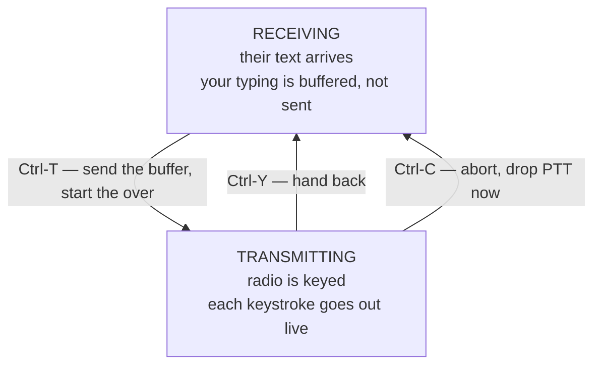

# Keyboard to Keyboard — an Operating Tutorial

For an operator who knows radio but has never run a live digital conversation.
Every key in this document was read out of the deck's source, not remembered.

---

## Contents

1. [What keyboard-to-keyboard is](#1-what-keyboard-to-keyboard-is)
2. [The over: the one idea that matters](#2-the-over-the-one-idea-that-matters)
3. [Before the first session: protecting the radio](#3-before-the-first-session-protecting-the-radio)
4. [Session one — listen only](#4-session-one--listen-only)
5. [Tuning, from the beginning](#5-tuning-from-the-beginning)
6. [The language: abbreviations and prosigns](#6-the-language-abbreviations-and-prosigns)
7. [Session two — answering a CQ](#7-session-two--answering-a-cq)
8. [Session three — calling CQ yourself](#8-session-three--calling-cq-yourself)
9. [Choosing a mode](#9-choosing-a-mode)
10. [Where to listen](#10-where-to-listen)
11. [Reading the status line](#11-reading-the-status-line)
12. [Full key reference](#12-full-key-reference)
13. [What worked, the first time out](#13-what-worked-the-first-time-out)
14. [When something goes wrong](#14-when-something-goes-wrong)

---

## 1. What keyboard-to-keyboard is

Most digital activity on the bands today is **structured**: FT8, JT65, WSPR. A
computer exchanges a fixed set of fields — callsign, grid, signal report — and
the operator's role is to click. The exchange is identical every time, and a
contact carries no information beyond "we heard each other".

Keyboard-to-keyboard is the older idea. Two people type at each other in real
time, in sentences, about whatever they like. The mode carries characters, not
fields. A PSK31 contact can be thirty seconds or ninety minutes.

This changes what the equipment is for. An FT8 station is a decoder with a
mouse. A keyboard-to-keyboard station is a **terminal** — and that is what this
deck is: a screen, a keyboard, and a radio, with nothing else in the way.

The trade is that **you have to know what to say**. Sections 6 through 8 cover
that, because the conventions are real and other operators expect them.

---

## 2. The over: the one idea that matters

Understand this before anything else, because it is where every newcomer's
first contact goes wrong.

This is **half duplex**. Only one station transmits at a time, and you take
turns — each turn is called an **over**. You type your whole over, then send it,
then listen while the other operator does the same.

The deck makes that turn-taking explicit:



**Typing while receiving does not transmit.** It accumulates in a buffer. This
is deliberate and it is the single most useful habit in keyboard-to-keyboard
operating: compose your reply *while they are still sending*, so that when they
hand over you press `Ctrl-T` and your whole reply goes out at once with no dead
air.

Then, **while still transmitting**, anything more you type goes out live,
character by character, as you type it. That is the conversational part — the
other operator watches your sentences form, typos and all. Nobody corrects
typos in this hobby. Type on.

`Ctrl-Y` ends the over. fldigi finishes sending whatever is still in its buffer
and then drops back to receive on its own — the radio does not unkey the
instant you press it, and that is correct.

`Enter` inserts a newline. It does **not** send. There is no "send" key other
than `Ctrl-T`.

---

## 3. Before the first session: protecting the radio

Skip this and you may damage the FTX-1. Two facts about digital modes:

**PSK31 and its relatives are continuous-carrier modes.** Unlike SSB, where
your voice's peaks and gaps average out to perhaps 20% of rated power, a PSK31
transmission is close to **100% duty cycle**. The finals see full output for the
entire over, and an over can be minutes long.

> **Run reduced power.** A common rule is 25–50% of the radio's rated output.
> For casual work, 20–30 W from a 100 W radio is plenty — PSK31 is a weak-signal
> mode and routinely makes contacts at 5 W.

**ALC must read zero.** Digital audio drive is set by the sound card level, not
by the radio's mic gain. If the ALC meter moves at all, you are overdriving:
the transmitted signal grows sidebands, splatters across other contacts, and
your IMD reading goes bad. Turn audio drive **down** until ALC is at rest, then
leave it.

The deck shows an **IMD** figure in the status line when the other station's
signal permits it. Better than **−25 dB** is good; worse than **−20 dB** means
somebody is overdriving. Other operators will tell you — politely, usually.

**Set the radio's time-out timer.** PTT is a pin held by the USB interface. If
the software hangs, the radio stays keyed, and the radio's own timer is the only
thing that stops it. Set it before you key up for the first time.

Finally: **verify `Ctrl-C` aborts** before you depend on it. Start an over into
a dummy load, press `Ctrl-C`, confirm the radio unkeys.

---

## 4. Session one — listen only

Do not transmit at all the first time out. The goal is to see decoded text
appear and to get used to the screen.

**1. Confirm transmit is inhibited.** It is **on by default at every power-on**
— the status line shows `INH`, and the transcript says so at startup. This is
enforced inside the deck, so no keystroke can key the radio while it is set.
Nothing to do here; just check the status line.

`Ctrl-I`, or `F1` → `7` → `i`, clears it when you are ready to transmit. Set
`INHIBIT_ON_START = no` in `cyberdeck.conf` if you would rather it came up
live.

**2. Set the mode.** `F3` → `1` for **BPSK31**. This is where the people are.

**3. Set the frequency.** `F1` → `3` (Band) → `4` for **14.070 MHz**, the 20 m
PSK31 watering hole. The deck sets the radio's **mode** at the same time, from
`RIG_MODE` in `cyberdeck.conf` (default `USB`), so the sideband is not something
to remember on each band change.

> Digital modes use **upper sideband on every band**, including 40 and 80 m,
> where voice uses lower. This surprises people. If you are decoding nothing on
> a band that sounds busy, check the sideband first.

**4. Turn the squelch off.** `F1` → `2` (Tune Settings) → `s` toggles it. With squelch
**off**, fldigi decodes the noise floor continuously and the transcript fills
with random characters within a few seconds.

**That garbage is the most valuable diagnostic you have.** It proves audio is
reaching the modem. If you see nothing at all with squelch off, the problem is
the audio path — not propagation, not the antenna, not the band. Stop and fix
that first.

**5. Watch.** Turn squelch back on once you are satisfied. Real signals will
decode into readable text. Spend a session just reading other people's
conversations; every convention in section 6 will appear within ten minutes.

`PgUp` and `PgDn` scroll back through the transcript.

---

## 5. Tuning, from the beginning

This is the part with no equivalent in voice operating, so it is worth building
up slowly. Nothing here is difficult once the picture is right, and almost
everyone gets it wrong the same way first.

### What your radio actually gives the computer

Your FTX-1 is not sending fldigi a frequency. It is sending **audio** — the
same audio a loudspeaker would make.

In upper sideband, the radio takes a slice of radio spectrum about 3 kHz wide,
starting at the frequency on its display, and shifts it down to audio. So:

| On the air | Comes out as audio at |
|---|---|
| 14.070.000 — exactly your dial | 0 Hz (inaudible) |
| 14.071.000 | 1000 Hz |
| 14.071.500 | 1500 Hz |
| 14.072.800 | 2800 Hz |

**The dial frequency is the bottom edge of the window, not the middle.**
Everything you can hear is *above* it. That single fact explains most of what
follows.

### What fldigi does with that audio

fldigi listens at **one spot** inside that 3 kHz of audio. That spot is the
**carrier**, and it is shown on the `F2` screen.

Carrier 1500 Hz means: *decode whatever is at 1500 Hz in the audio*, which is
whatever is transmitting at dial + 1500 Hz on the air.

A BPSK31 signal is **31 Hz wide**. The audio window is 3000 Hz wide. So there
is room for dozens of separate conversations side by side inside one dial
setting, and fldigi picks one by moving its carrier.

### The two knobs, and why they are different

| | What it moves | Key | Does the radio respond? |
|---|---|---|---|
| **VFO** | The whole 3 kHz window, up and down the band | `,` `.` 100 Hz · `<` `>` 1 kHz | Yes — the dial changes |
| **Carrier** | Where *inside* that window fldigi listens | `←` `→` 10 Hz · `↑` `↓` search | **No — nothing happens on the radio** |

**Moving the carrier does nothing visible on the radio.** The dial does not
change, the waterfall does not shift, no light comes on. The only place that
change appears is the deck's `carrier` field. This is correct and it is not a
fault — it is a change inside the computer, not inside the radio.

Nearly all tuning is carrier tuning. You set the VFO once for the band and then
leave it alone.

### Answering your question about the waterfall

Yes — **the dial marker belongs to the left of the signal.** With the carrier
parked at 1500 Hz, a signal you want should sit about **1.5 kHz to the right**
of your dial frequency on the radio's display.

If you centre the radio's marker on the signal, you have put that signal at 0 Hz
audio, at the very bottom edge of the window, and fldigi will not hear it at
all.

But **do not tune this way.** Your waterfall's narrowest span is 5 kHz. Across
a few hundred pixels that is tens of hertz per pixel, and a BPSK31 signal is
31 Hz wide — one pixel, maybe two. You cannot land on it by eye, and you do not
have to.

### How to actually tune, every time

1. **Set the band once.** `F1` → `3` → `4` for 14.070. Then take your hand off
   the VFO knob.
2. **Turn squelch off** (`F1` → `2` → `s`) and confirm the screen fills with
   garbage. That is your proof audio is arriving. Turn it back on.
3. **Stay on the conversation screen.** The tuning keys work here, and this is
   where you can see whether tuning is working — the transcript is the only
   real test. A carrier number that looks right while nothing decodes is not
   tuned.
4. **Press `↑` or `↓`.** fldigi searches the audio for the next real signal and
   moves its carrier onto it, to the hertz. The deck reports what happened:

   ```
   search up: carrier 1500 -> 1832 Hz
   search up: nothing found above the squelch; still 1832 Hz
   ```

   The second message means the band is quiet, or the squelch is set higher
   than the signals present. It does not mean the key failed.
5. **Nudge with `←` `→`** if the decode is imperfect — 10 Hz at a time, watching
   the text improve or degrade as you go. Characters turning from noise into
   words is the only confirmation that matters.
6. **Leave AFC on** (`F2` → `a`). It tracks a drifting signal so you do not
   have to.

**The `decode` line is the instrument that matters.** It shows the tail of
what is being decoded, live, one line, at the bottom of the `F2` screen. It
answers the two questions the numbers cannot:

* **Is the carrier on a signal?** Noise looks like noise. Nothing looks like
  nothing. The quality bar can sit high on something that is not text.
* **Is the mark/space sense right?** Plausible letters that never form words
  mean press `v`. That is the whole diagnosis, visible without leaving the
  screen you are tuning on.

**Squelch is adjusted here too** — `+` and `-`, two at a time. Setting it just
above the noise floor is what turns fragments into copy, and doing it while
watching the decode line is far quicker than guessing from the menu.

**`F2` is for reading, not for tuning.** It shows carrier, width, S/N, IMD and
signal quality in one place, which is useful when you want to know *how good*
a decode is. But it hides the transcript, so tuning there is done blind. Tune
on the conversation screen; visit `F2` to check the numbers.

If searching finds nothing repeatedly, the problem is upstream of tuning:
either there is genuinely no activity, or the squelch is too high — `F1` → `2`
→ `-` lowers it. Check by turning squelch off and looking for the noise
garbage again.

### Where the VFO knob is still the right tool

* Changing bands.
* Activity you can see on the radio's waterfall that is **outside** your
  current window — below your dial, or more than ~3 kHz above it. Move the dial
  so it falls inside, then search.

That is the whole of it. Set the band, search, nudge, talk.

## 6. The language: abbreviations and prosigns

These come from landline telegraphy and are still used, because they are short
and unambiguous when copy is marginal. You will be understood without them, but
you will not understand others *unless you know them*.

**Structural:**

| | |
|---|---|
| `de` | "from" — always precedes your own call: `NOCALL de KD3CCO` |
| `k` | "go ahead, anyone" — invites any station to reply |
| `kn` | "go ahead, *you only*" — invites the specific station, discourages others |
| `btu` | "back to you" |
| `sk` | End of contact. The conversation is over |
| `cq` | A general call to anybody listening |

**Common shorthand:**

| | | | |
|---|---|---|---|
| `pse` | please | `tnx` / `tu` | thanks |
| `hpe` | hope | `cuagn` | see you again |
| `es` | and | `ur` | your / you are |
| `hw?` | "how do you copy?" | `fb` | fine business — "that's great" |
| `rig` | radio | `ant` | antenna |
| `wx` | weather | `hr` | here |
| `op` | operator's name | `qth` | location |

**Q-codes worth knowing:**

| | |
|---|---|
| `QRZ?` | "Who is calling me?" |
| `QSB` | Fading — the signal rises and falls |
| `QRM` | Interference from other stations |
| `QRN` | Interference from natural noise — static, lightning |
| `QSL` | "Received and understood" |
| `QRT` | Shutting down the station |
| `73` | Best regards. Never "73s" — it is already plural |

A signal report in digital is usually plain language or **RST** — readability
1–5, strength 1–9, tone 9 (tone is meaningless here, so `599` and `59` are both
common and neither is taken literally).

---

## 7. Session two — answering a CQ

Easier than calling CQ, because the other operator is expecting a reply and
sets the pace. Turn transmit inhibit **off** first: `F1` → `7` → `i`.

**1. Find a CQ.** Watch the transcript for something like:

```
CQ CQ CQ de NOCALL NOCALL NOCALL pse k
```

**2. Compose while they finish.** This is the habit from section 2. As soon as
you see their call, start typing — nothing goes on the air yet:

```
NOCALL de KD3CCO KD3CCO KD3CCO k
```

**3. Send it the moment they stop.** `Ctrl-T`. Your buffered text goes out as
one block. Then `Ctrl-Y` to hand back.

Keep the first over **short**. You are establishing that you can hear each other
and nothing more.

**4. They reply with a report.** Something like:

```
KD3CCO de NOCALL  Thanks for the call, ur RST 579 579 in Hartford CT.
Name here is Jim. Rig is a K3 running 30 watts to a dipole. HW? BTU KD3CCO de NOCALL kn
```

**5. Your real over.** Compose it while they type. The expected content is a
mirror of theirs — report, name, location, station:

```
NOCALL de KD3CCO  Good evening Jim, tnx fb report. Ur RST 589 here in
State College PA. Name is Don. Rig is a Yaesu FTX-1 at 25 watts to a
wire antenna. First keyboard to keyboard contact for me es this deck is
homebrew. BTU Jim de KD3CCO kn
```

`Ctrl-T` to send, then `Ctrl-Y`.

**6. Carry on, or close.** Once the mandatory exchange is done the conversation
is yours. When either of you is ready to finish:

```
NOCALL de KD3CCO  Tnx fb qso Jim, hpe cuagn. 73 es gd dx. de KD3CCO sk
```

---

## 8. Session three — calling CQ yourself

Harder, only because you are committing to be there when someone answers.

**1. Find clear space.** Use `F2` and `↑`/`↓` to look for a gap between signals
with no activity in it. Calling on top of an existing contact is the one real
discourtesy in this hobby.

**2. Compose the call.** The rhythm is threes — the repetition is what lets
someone tuning across the band catch your callsign:

```
CQ CQ CQ de KD3CCO KD3CCO KD3CCO
CQ CQ CQ de KD3CCO KD3CCO KD3CCO pse k
```

**3.** `Ctrl-T`, then `Ctrl-Y`. Now wait — genuinely wait. Give it at least
fifteen to thirty seconds before calling again. Replies come slower than you
expect, because the other operator is composing too.

**4. If someone answers,** they will send your call, `de`, and theirs. Go to
section 7 step 4 and carry on — the roles are simply reversed, and as the
calling station you send the first report.

**If nobody answers** after three or four calls, move a little and try again, or
change bands. `F1` → `3` steps through the standard digital frequencies.

---

## 9. Choosing a mode

`F3` opens the mode menu. These eleven are on the top tier; `m` opens the full
list of everything fldigi supports, paged.

| Key | Mode | When |
|---|---|---|
| `a` | **AUTO (RSID)** | Not a mode — switches to whatever the other station identifies as. Leave it on |
| `1` | **BPSK31** | **Start here.** The default for conversation. Narrow, efficient, and where the people are |
| `2` | BPSK63 | Twice the speed, needs a better signal. Good on a strong path |
| `3` | QPSK31 | BPSK31 with error correction. Better in noise, worse when the path is unstable |
| `4` | RTTY | The old standard. Rugged, noisy, wide. Still used in contests. **Sounds like two tones alternating rapidly** — if you hear that on the band, this is the mode |
| `5` | OLIVIA-8/250 | Very robust — readable below the noise floor. Slow |
| `6` | OLIVIA-8/500 | Wider and faster Olivia |
| `7` | MFSK16 | Good on paths with flutter or auroral distortion |
| `8` | THOR22 | Robust, designed for poor conditions |
| `9` | CONTESTIA | Olivia's lighter relative |
| `0` | DOMEX8 | DominoEX — handles ionospheric wobble well |
| `h` | FELDHELL | Hellschreiber. Paints letters as images. Nobody needs it; everybody should try it once |
| `c` | **CW** | Morse, sent and decoded by fldigi. See the caveat below |

The practical rule: **BPSK31 unless you have a reason**. If the path is too
noisy for it, try Olivia. If you have a strong signal and want speed, BPSK63.

### Why RTTY is all capitals

RTTY is Baudot — five bits per character. The code has no lowercase at all, so
every RTTY signal on the air is uppercase because nothing else can be sent.
fldigi converts your typing for you, so there is no need to hold Caps Lock,
though it does no harm: every command key on the deck is case-folded and works
either way.

PSK31 is not like this. It uses varicode, carries the full character set, and
ordinary mixed case is the convention — so Caps Lock is worth switching off
when you go back to PSK.

This is also why RTTY copy fails in stretches rather than degrading gently:
Baudot needs a separate shift character to reach digits and punctuation, and
one corrupted shift throws everything after it into the wrong state until the
next one arrives.

### Identifying a mode by ear

Before reaching for AUTO, the sound tells you most of it:

| Sounds like | Probably |
|---|---|
| Two tones alternating rapidly, a warble | **RTTY** |
| A single steady musical tone, warbling slightly | **PSK31** |
| Several tones in a rising or shifting pattern | **Olivia** or **MFSK** |
| Bursts that start and stop on a clock, ~15 s | **FT8** — not a keyboard mode, will not decode |
| A rough, rapid buzz | **FELDHELL** |

### A caveat about CW

CW is keyboard-to-keyboard operating — the original form of it — and fldigi
will send and decode it. Two things to know before using it here.

**fldigi's CW decoder is not a trained ear.** It copes with a clean, steady,
machine-sent signal and struggles with hand-sent fists, QSB and QRM, which is
most of what is actually on the air. Sending is reliable; copying is the weak
half.

**The radio stays in its data mode.** The deck sets `RIG_MODE` at startup and
on band change, not when you change modem, so picking CW here does not put the
FTX-1 into CW mode. fldigi generates an audio tone that goes out through the
data path as a sideband signal. That works and is legitimate, but it is not the
same as the radio's own CW mode: you are not using its CW filters, and your
signal occupies the sideband path rather than the narrow one.

If you want real CW, set the radio to CW yourself, or set
`RIG_MODE = CW` in `cyberdeck.conf` for a session spent there.

### Automatic mode switching

There is no mode that listens to a signal and works out what it is from first
principles — nothing on the air does blind modulation classification.

What exists is **RSID** (RxID), and it is close enough to be worth relying on.
A station's software sends a short tone burst ahead of its transmission that
names the mode it is about to use. With RSID on, fldigi hears that burst and
**switches modes automatically** to match, then decodes.

The deck turns RSID **on at startup** (`RSID_ON_START` in `cyberdeck.conf`),
and it is the practical answer to "what mode is that?" — if the other station
sends an identifier, you do not have to know.

Its limits, stated plainly:

* The other station must be **sending** RSID. Many do; not all.
* It identifies the mode, not the frequency — the carrier still has to be near
  the signal, so `↑`/`↓` search still matters.
* Turn on **TXID** (`F1` → `2` → `x`) so you extend the same courtesy. It sends
  one identifier before each of your overs.

Leave both on unless you have a reason not to.

---

## 10. Where to listen

`F1` → `3` sets the VFO to these directly. All **USB**.

| Key | Frequency | Band | Notes |
|---|---|---|---|
| `1` | 3.580 | 80 m | Night, regional. **Where this deck made its first contacts** |
| `2` | 7.070 | 40 m | Best in the evening and overnight |
| `3` | 10.142 | 30 m | Digital-only band, quiet and reliable |
| `4` | 14.070 | 20 m | **The main one.** Busy most daylight hours |
| `5` | 21.070 | 15 m | Daytime, needs good conditions |
| `6` | 28.120 | 10 m | Sporadic — brilliant when open, dead otherwise |
| `7` | 50.290 | 6 m | PSK31 calling frequency. Sporadic-E in season |
| `8` | 144.144 | 2 m | PSK31 calling frequency; activity runs to 144.150 |
| `9` | 432.200 | 70 cm | PSK31 calling frequency. Thin, but it is there |

Listed low to high. A band this radio cannot reach is shown marked
`(not supported)` rather than hidden, so the list does not quietly change with
the hardware.

**VHF and UHF are different in practice.** Those three are calling frequencies
in the weak-signal SSB segments, not the busy watering holes the HF entries
are. Activity is sparse and often arranged in advance or during a band
opening — the radio must be in **USB**, not FM, which `RIG_MODE = PKTUSB`
takes care of.

Activity sits in the ~2 kHz **above** each of these. Park the VFO on the listed
frequency and move the audio carrier to hunt, as in section 5.

Best odds for a first contact: **14.070 in the afternoon**, or **7.070 after
dark**.

---

## 11. Reading the status line

The top row, in reverse video. Fields drop from the right as the terminal gets
narrower, so a narrow font keeps callsign, state and clock.

| Field | Meaning |
|---|---|
| **call** | Your callsign, from `cyberdeck.conf` |
| **freq** | The radio's VFO, read back through rigctld. **If this is 0.0, rig control is not working** |
| **sideband** | USB or LSB as the radio reports it |
| **mode** | The current modem — BPSK31 and so on |
| **carrier** | Audio offset in Hz: where inside the passband the modem is listening |
| **two readouts** | **Mode-dependent, and they label themselves.** Under PSK they are `S/N 6 dB` and `IMD ---`. Under RTTY the first becomes `45 /170` — baud rate and shift in Hz — and the second becomes the S/N. Olivia reports neither and they go blank. Read the label, not the position |
| **state** | RX or TX |
| **clock** | **UTC**, marked `Z`. Always UTC — it is the convention for logging, and it is what the other operator's log will say |

Frequencies read at the radio's own resolution — `14.070.589`, not `14.071` —
so the deck's number can be compared against the radio's display digit for
digit.

The status row is **a filled bar — black text on the scheme's color**. If it
ever renders as one solid block of color with no readable text, that is a
contrast fault in the color pair, not an empty bar.

`INH` in the state field is the transmit inhibit. If you press `Ctrl-T` and
nothing happens, that is the first place to look.

**When the deck commands the VFO**, it reads the frequency back and says what
happened:

```
VFO 14.070.000  PKTUSB
VFO 14.070.000 refused — radio stayed on 14.071.885
```

The second line means the radio declined the command. The deck asks once and
reports; it does not re-send. A retry loop cannot tell a refused command from
you turning the knob, so it would fight a deliberate manual tune and never let
go.

The bottom row lists the active key bindings, shedding entries as the width
shrinks.

---

## 12. Full key reference

### Conversation screen

| Key | Action |
|---|---|
| `F1` | Menu |
| `F2` | Tuning screen |
| `F3` | Mode menu |
| `F4` | Next color scheme |
| `Ctrl-T` | **Start the over** — send the buffer, key the radio |
| `Ctrl-Y` | **Hand back** — finish the over, return to receive |
| `Ctrl-C` | **Abort** — drop PTT immediately |
| `Ctrl-I` | Transmit inhibit on/off — **`Tab` does this too**, see below |
| `Ctrl-X` | Clear the transcript |
| `Ctrl-L` | Redraw the screen |
| `Ctrl-Q` | Quit |
| `←` `→` | Move the cursor in the line you are typing |
| `↑` `↓` | Recall previous overs |
| `Home` / `End` | Start / end of the line |
| `Ctrl-A` `Ctrl-D` | Carrier −10 / +10 Hz — **tune while watching the decode** |
| `Ctrl-W` `Ctrl-S` | Search for the next signal, up / down |
| `F5`–`F12` | Insert a message memory at the cursor |
| `Ctrl-Z` | Undo the last memory insert |
| `PgUp` / `PgDn` | Scroll the transcript |
| `Enter` | Newline — **does not send** |
| `Backspace` | Delete from the compose buffer |

The four tuning keys are not on the hint line at the bottom of the screen —
there was not room, and they are listed in **Tune Settings** (`F1` → `2`)
instead.

### Menu (`F1`)

| Key | Submenu | Contents |
|---|---|---|
| `1` | Mode | `a` AUTO (RSID) · the twelve modes above · `m` for all |
| `2` | Tune Settings | `a` AFC · `s` squelch · `+`/`-` level · `r` RSID · `x` TXID · `v` reverse · `c` park carrier |
| `3` | Band | `1`–`9`, 80 m up to 70 cm |
| `4` | Display | `1` Matrix · `2` Deckard · `3` Hal · `4` Tron · `t` timestamps |
| `5` | Memories | The eight message memories; `Enter` edits one in place |
| `6` | Station | Callsign, name, QTH, grid, rig — `Enter` edits one in place |
| `7` | System | `i` inhibit · `c` clear transcript · `q` quit |

**The line you type edits like a terminal.** `←` `→` move the cursor and
typing inserts at it, `Backspace` deletes before it, `Home` and `End` jump to
the ends, and `↑` `↓` recall overs you have already sent — useful for repeating
a call or reusing a station description. Stepping forward past the newest entry
gives you back whatever you were typing before you started browsing.

None of that applies **mid-over**: once `Ctrl-T` is pressed, characters go out
as you type them and cannot be recalled. That is how keyboard modes have always
worked and is not a fault.

**Tuning from this screen is on `Ctrl-W` `Ctrl-A` `Ctrl-S` `Ctrl-D`** — the
WASD cluster, under the left hand while the right stays on the text. `Ctrl-A`
and `Ctrl-D` move the carrier ten hertz; `Ctrl-W` and `Ctrl-S` search for the
next signal.

Not `Ctrl`+arrows: the Linux console cannot report a modified arrow at all, so
`Ctrl-←` is indistinguishable from `←` on the panel. It would have worked over
SSH from a terminal emulator and silently failed on the deck.

### Message memories

`F5` to `F12` insert stored text **at the cursor**, so a memory can go into the
middle of a line you are already composing. `Ctrl-Z` takes the last insert back
out, cursor and all.

The defaults cover a contact's shape — a CQ, a call, name and QTH, the station
description, a sign-off:

| Token | Filled in from |
|---|---|
| `{call}` | Callsign |
| `{name}` | Name |
| `{qth}` | QTH |
| `{grid}` | Locator |
| `{rig}` | Rig |

Those come from **Station** (`F1` → `6`), which lists each field beside its
token — so the place you look up what `{grid}` is set to is also where you
learn that `{grid}` exists. Changing your callsign does not mean rewriting
every memory.

**To edit one:** `F1` → `5`, arrow to a slot, `Enter`. The memory opens in a
line editor with its current text loaded: type, `←` `→` `Home` `End` to move,
`Backspace` and `Delete`, `Ctrl-U` to clear the whole line, `Enter` to save,
`Esc` to discard. Saving an empty line marks the slot `(empty)`.

**Station fields are edited the same way**, from `F1` → `6`. Both are kept
across restarts, and both override whatever `cyberdeck.conf` started with.

Mid-over a memory is **sent immediately** rather than inserted, like any other
typing, and cannot be undone. The far end has already seen it.

**Navigating menus.** Either way works:

- **Arrow keys** — `↑` `↓` move the highlight, wrapping at the ends; `Enter`
  chooses the highlighted row; `Esc` goes back.
- **The letter or digit** beside a row selects it directly without moving the
  highlight. Faster once a menu is familiar.

`Esc` goes back one level, and back to the conversation from the root.

Menus that reflect radio state — Tuning especially — **show the current value**
beside each entry, so you can see whether squelch is on rather than toggling it
and guessing.

> **`Tab` toggles transmit inhibit.** `Ctrl-I` and `Tab` are the same byte —
> ASCII 9 — so the terminal cannot tell them apart. Pressing `Tab` mid-sentence
> will silently enable or disable transmit. Watch the status line if you have
> hit it by accident; there is no other way to tell.

### Tuning screen (`F2`)

| Key | Action | Does the radio move? |
|---|---|---|
| `←` `→` | Carrier −10 / +10 Hz | **No** |
| `↑` `↓` | **Search for the next signal** up or down | **No** |
| `,` `.` | VFO −100 / +100 Hz | Yes |
| `<` `>` | VFO −1 / +1 kHz | Yes |
| `a` `s` `r` `x` `v` | AFC · squelch · RSID · TXID · reverse | No |
| `+` `-` | Squelch level, 2 at a time | No |
| `F2` or `Esc` | Back to the conversation | — |

Command keys here are **case-folded**, so they work with Caps Lock on — which
is how you will be operating on RTTY.

**The third column matters and it surprises people.** `←` `→` `↑` `↓` move
fldigi's **carrier** — where inside the received audio it listens. The radio is
not told and does not respond: the dial stays put, the waterfall does not
shift, nothing happens on the front panel. The only place that change appears
is the deck's own `carrier` field.

That is not a fault. It is how the deck tunes: the radio holds one dial
frequency, and fldigi walks around inside the passband it provides.

Only `,` `.` `<` `>` command the radio itself.

---

## 13. What worked, the first time out

Recorded because it is more use than any amount of theory: two contacts,
**N3QE** and **K4ZW**, 80 m RTTY, 5 W, on 2026-09-19 during a sprint.

What made the difference, in order of how much it mattered:

**Squelch just above the noise floor.** Not on, not off — adjusted. `F1` → `2`,
then `+` and `-`. Too high and real signals never open it; too low and the
transcript fills with garbage that buries the copy. Finding the edge was the
single biggest improvement.

**The reverse toggle.** `v`. RTTY is conventionally lower sideband and the deck
transmits AFSK through the radio's DATA-U path, which is upper — so the tones
arrive swapped and decode as plausible letters that never form words. Both
contacts needed it.

**The `F2` search, not the VFO knob.** `↑`/`↓` lands the carrier on a signal to
the hertz. Section 5 argues this at length; on the air it simply works.

**Contest exchanges are short**, which makes a sprint a good place to start.
Nobody expects a rag-chew, the format is predictable, and there are plenty of
stations calling.

## 14. When something goes wrong

**Nothing decodes at all.** Turn squelch off (`F1` → `2` → `s`). If the screen
does not fill with garbage within a few seconds, audio is not reaching the
modem — that is a wiring or sound-card problem, not a radio one. See Phase 4
step 3 of `deploy_cyberdeck_instructions.md`.

**Garbage decodes, but never anything readable.** Three causes, in order of
likelihood:

* **The carrier is not on the signal.** Use `↑`/`↓` to search rather than
  placing it by hand — a BPSK31 signal is 31 Hz wide and 20 Hz off decodes
  nothing.
* **Wrong mark/space sense, on RTTY.** Ham RTTY is conventionally lower
  sideband, and the deck runs AFSK through the radio's DATA-U path, which is
  upper — so the tones can arrive swapped. The signature is a steady stream of
  plausible letters that never form words. Press **`v`** (`F1` → `2` → `v`, or
  `v` on the `F2` screen) to flip it. If the text turns into English, that was
  it.
* **Wrong sideband** — digital is USB on every band.

**Frequency shows 0.0.** Rig control is down. The mode still works; you just
have to set the VFO on the radio's own dial. Check `cyberdeck-rigctld`.

**The radio will not key.** Transmit inhibit is the first thing to check — `F1`
→ `6` → `i`. It is enforced in the deck, so nothing else will override it.

**The radio keys and will not stop.** `Ctrl-C`. If that fails, the radio's
time-out timer is your backstop — which is why section 3 says to set it. Power
the radio down if you must.

**Someone says you are splattering.** Reduce audio drive until ALC reads zero,
and reduce power. See section 3.

**The keyboard stops responding.** Bluetooth has dropped. It is bonded and
trusted, so it should reconnect on its own; if not, SSH in and
`sudo systemctl start cyberdeck-btpair`.

---

## A first session, condensed

1. Check the status line reads `INH` — transmit starts inhibited
2. `F3` `1` — BPSK31
3. `F1` `3` `4` — 14.070, and set the radio to **USB**
4. `F1` `2` `s` — squelch off; confirm the screen fills with noise
5. `F1` `2` `s` — squelch back on
6. `F2`, then `↑`/`↓` to land on a real signal; `Esc`
7. Read other people's contacts for half an hour
8. `Ctrl-I` — enable transmit (it starts inhibited)
9. Answer a CQ with section 7 in front of you

Reduced power. ALC at zero. Time-out timer set.

73.
