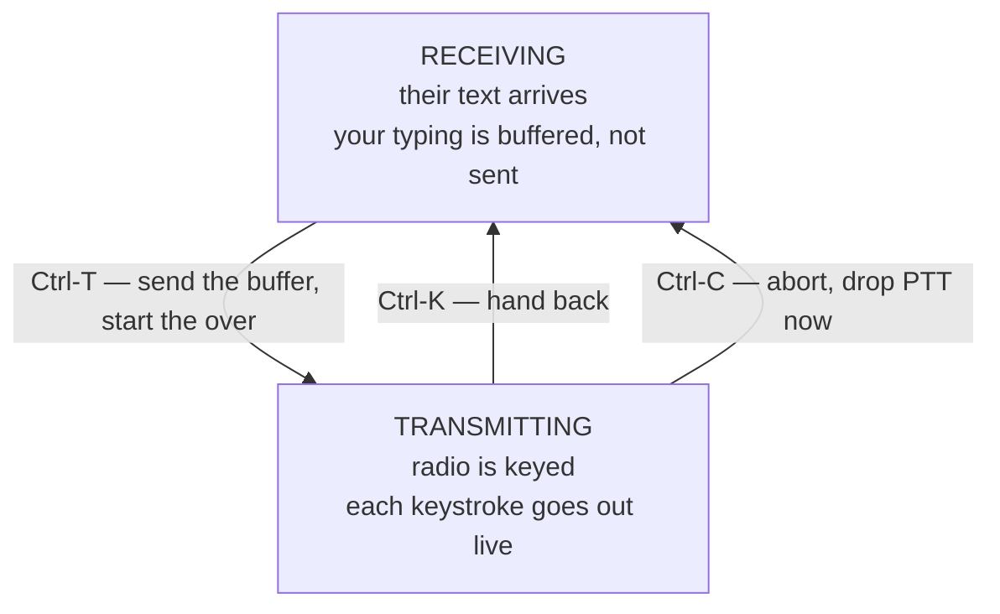

# Keyboard to Keyboard — an Operating Tutorial

For an operator who knows radio but has never run a live digital conversation.
Every key in this document was read out of the deck's source, not remembered.

---

## Contents

1. [What keyboard-to-keyboard is](#1-what-keyboard-to-keyboard-is)
2. [The over: the one idea that matters](#2-the-over-the-one-idea-that-matters)
3. [Before the first session: protecting the radio](#3-before-the-first-session-protecting-the-radio)
4. [Session one — listen only](#4-session-one--listen-only)
5. [Tuning without a waterfall](#5-tuning-without-a-waterfall)
6. [The language: abbreviations and prosigns](#6-the-language-abbreviations-and-prosigns)
7. [Session two — answering a CQ](#7-session-two--answering-a-cq)
8. [Session three — calling CQ yourself](#8-session-three--calling-cq-yourself)
9. [Choosing a mode](#9-choosing-a-mode)
10. [Where to listen](#10-where-to-listen)
11. [Reading the status line](#11-reading-the-status-line)
12. [Full key reference](#12-full-key-reference)
13. [When something goes wrong](#13-when-something-goes-wrong)

---

## 1. What keyboard-to-keyboard is

Most digital activity on the bands today is **structured**: FT8, JT65, WSPR. A
computer exchanges a fixed set of fields — callsign, grid, signal report — and
the operator's role is to click. The exchange is identical every time, and a
contact carries no information beyond "we heard each other".

Keyboard-to-keyboard is the older idea. Two people type at each other in real
time, in sentences, about whatever they like. The mode carries characters, not
fields. A PSK31 contact can be thirty seconds or ninety minutes.

This changes what the equipment is for. An FT8 station is a decoder with a
mouse. A keyboard-to-keyboard station is a **terminal** — and that is what this
deck is: a screen, a keyboard, and a radio, with nothing else in the way.

The trade is that **you have to know what to say**. Sections 6 through 8 cover
that, because the conventions are real and other operators expect them.

---

## 2. The over: the one idea that matters

Understand this before anything else, because it is where every newcomer's
first contact goes wrong.

This is **half duplex**. Only one station transmits at a time, and you take
turns — each turn is called an **over**. You type your whole over, then send it,
then listen while the other operator does the same.

The deck makes that turn-taking explicit:



**Typing while receiving does not transmit.** It accumulates in a buffer. This
is deliberate and it is the single most useful habit in keyboard-to-keyboard
operating: compose your reply *while they are still sending*, so that when they
hand over you press `Ctrl-T` and your whole reply goes out at once with no dead
air.

Then, **while still transmitting**, anything more you type goes out live,
character by character, as you type it. That is the conversational part — the
other operator watches your sentences form, typos and all. Nobody corrects
typos in this hobby. Type on.

`Ctrl-K` ends the over. fldigi finishes sending whatever is still in its buffer
and then drops back to receive on its own — the radio does not unkey the
instant you press it, and that is correct.

`Enter` inserts a newline. It does **not** send. There is no "send" key other
than `Ctrl-T`.

---

## 3. Before the first session: protecting the radio

Skip this and you may damage the FTX-1. Two facts about digital modes:

**PSK31 and its relatives are continuous-carrier modes.** Unlike SSB, where
your voice's peaks and gaps average out to perhaps 20% of rated power, a PSK31
transmission is close to **100% duty cycle**. The finals see full output for the
entire over, and an over can be minutes long.

> **Run reduced power.** A common rule is 25–50% of the radio's rated output.
> For casual work, 20–30 W from a 100 W radio is plenty — PSK31 is a weak-signal
> mode and routinely makes contacts at 5 W.

**ALC must read zero.** Digital audio drive is set by the sound card level, not
by the radio's mic gain. If the ALC meter moves at all, you are overdriving:
the transmitted signal grows sidebands, splatters across other contacts, and
your IMD reading goes bad. Turn audio drive **down** until ALC is at rest, then
leave it.

The deck shows an **IMD** figure in the status line when the other station's
signal permits it. Better than **−25 dB** is good; worse than **−20 dB** means
somebody is overdriving. Other operators will tell you — politely, usually.

**Set the radio's time-out timer.** PTT is a pin held by the USB interface. If
the software hangs, the radio stays keyed, and the radio's own timer is the only
thing that stops it. Set it before you key up for the first time.

Finally: **verify `Ctrl-C` aborts** before you depend on it. Start an over into
a dummy load, press `Ctrl-C`, confirm the radio unkeys.

---

## 4. Session one — listen only

Do not transmit at all the first time out. The goal is to see decoded text
appear and to get used to the screen.

**1. Confirm transmit is inhibited.** It is **on by default at every power-on**
— the status line shows `INH`, and the transcript says so at startup. This is
enforced inside the deck, so no keystroke can key the radio while it is set.
Nothing to do here; just check the status line.

`Ctrl-I`, or `F1` → `6` → `i`, clears it when you are ready to transmit. Set
`INHIBIT_ON_START = no` in `cyberdeck.conf` if you would rather it came up
live.

**2. Set the mode.** `F3` → `1` for **BPSK31**. This is where the people are.

**3. Set the frequency.** `F1` → `3` (Radio) → `1` for **14.070 MHz**, the 20 m
PSK31 watering hole. The deck sets the radio's **mode** at the same time, from
`RIG_MODE` in `cyberdeck.conf` (default `USB`), so the sideband is not something
to remember on each band change.

> Digital modes use **upper sideband on every band**, including 40 and 80 m,
> where voice uses lower. This surprises people. If you are decoding nothing on
> a band that sounds busy, check the sideband first.

**4. Turn the squelch off.** `F1` → `2` (Tuning) → `s` toggles it. With squelch
**off**, fldigi decodes the noise floor continuously and the transcript fills
with random characters within a few seconds.

**That garbage is the most valuable diagnostic you have.** It proves audio is
reaching the modem. If you see nothing at all with squelch off, the problem is
the audio path — not propagation, not the antenna, not the band. Stop and fix
that first.

**5. Watch.** Turn squelch back on once you are satisfied. Real signals will
decode into readable text. Spend a session just reading other people's
conversations; every convention in section 6 will appear within ten minutes.

`PgUp` and `PgDn` scroll back through the transcript.

---

## 5. Tuning without a waterfall

A conventional fldigi screen shows a waterfall and you click on a signal. This
deck has an 800×480 panel and a text terminal, so it does the same job with
keys. Press **`F2`** for the tuning screen.

Two different things are being tuned, and confusing them is the usual beginner's
problem:

| | What moves | Key |
|---|---|---|
| **The radio's VFO** | The whole receiver window | `,` `.` by 100 Hz · `<` `>` by 1 kHz |
| **The audio carrier** | Where inside that window the modem listens | `←` `→` by 10 Hz |

A BPSK31 signal is only about 31 Hz wide. Inside the radio's ~3 kHz passband
there is room for dozens of them side by side. Normally you leave the VFO parked
on 14.070 and move the **carrier** to pick out one signal among many.

**The efficient way to find signals:** `↑` and `↓` run fldigi's own search,
which hunts for the next detectable signal above or below the current carrier
and lands on it. Use those first; use `←` `→` only to fine-tune afterwards.

Then let the software hold it:

- **`a` — AFC.** Automatic frequency control. Leave this **on**; it follows a
  drifting signal so you do not have to chase it.
- **`s` — Squelch.** On for normal operating, off for the diagnostic in
  section 4.
- **`r` — RSID.** When another station sends a mode identifier, fldigi reads it
  and switches modes to match. Very useful, because it rescues you when someone
  answers your CQ in a mode you were not expecting.
- **`x` — TXID.** Sends *our* identifier ahead of our overs, so their software
  can do the same for us. Courteous; leave it on.

`F2` or `Esc` returns to the conversation.

---

## 6. The language: abbreviations and prosigns

These come from landline telegraphy and are still used, because they are short
and unambiguous when copy is marginal. You will be understood without them, but
you will not understand others *unless you know them*.

**Structural:**

| | |
|---|---|
| `de` | "from" — always precedes your own call: `W1ABC de KD3CCO` |
| `k` | "go ahead, anyone" — invites any station to reply |
| `kn` | "go ahead, *you only*" — invites the specific station, discourages others |
| `btu` | "back to you" |
| `sk` | End of contact. The conversation is over |
| `cq` | A general call to anybody listening |

**Common shorthand:**

| | | | |
|---|---|---|---|
| `pse` | please | `tnx` / `tu` | thanks |
| `hpe` | hope | `cuagn` | see you again |
| `es` | and | `ur` | your / you are |
| `hw?` | "how do you copy?" | `fb` | fine business — "that's great" |
| `rig` | radio | `ant` | antenna |
| `wx` | weather | `hr` | here |
| `op` | operator's name | `qth` | location |

**Q-codes worth knowing:**

| | |
|---|---|
| `QRZ?` | "Who is calling me?" |
| `QSB` | Fading — the signal rises and falls |
| `QRM` | Interference from other stations |
| `QRN` | Interference from natural noise — static, lightning |
| `QSL` | "Received and understood" |
| `QRT` | Shutting down the station |
| `73` | Best regards. Never "73s" — it is already plural |

A signal report in digital is usually plain language or **RST** — readability
1–5, strength 1–9, tone 9 (tone is meaningless here, so `599` and `59` are both
common and neither is taken literally).

---

## 7. Session two — answering a CQ

Easier than calling CQ, because the other operator is expecting a reply and
sets the pace. Turn transmit inhibit **off** first: `F1` → `6` → `i`.

**1. Find a CQ.** Watch the transcript for something like:

```
CQ CQ CQ de W1ABC W1ABC W1ABC pse k
```

**2. Compose while they finish.** This is the habit from section 2. As soon as
you see their call, start typing — nothing goes on the air yet:

```
W1ABC de KD3CCO KD3CCO KD3CCO k
```

**3. Send it the moment they stop.** `Ctrl-T`. Your buffered text goes out as
one block. Then `Ctrl-K` to hand back.

Keep the first over **short**. You are establishing that you can hear each other
and nothing more.

**4. They reply with a report.** Something like:

```
KD3CCO de W1ABC  Thanks for the call, ur RST 579 579 in Hartford CT.
Name here is Jim. Rig is a K3 running 30 watts to a dipole. HW? BTU KD3CCO de W1ABC kn
```

**5. Your real over.** Compose it while they type. The expected content is a
mirror of theirs — report, name, location, station:

```
W1ABC de KD3CCO  Good evening Jim, tnx fb report. Ur RST 589 here in
State College PA. Name is Don. Rig is a Yaesu FTX-1 at 25 watts to a
wire antenna. First keyboard to keyboard contact for me es this deck is
homebrew. BTU Jim de KD3CCO kn
```

`Ctrl-T` to send, then `Ctrl-K`.

**6. Carry on, or close.** Once the mandatory exchange is done the conversation
is yours. When either of you is ready to finish:

```
W1ABC de KD3CCO  Tnx fb qso Jim, hpe cuagn. 73 es gd dx. de KD3CCO sk
```

---

## 8. Session three — calling CQ yourself

Harder, only because you are committing to be there when someone answers.

**1. Find clear space.** Use `F2` and `↑`/`↓` to look for a gap between signals
with no activity in it. Calling on top of an existing contact is the one real
discourtesy in this hobby.

**2. Compose the call.** The rhythm is threes — the repetition is what lets
someone tuning across the band catch your callsign:

```
CQ CQ CQ de KD3CCO KD3CCO KD3CCO
CQ CQ CQ de KD3CCO KD3CCO KD3CCO pse k
```

**3.** `Ctrl-T`, then `Ctrl-K`. Now wait — genuinely wait. Give it at least
fifteen to thirty seconds before calling again. Replies come slower than you
expect, because the other operator is composing too.

**4. If someone answers,** they will send your call, `de`, and theirs. Go to
section 7 step 4 and carry on — the roles are simply reversed, and as the
calling station you send the first report.

**If nobody answers** after three or four calls, move a little and try again, or
change bands. `F1` → `3` steps through the standard digital frequencies.

---

## 9. Choosing a mode

`F3` opens the mode menu. These eleven are on the top tier; `m` opens the full
list of everything fldigi supports, paged.

| Key | Mode | When |
|---|---|---|
| `1` | **BPSK31** | **Start here.** The default for conversation. Narrow, efficient, and where the people are |
| `2` | BPSK63 | Twice the speed, needs a better signal. Good on a strong path |
| `3` | QPSK31 | BPSK31 with error correction. Better in noise, worse when the path is unstable |
| `4` | RTTY | The old standard. Rugged, noisy, wide. Still used in contests |
| `5` | OLIVIA-8/250 | Very robust — readable below the noise floor. Slow |
| `6` | OLIVIA-8/500 | Wider and faster Olivia |
| `7` | MFSK16 | Good on paths with flutter or auroral distortion |
| `8` | THOR22 | Robust, designed for poor conditions |
| `9` | CONTESTIA | Olivia's lighter relative |
| `0` | DOMEX8 | DominoEX — handles ionospheric wobble well |
| `h` | FELDHELL | Hellschreiber. Paints letters as images. Nobody needs it; everybody should try it once |

The practical rule: **BPSK31 unless you have a reason**. If the path is too
noisy for it, try Olivia. If you have a strong signal and want speed, BPSK63.

Leave **RSID** on (section 5) and the deck will follow other operators into
whatever mode they choose, which saves guessing.

---

## 10. Where to listen

`F1` → `3` sets the VFO to these directly. All **USB**.

| Key | Frequency | Band | Notes |
|---|---|---|---|
| `1` | 14.070 | 20 m | **The main one.** Busy most daylight hours |
| `2` | 7.070 | 40 m | Best in the evening and overnight |
| `3` | 3.580 | 80 m | Night, regional |
| `4` | 10.142 | 30 m | Digital-only band, quiet and reliable |
| `5` | 21.070 | 15 m | Daytime, needs good conditions |
| `6` | 28.120 | 10 m | Sporadic — brilliant when open, dead otherwise |

Activity sits in the ~2 kHz **above** each of these. Park the VFO on the listed
frequency and move the audio carrier to hunt, as in section 5.

Best odds for a first contact: **14.070 in the afternoon**, or **7.070 after
dark**.

---

## 11. Reading the status line

The top row, in reverse video. Fields drop from the right as the terminal gets
narrower, so a narrow font keeps callsign, state and clock.

| Field | Meaning |
|---|---|
| **call** | Your callsign, from `cyberdeck.conf` |
| **freq** | The radio's VFO, read back through rigctld. **If this is 0.0, rig control is not working** |
| **sideband** | USB or LSB as the radio reports it |
| **mode** | The current modem — BPSK31 and so on |
| **carrier** | Audio offset in Hz: where inside the passband the modem is listening |
| **snr** | Signal-to-noise of what is being decoded |
| **imd** | Intermodulation distortion of the *received* signal. Worse than −20 dB means that station is overdriving |
| **state** | RX or TX |
| **clock** | **UTC**, marked `Z`. Always UTC — it is the convention for logging, and it is what the other operator's log will say |

The bottom row lists the active key bindings, shedding entries as the width
shrinks.

---

## 12. Full key reference

### Conversation screen

| Key | Action |
|---|---|
| `F1` | Menu |
| `F2` | Tuning screen |
| `F3` | Mode menu |
| `F4` | Next color scheme |
| `Ctrl-T` | **Start the over** — send the buffer, key the radio |
| `Ctrl-K` | **Hand back** — finish the over, return to receive |
| `Ctrl-C` | **Abort** — drop PTT immediately |
| `Ctrl-I` | Transmit inhibit on/off — **`Tab` does this too**, see below |
| `Ctrl-L` | Redraw the screen |
| `Ctrl-Q` | Quit |
| `PgUp` / `PgDn` | Scroll the transcript |
| `Enter` | Newline — **does not send** |
| `Backspace` | Delete from the compose buffer |

### Menu (`F1`)

| Key | Submenu | Contents |
|---|---|---|
| `1` | Mode | The eleven modes above, `m` for all |
| `2` | Tuning | `a` AFC · `s` squelch · `r` RSID · `x` TXID · `+`/`-` squelch level · `c` park carrier |
| `3` | Radio | `1`–`6` band frequencies |
| `4` | Display | `1` Matrix · `2` Deckard · `3` Hal · `4` Tron · `t` timestamps |
| `5` | Station | Read-only; edit `cyberdeck.conf` |
| `6` | System | `i` inhibit · `c` clear transcript · `q` quit |

**Navigating menus.** Either way works:

- **Arrow keys** — `↑` `↓` move the highlight, wrapping at the ends; `Enter`
  chooses the highlighted row; `Esc` goes back.
- **The letter or digit** beside a row selects it directly without moving the
  highlight. Faster once a menu is familiar.

`Esc` goes back one level, and back to the conversation from the root.

Menus that reflect radio state — Tuning especially — **show the current value**
beside each entry, so you can see whether squelch is on rather than toggling it
and guessing.

> **`Tab` toggles transmit inhibit.** `Ctrl-I` and `Tab` are the same byte —
> ASCII 9 — so the terminal cannot tell them apart. Pressing `Tab` mid-sentence
> will silently enable or disable transmit. Watch the status line if you have
> hit it by accident; there is no other way to tell.

### Tuning screen (`F2`)

| Key | Action |
|---|---|
| `←` `→` | Carrier ∓10 Hz |
| `↑` `↓` | **Search for the next signal** up or down |
| `,` `.` | VFO ∓100 Hz |
| `<` `>` | VFO ∓1 kHz |
| `a` `s` `r` `x` | AFC · squelch · RSID · TXID |
| `F2` or `Esc` | Back to the conversation |

---

## 13. When something goes wrong

**Nothing decodes at all.** Turn squelch off (`F1` → `2` → `s`). If the screen
does not fill with garbage within a few seconds, audio is not reaching the
modem — that is a wiring or sound-card problem, not a radio one. See Phase 4
step 3 of `deploy_cyberdeck_instructions.md`.

**Garbage decodes, but never anything readable.** Usually the wrong sideband —
digital is USB on every band. Otherwise the carrier is not on a signal: use
`F2` and `↑`/`↓` to search rather than hunting by hand.

**Frequency shows 0.0.** Rig control is down. The mode still works; you just
have to set the VFO on the radio's own dial. Check `cyberdeck-rigctld`.

**The radio will not key.** Transmit inhibit is the first thing to check — `F1`
→ `6` → `i`. It is enforced in the deck, so nothing else will override it.

**The radio keys and will not stop.** `Ctrl-C`. If that fails, the radio's
time-out timer is your backstop — which is why section 3 says to set it. Power
the radio down if you must.

**Someone says you are splattering.** Reduce audio drive until ALC reads zero,
and reduce power. See section 3.

**The keyboard stops responding.** Bluetooth has dropped. It is bonded and
trusted, so it should reconnect on its own; if not, SSH in and
`sudo systemctl start cyberdeck-btpair`.

---

## A first session, condensed

1. Check the status line reads `INH` — transmit starts inhibited
2. `F3` `1` — BPSK31
3. `F1` `3` `1` — 14.070, and set the radio to **USB**
4. `F1` `2` `s` — squelch off; confirm the screen fills with noise
5. `F1` `2` `s` — squelch back on
6. `F2`, then `↑`/`↓` to land on a real signal; `Esc`
7. Read other people's contacts for half an hour
8. `Ctrl-I` — enable transmit (it starts inhibited)
9. Answer a CQ with section 7 in front of you

Reduced power. ALC at zero. Time-out timer set.

73.
