<!-- _class: title -->
<!-- _paginate: false -->
<!-- _footer: "" -->

# A keyboard-to-keyboard cyberdeck

**KD3CCO**

A single-purpose HF text terminal for \$68

---

<!-- _class: evidence -->

# My desk is 20 by 14 inches, and a laptop does not fit on it

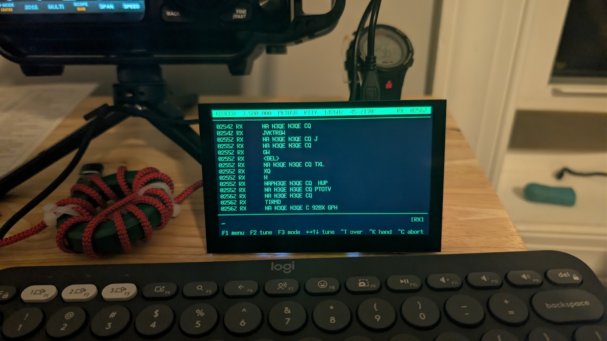

The whole station: the deck, a Bluetooth keyboard, and the FTX-1 just out of frame.

---

# Every digital-mode program assumes a waterfall, a mouse, and a bunch of cluttered windows

That is the right design for tuning and for contesting.

It is the wrong design for **having a conversation** — which is what RTTY, PSK31 and Olivia were built for, and the part I actually wanted.

Opening a laptop to operate also feels like clocking back in.

---

<!-- _class: evidence -->

# So the screen shows the conversation, and not much else

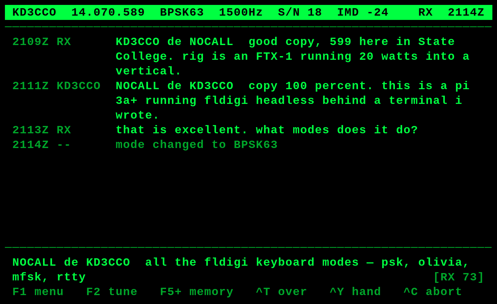

66 columns by 20 rows. A status line, the conversation, what you are typing, and the keys that do something.

---

<!-- _class: evidence -->

# The first contact on it was RTTY, and it went exactly like any other QSO

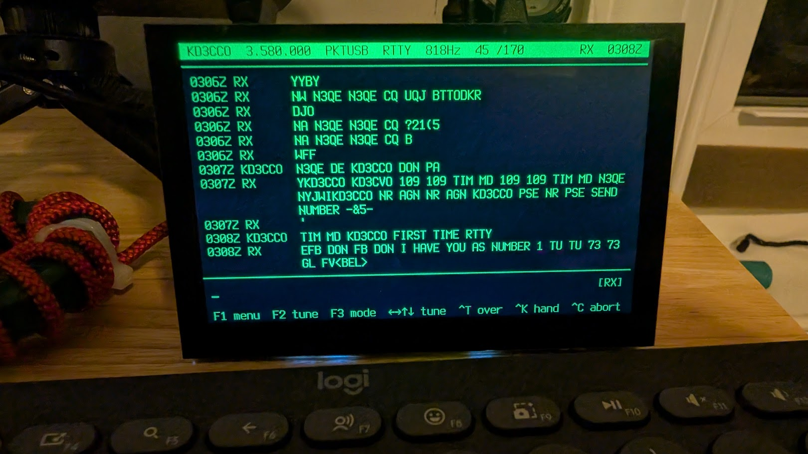

N3QE: "FB DON I HAVE YOU AS NUMBER 1." 

---

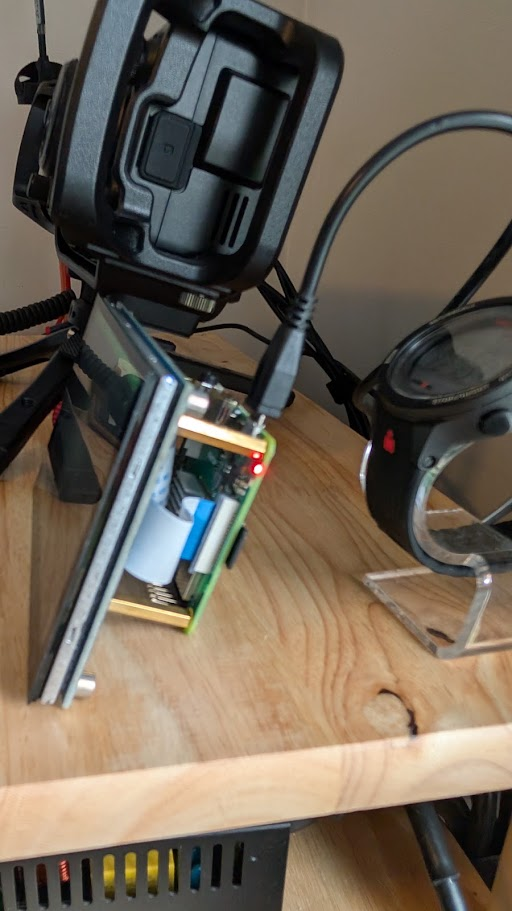

<!-- _class: panel -->

# It is a \$25 computer behind a \$43 panel, on standoffs that are also the stand

Raspberry Pi 3A+ · Waveshare 5-inch DSI panel · 66 × 20 characters of text.

It ran like this to begin with — the panel plugs into a ribbon cable, the standoffs hold it up, and nothing in the build is beyond a screwdriver.

---

<!-- _class: evidence -->

# A CRT-inspired case finishes the device

<figure>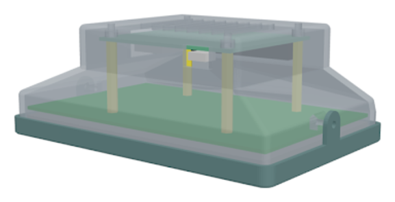<figcaption>drawn in OpenSCAD, around the real panel</figcaption></figure>
<figure>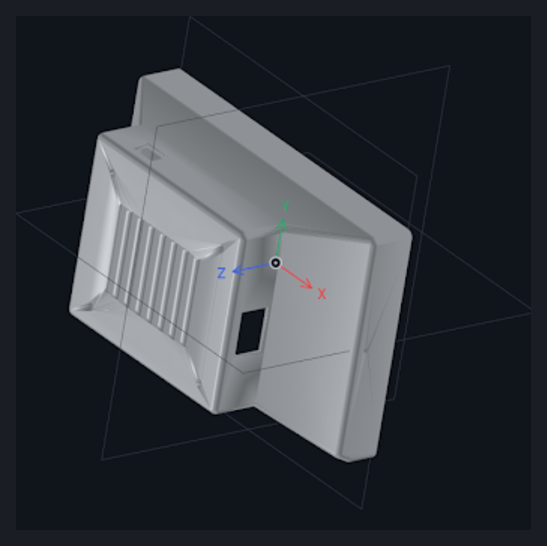<figcaption>the shell it exports</figcaption></figure>

Parametric, so the panel, the Pi and the standoff heights are numbers at the top of the file rather than measurements baked into a mesh — which matters when the thing you are modeling is already built and cannot change to suit the model.

---

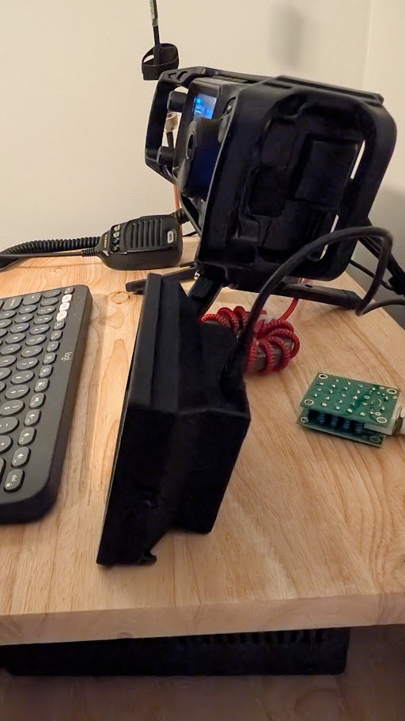

<!-- _class: panel -->

# KD3CCP printed the case and it came out great

It does two jobs. It **encloses the electronics** — the Pi, the back of the panel, and the ribbon cable between them, which was the most exposed thing on the bare build. And it is **a stable stand**.

**Twelve days** from the first contacts on this thing to a printed shell around it.

---

<!-- _class: evidence -->

# And it earns its place on the desk beside my radio

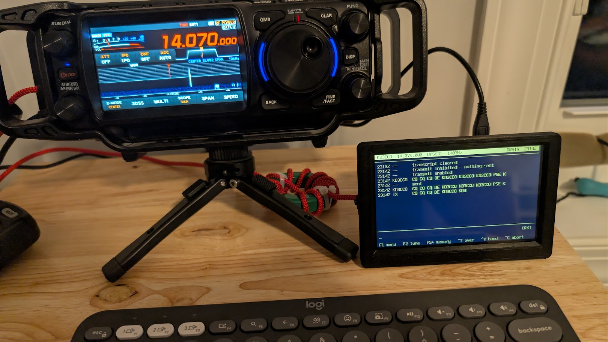

Calling CQ on 20 m BPSK31. The FTX-1 does the radio; the deck does the conversation.

---
<!-- _class: evidence -->

# I did not write a modem, and that is the whole trick

A PSK31 demodulator that beats fldigi's would be a multi-year project, and I would lose.

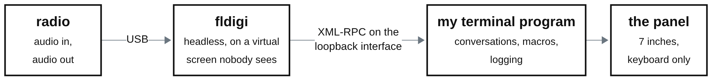

**XML-RPC** is one program calling functions inside another over HTTP. fldigi publishes a documented method list and keeps it stable across releases; the deck calls forty of them — `modem.set_by_name`, `main.set_frequency`, `text.add_tx`, `text.get_rx`. That makes it a supported client of fldigi, not a fork of it and not a screen-scrape.

**The loopback interface** is `127.0.0.1`, the machine talking to itself. The calls never reach a network card, nothing is open to the LAN, and there is no port to secure.

All of fldigi's signal processing. None of its interface.

---

<!-- _class: evidence -->

# Every control is one keystroke away

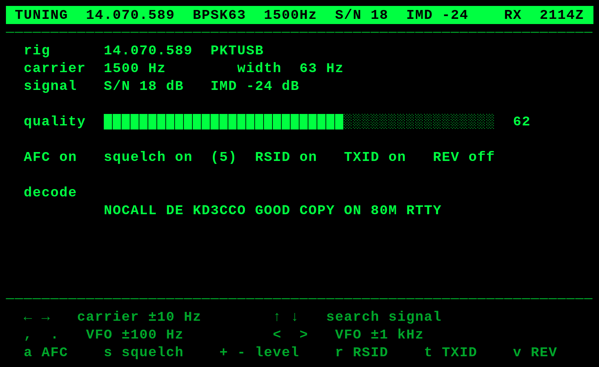

F2 tuning: carrier, AFC, squelch, signal search. F3 changes mode. Either key gets you back.

---

<!-- _class: evidence -->

# Without a waterfall to look at, the deck has to hunt for the signal itself

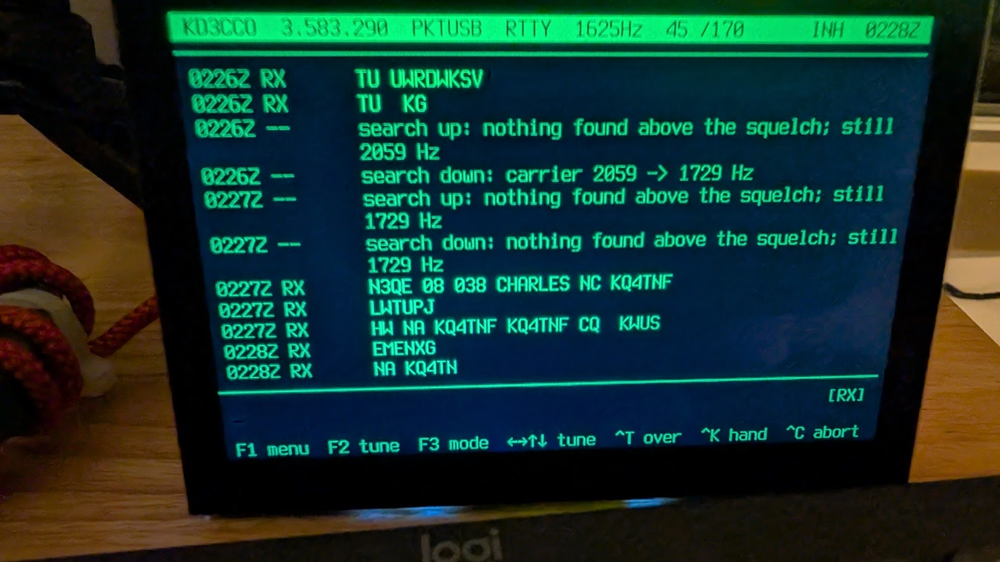

"search down: carrier 2059 → 1729 Hz." It steps the carrier looking for something above the squelch, because there is no picture to point at.

---

<!-- _class: evidence -->

# It keeps up with an RTTY sprint exchange

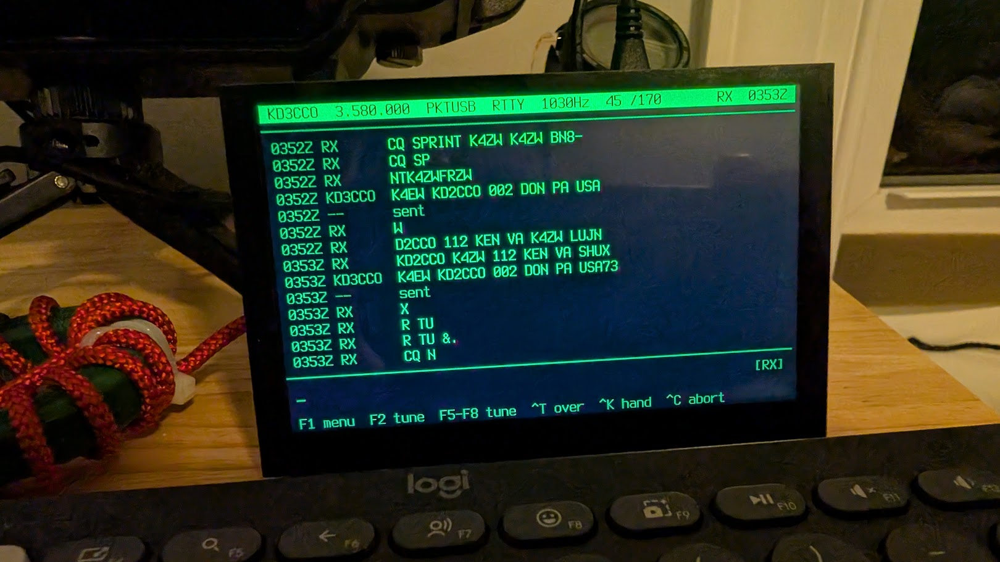

Serial number, name, state, sent and confirmed, in about 70 seconds on 80 m.

---

<!-- _class: evidence -->

# Explaining the deck to another operator, using the deck

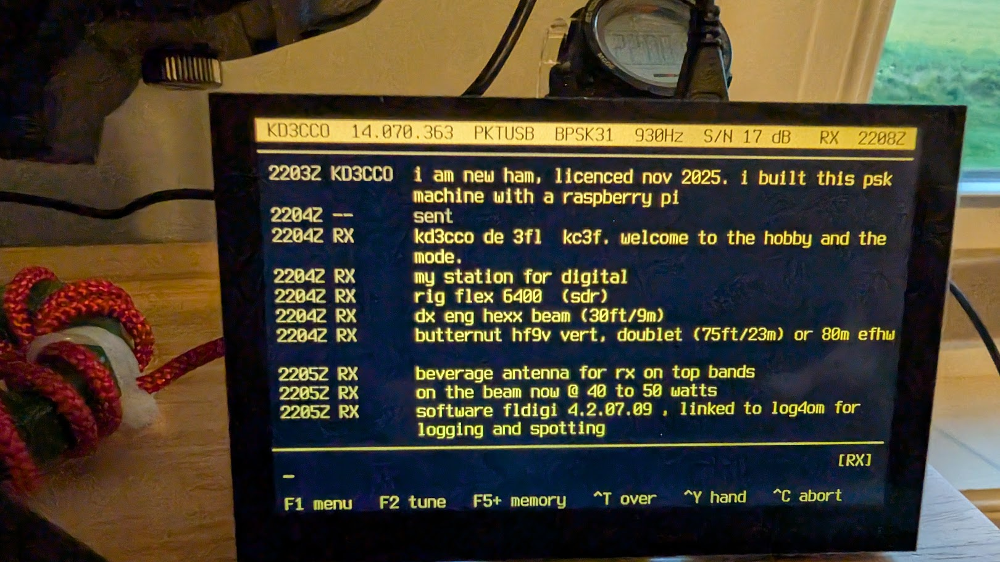

BPSK31 on 20 m: "i built this psk machine with a raspberry pi." KC3FL came back with a full station list — rig, beam, verticals, beverage.

---

<!-- _class: evidence -->

# The color schemes are an indulgence, and worth every minute

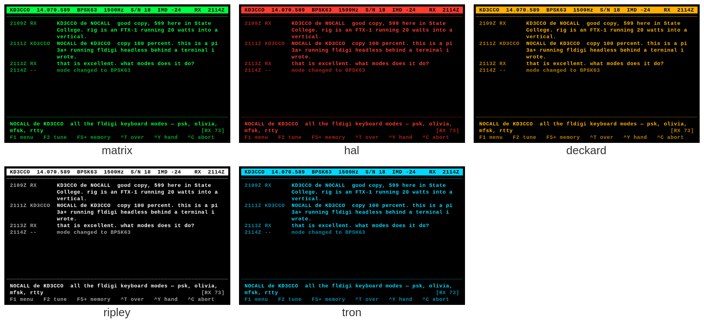

Five schemes, switched from the menu. Amber is the readable one in daylight; matrix is the one people ask about.

---

<!-- _class: evidence -->

# It pairs its own Bluetooth keyboard, with no second computer

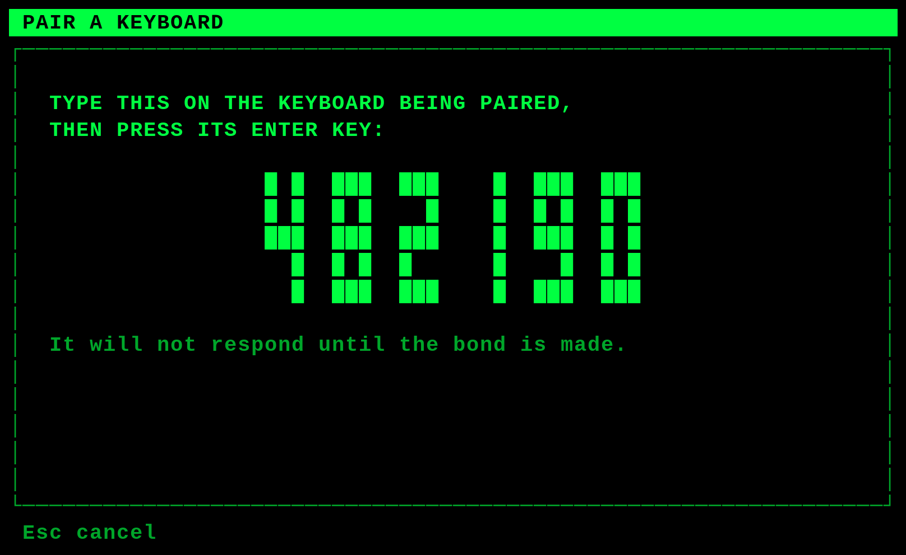

Pairing needs a screen and a keyboard that types. The deck has a screen; the keyboard being paired types.

---

<!-- _class: evidence -->

# It joins a WiFi network from the panel, and keeps time without one

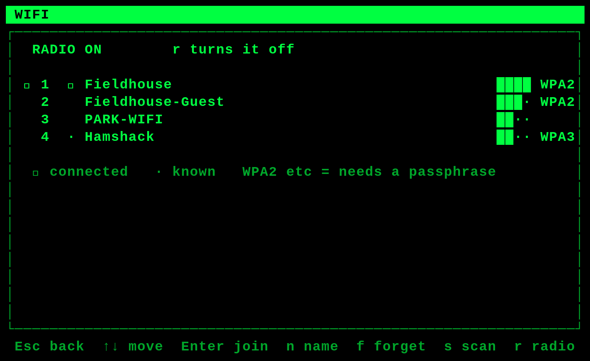

A \$15 real-time clock means a field session is stamped correctly with the WiFi switched off.

---

<!-- _class: evidence -->

# It has worked real DX — Martinique on 20 m PSK31, 20 watts

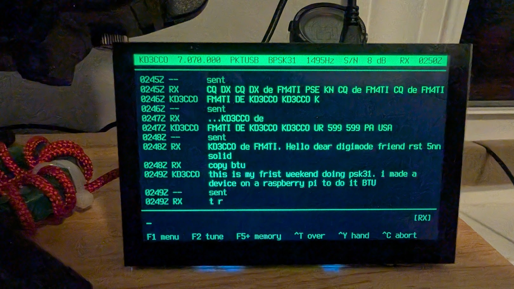

Also Germany, JO41XW — two operators in mountain villages, four thousand miles apart, typing at each other.

---
<!-- _class: evidence -->

# AI helps with faster code and better documentation practices

Hobby time arrives as confetti: twenty minutes before dinner, an hour on a Sunday. What decides whether a project happens is how much progress fits inside one fragment — a text terminal for HF with 534 tests behind it was never going to happen otherwise.

**Then turn it against your own design.** Write down how it should work, ask for an analysis of the alternatives, and ask the question worth more than any of them: *does this design imply there are tools, techniques or facts I am not accounting for?*

---

<!-- _class: evidence -->

# Code, documentation, slides and the blog in one window, where the assistant can see all of it

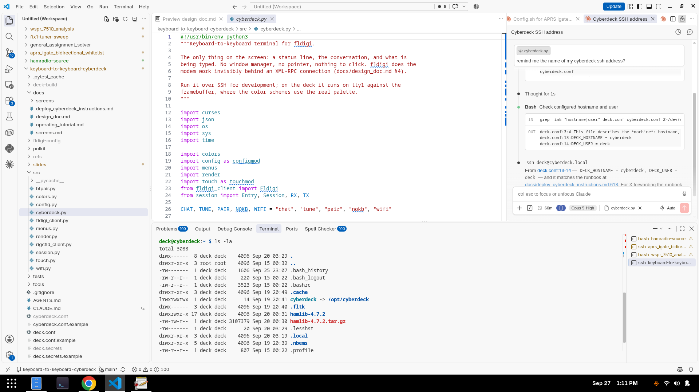

Documentation is markdown in the repository, beside the code. Everything advances in the same sitting, so nothing drifts. The blog is another repository in the same workspace; these slides are markdown in this one.

---

<!-- _class: closing -->

# Build something that annoys you into existence

**Code, design document, runbook, operating tutorial**
github.com/hatandspecs/keyboard-to-keyboard-cyberdeck

**Write-up, with photographs and the things that went wrong**
hatandspecs.github.io/hamradio/articles/keyboard-to-keyboard-cyberdeck/

It runs on an ordinary laptop too: start fldigi, run one Python file.

**KD3CCO** — questions welcome
